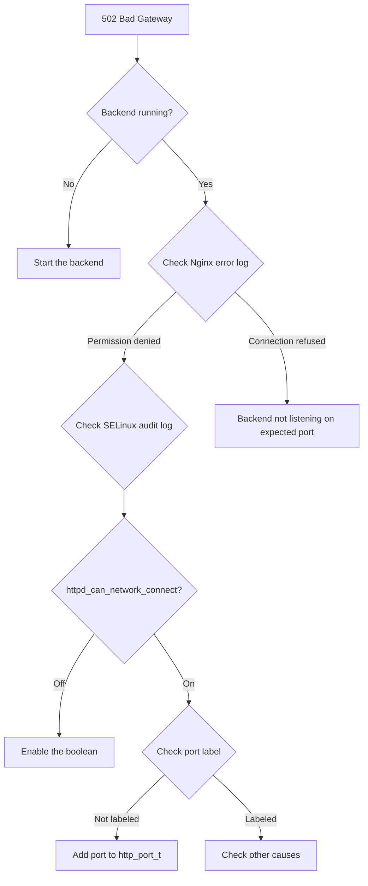

# How to Fix SELinux httpd_can_network_connect Issues with Nginx on RHEL 9

Author: [nawazdhandala](https://www.github.com/nawazdhandala)

Tags: RHEL, Nginx, SELinux, Troubleshooting, Linux

Description: A focused guide to diagnosing and fixing SELinux network connection denials for Nginx on RHEL 9.

---

## The Problem

You set up Nginx as a reverse proxy on RHEL 9. Everything looks correct in the config. But when you browse to the site, you get a 502 Bad Gateway error. The Nginx error log shows something like:

```
connect() to 127.0.0.1:3000 failed (13: Permission denied) while connecting to upstream
```

That "Permission denied" is not a file permission issue. It is SELinux blocking Nginx from making an outgoing network connection.

## Why This Happens

RHEL 9 ships with SELinux in enforcing mode. The default policy for the `httpd_t` domain (which covers both Apache and Nginx) does not allow outgoing network connections. This is a security feature. A compromised web server cannot phone home or connect to other services unless you explicitly allow it.

## Step 1 - Confirm SELinux Is the Cause

Check the audit log for denials:

```bash
# Search for recent AVC denials related to nginx
sudo ausearch -m avc -ts recent | grep nginx
```

You will see something like:

```
type=AVC msg=audit(...): avc:  denied  { name_connect } for  pid=12345
comm="nginx" dest=3000 scontext=system_u:system_r:httpd_t:s0
tcontext=system_u:object_r:unreserved_port_t:s0 tclass=tcp_socket permissive=0
```

The key parts: `denied { name_connect }`, `httpd_t`, and the destination port. SELinux blocked Nginx from connecting to port 3000.

## Step 2 - Check the Current Boolean

```bash
# Check the current state of the network connect boolean
getsebool httpd_can_network_connect
```

If it shows `off`, that confirms the issue.

## Step 3 - Enable the Boolean

```bash
# Allow Nginx (and Apache) to make outgoing network connections
sudo setsebool -P httpd_can_network_connect on
```

The `-P` flag makes the change persistent across reboots. Without it, the boolean resets when the system restarts.

## Step 4 - Verify the Fix

```bash
# Confirm the boolean is now on
getsebool httpd_can_network_connect

# Test your site
curl -I http://your-site.example.com
```

The 502 error should be gone.

## Other Useful SELinux Booleans for Nginx

Depending on your setup, you might need other booleans:

| Boolean | Purpose | Command |
|---------|---------|---------|
| `httpd_can_network_connect` | Connect to any port | `sudo setsebool -P httpd_can_network_connect on` |
| `httpd_can_network_connect_db` | Connect to database ports only | `sudo setsebool -P httpd_can_network_connect_db on` |
| `httpd_can_network_relay` | Act as a relay/proxy | `sudo setsebool -P httpd_can_network_relay on` |

If your backend runs on a standard port and you only need database connectivity, `httpd_can_network_connect_db` is more restrictive and therefore more secure.

## When the Port Matters

SELinux also cares about the port type. Standard HTTP ports (80, 443, 8080, etc.) are labeled `http_port_t`. If your backend runs on a non-standard port, you might need to add it:

```bash
# Check if a port is already labeled for HTTP
sudo semanage port -l | grep http_port_t

# Add a custom port to the HTTP port type
sudo semanage port -a -t http_port_t -p tcp 3000
```

This is an alternative to using `httpd_can_network_connect`. Instead of allowing connections to any port, you label specific ports as HTTP-accessible.

## Troubleshooting Decision Flow



## Using sealert for Better Diagnostics

The `sealert` tool provides human-readable explanations:

```bash
# Install if not present
sudo dnf install -y setroubleshoot-server

# Analyze the audit log
sudo sealert -a /var/log/audit/audit.log
```

The output will suggest the exact command to fix the issue.

## Do Not Disable SELinux

It is tempting to run `setenforce 0` and move on. Resist that urge. SELinux provides real protection. If your web server gets exploited, SELinux limits what the attacker can do. Setting the correct boolean takes 10 seconds and keeps that protection in place.

## Quick Test: Is SELinux the Problem?

If you want to quickly confirm SELinux is causing the issue (without disabling it globally):

```bash
# Temporarily set to permissive for testing
sudo setenforce 0

# Test your site
curl -I http://your-site.example.com

# Immediately re-enable enforcing
sudo setenforce 1
```

If the site works in permissive mode but not in enforcing mode, you know it is an SELinux issue. Then set the right boolean and keep enforcing mode on.

## Wrap-Up

The `httpd_can_network_connect` boolean is the single most common SELinux issue with Nginx reverse proxies on RHEL 9. The fix is one command. The important thing is recognizing SELinux as the cause, which means checking the audit log rather than assuming the problem is in your Nginx config. Keep SELinux enforcing, set the right booleans, and move on.
