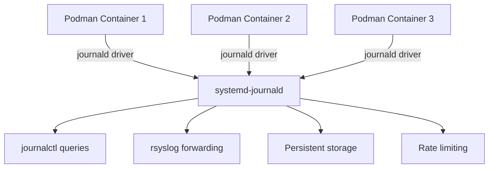

# How to Forward Container Logs from Podman to journald on RHEL

Author: [nawazdhandala](https://www.github.com/nawazdhandala)

Tags: RHEL, Podman, Journald, Containers, Logging, Linux

Description: Learn how to configure Podman containers on RHEL to send their logs to journald for centralized container log management using standard systemd tools.

---

Podman on RHEL supports multiple logging drivers, and journald is the recommended one for production environments. When container logs go to journald, you can use all the standard journalctl filtering and searching capabilities to manage container logs alongside your system logs.

## Why Use journald for Container Logs



Benefits of using journald as the Podman log driver:

- Unified log management with system logs
- Structured metadata (container name, ID, image)
- Built-in rate limiting and storage quotas
- Easy forwarding to remote syslog or SIEM
- Survives container restarts

## Step 1: Check the Default Log Driver

```bash
# Check Podman's default log driver
podman info --format '{{.Host.LogDriver}}'

# For rootless Podman
podman info --format '{{.Host.LogDriver}}'
```

On RHEL, the default log driver is typically `journald`.

## Step 2: Configure journald as the Default Log Driver

To set journald as the default for all containers, edit the containers configuration:

```bash
# Edit the system-wide containers configuration
sudo vi /etc/containers/containers.conf
```

Add or modify:

```ini
[engine]
# Set journald as the default logging driver for all containers
log_driver = "journald"
```

For rootless Podman (per-user configuration):

```bash
# Create the user config directory
mkdir -p ~/.config/containers

# Edit the user configuration
vi ~/.config/containers/containers.conf
```

```ini
[engine]
log_driver = "journald"
```

## Step 3: Run Containers with journald Logging

### Specify the Log Driver Per Container

```bash
# Run a container with journald logging
podman run -d \
    --name mywebapp \
    --log-driver journald \
    nginx:latest

# Run with additional log options
podman run -d \
    --name myapp \
    --log-driver journald \
    --log-opt tag="myapp-{{.Name}}" \
    myapp:latest
```

### Using Custom Log Tags

Tags help identify containers in journal output:

```bash
# Run with a custom tag that includes the container name
podman run -d \
    --name redis-cache \
    --log-driver journald \
    --log-opt tag="redis-{{.Name}}" \
    redis:latest

# Run with a tag that includes the image name
podman run -d \
    --name postgres-db \
    --log-driver journald \
    --log-opt tag="{{.ImageName}}" \
    postgres:15
```

## Step 4: Query Container Logs with journalctl

### View Logs by Container Name

```bash
# View logs for a specific container
journalctl CONTAINER_NAME=mywebapp --no-pager

# Follow container logs in real time
journalctl CONTAINER_NAME=mywebapp -f

# View last 50 log entries
journalctl CONTAINER_NAME=mywebapp -n 50
```

### View Logs by Container ID

```bash
# Get the container ID
podman ps --format "{{.ID}} {{.Names}}"

# View logs by container ID
journalctl CONTAINER_ID=abc123def456 --no-pager
```

### Filter Container Logs by Time

```bash
# Container logs from the last hour
journalctl CONTAINER_NAME=mywebapp --since "1 hour ago"

# Container logs from a specific time range
journalctl CONTAINER_NAME=mywebapp \
    --since "2026-03-04 08:00:00" \
    --until "2026-03-04 12:00:00"
```

### Filter Container Logs by Tag

```bash
# View logs by the custom tag
journalctl CONTAINER_TAG=myapp-myapp --no-pager

# Or use syslog identifier
journalctl SYSLOG_IDENTIFIER=myapp-myapp --no-pager
```

### Combine Filters

```bash
# Error-level container logs from the last day
journalctl CONTAINER_NAME=mywebapp -p err --since "1 day ago"

# All container logs (filter by Podman's container ID field)
journalctl -t podman --no-pager -n 100
```

## Step 5: Use podman logs with journald

The `podman logs` command works with the journald driver too:

```bash
# View container logs through podman
podman logs mywebapp

# Follow logs
podman logs -f mywebapp

# Show timestamps
podman logs -t mywebapp

# Show last 20 lines
podman logs --tail 20 mywebapp

# Show logs since a timestamp
podman logs --since "2026-03-04T08:00:00" mywebapp
```

## Step 6: Container Logs in Systemd Services

When running Podman containers as systemd services (using Quadlet or podman generate), logs automatically go to journald:

```bash
# Generate a systemd service for a container
podman generate systemd --name mywebapp --files --new
```

This creates a service file, and you can then manage logs with:

```bash
# View logs through systemd
journalctl -u container-mywebapp.service

# Follow service logs
journalctl -u container-mywebapp.service -f
```

### Using Quadlet (Recommended on RHEL)

Create a Quadlet container file:

```bash
# Create a Quadlet definition
sudo vi /etc/containers/systemd/mywebapp.container
```

```ini
[Container]
ContainerName=mywebapp
Image=docker.io/library/nginx:latest
PublishPort=8080:80
LogDriver=journald

[Service]
Restart=always

[Install]
WantedBy=multi-user.target
```

```bash
# Reload systemd to pick up the Quadlet definition
sudo systemctl daemon-reload

# Start the container service
sudo systemctl start mywebapp.service

# View logs through journalctl
journalctl -u mywebapp.service -f
```

## Step 7: Forward Container Logs via rsyslog

To forward container logs to a remote server or SIEM:

```bash
# Create an rsyslog configuration for container log forwarding
sudo vi /etc/rsyslog.d/container-forward.conf
```

```bash
# Forward container logs identified by their syslog identifier
if $programname startswith 'podman' or $syslogtag startswith 'conmon' then {
    action(type="omfwd"
        target="logserver.example.com"
        port="514"
        protocol="tcp"
        queue.type="LinkedList"
        queue.filename="container_queue"
        queue.maxdiskspace="500m"
        queue.saveonshutdown="on"
    )
}
```

```bash
# Restart rsyslog
sudo systemctl restart rsyslog
```

## Step 8: JSON Output for Container Logs

Export container logs in JSON for analysis:

```bash
# Get container logs in JSON format
journalctl CONTAINER_NAME=mywebapp -o json-pretty -n 10

# Get all container log fields
journalctl CONTAINER_NAME=mywebapp -o verbose -n 5
```

Available container-specific fields in the journal:

| Field | Description |
|-------|-------------|
| CONTAINER_NAME | Container name |
| CONTAINER_ID | Short container ID |
| CONTAINER_ID_FULL | Full container ID |
| CONTAINER_TAG | Custom tag from --log-opt tag |
| IMAGE_NAME | Container image name |

## Troubleshooting

```bash
# Verify the log driver for a running container
podman inspect mywebapp --format '{{.HostConfig.LogConfig.Type}}'

# Check if journald is receiving container logs
journalctl --since "5 min ago" | grep -i container

# Check Podman events for container issues
podman events --since "1h"

# Verify journald is not rate limiting container logs
journalctl --grep="Suppressed" --no-pager -n 20
```

## Summary

Forwarding Podman container logs to journald on RHEL unifies your container and system logging into a single, queryable journal. Set `log_driver = "journald"` in your containers.conf, use custom tags for easy identification, and query logs with standard journalctl commands. For production setups, use Quadlet service definitions and forward container logs to your central log server via rsyslog.
