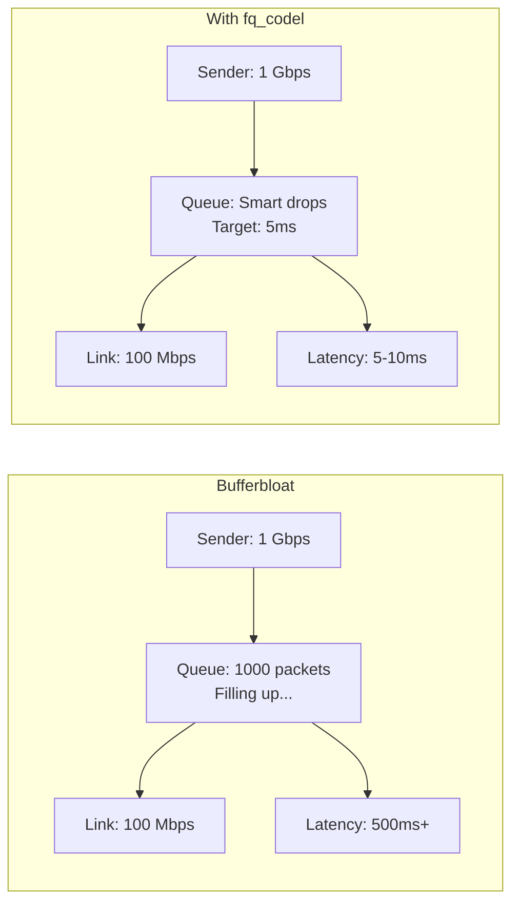
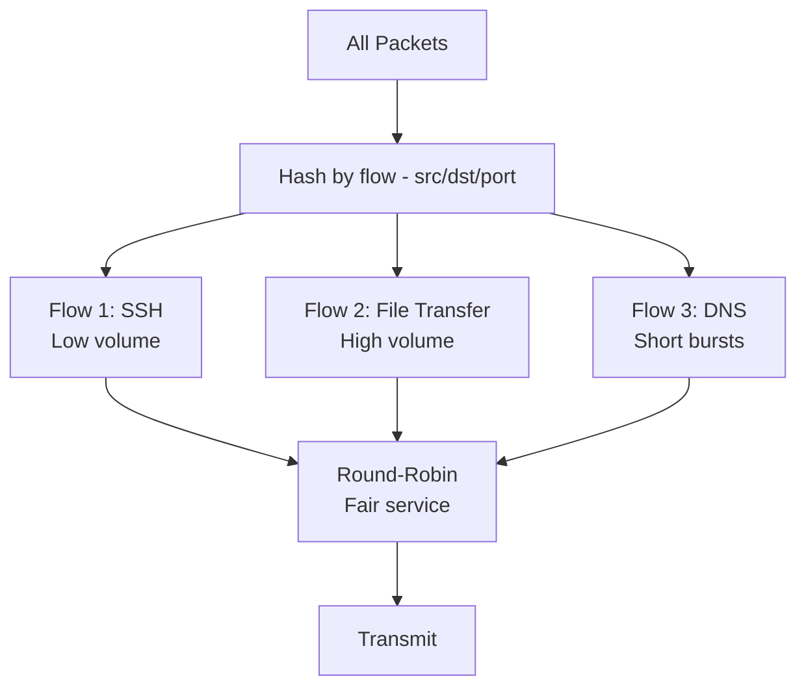

# How to Understand the fq_codel Default Queueing Discipline on RHEL

Author: [nawazdhandala](https://www.github.com/nawazdhandala)

Tags: RHEL, Fq_codel, QoS, Networking, Linux

Description: An in-depth look at fq_codel, the default queueing discipline on RHEL, explaining how it fights bufferbloat, ensures fairness between flows, and why it's a good default for most workloads.

---

RHEL uses fq_codel as the default queueing discipline on network interfaces. This is a significant improvement over the old pfifo_fast default. If you've ever wondered what fq_codel does, why it matters, or whether you should change it, this article breaks it all down.

## What Is a Queueing Discipline?

Every network interface has a queue where outgoing packets wait before being transmitted. The queueing discipline (qdisc) determines the order in which packets leave that queue and when packets should be dropped.

```bash
# Check what qdisc your interface uses
tc qdisc show dev ens192
# On RHEL, you'll likely see: fq_codel
```

## The Problem: Bufferbloat

Bufferbloat is what happens when network buffers (queues) are too large. Packets queue up, latency increases dramatically, but no packets are dropped, so TCP doesn't know to slow down. The result: multi-second latency spikes during file transfers, laggy SSH sessions, and terrible VoIP quality.



## What fq_codel Does

fq_codel combines two algorithms:

1. **Fair Queuing (fq)** - Separates traffic into individual flows and gives each flow its own virtual queue. A large download can't starve your SSH session.

2. **CoDel (Controlled Delay)** - Manages queue depth by targeting a specific sojourn time (how long packets sit in the queue). If packets wait longer than the target, CoDel starts dropping them, which signals TCP to slow down.

## How fq_codel Separates Flows



Each flow gets equal access to the link. A flow that's flooding the interface doesn't affect other flows.

## Default fq_codel Parameters

```bash
# View the current fq_codel parameters
tc -s -d qdisc show dev ens192
```

The default parameters on RHEL:

| Parameter | Default | Meaning |
|-----------|---------|---------|
| target | 5ms | Target maximum sojourn time |
| interval | 100ms | CoDel control interval |
| quantum | 1514 | Bytes dequeued per round-robin turn |
| flows | 1024 | Number of flow hash buckets |
| limit | 10240 | Maximum packets in the queue |
| ecn | enabled | Use ECN marking instead of drops when possible |

## Why 5ms Target?

The 5ms target is a well-researched default. It's long enough that a burst of packets during normal operation won't trigger unnecessary drops, but short enough to prevent the queue from growing into bufferbloat territory. For most internet-connected servers, 5ms is the sweet spot.

## Viewing fq_codel Statistics

```bash
# Show detailed statistics
tc -s qdisc show dev ens192
```

Important fields in the output:

- **maxpacket** - Largest packet seen
- **drop_overlimit** - Packets dropped because the queue limit was reached
- **new_flow_count** - Number of new flows detected
- **ecn_mark** - Packets marked with ECN instead of dropped
- **new_flows_len** - Current number of new flows
- **old_flows_len** - Current number of old (established) flows

## Tuning fq_codel

In most cases, the defaults are fine. But here are situations where tuning helps:

### For High-Bandwidth Links (10 Gbps+)

```bash
# Increase the quantum for faster links
sudo tc qdisc replace dev ens192 root fq_codel quantum 8000 flows 4096

# Or increase the limit
sudo tc qdisc replace dev ens192 root fq_codel limit 20480
```

### For Low-Bandwidth Links (under 10 Mbps)

```bash
# Lower the target for slow links
sudo tc qdisc replace dev ens192 root fq_codel target 2ms interval 50ms
```

### Disabling ECN

If ECN causes problems with certain equipment:

```bash
# Disable ECN marking
sudo tc qdisc replace dev ens192 root fq_codel noecn
```

## fq_codel vs Other Qdiscs

| Qdisc | Best For | Complexity |
|-------|----------|------------|
| fq_codel | General purpose (default) | Zero config |
| fq | Single-server with many clients | Low |
| cake | Home routers, WAN links | Low (auto-tunes) |
| htb + fq_codel | Multi-class QoS | High |
| pfifo_fast | Legacy (avoid) | Zero |

## When NOT to Change fq_codel

For most RHEL servers, fq_codel is the right choice. Don't change it unless:

- You need explicit bandwidth allocation between services (use HTB)
- You need to simulate network impairments (use netem)
- You need strict rate limiting (use tbf or HTB)
- You're running a dedicated router with multiple WAN links (consider CAKE)

## Testing fq_codel Effectiveness

You can demonstrate fq_codel's effect with a simple test:

```bash
# Start a large download or iperf test
iperf3 -c remote-server -t 60 &

# Simultaneously, measure latency
ping -c 60 remote-server

# With fq_codel: latency stays low even during the transfer
# Without fq_codel (pfifo_fast): latency would spike significantly
```

## Replacing fq_codel (If Needed)

```bash
# Replace with a different qdisc
sudo tc qdisc replace dev ens192 root fq

# Or replace with HTB for class-based QoS
sudo tc qdisc replace dev ens192 root handle 1: htb default 10

# To go back to fq_codel
sudo tc qdisc replace dev ens192 root fq_codel
```

## Checking the System-Wide Default

```bash
# See what the kernel uses as the default qdisc
sysctl net.core.default_qdisc
# Should return: net.core.default_qdisc = fq_codel

# If you wanted to change the system-wide default
# (not recommended - fq_codel is a good default)
# sudo sysctl -w net.core.default_qdisc=fq
```

## Wrapping Up

fq_codel on RHEL is one of those things that just works. It fights bufferbloat, ensures fairness between flows, and requires zero configuration for the vast majority of workloads. The combination of per-flow fair queuing and CoDel's intelligent drop strategy means your interactive traffic stays responsive even when the link is saturated. Unless you have a specific reason to change it, leave it as the default and enjoy the benefits.
