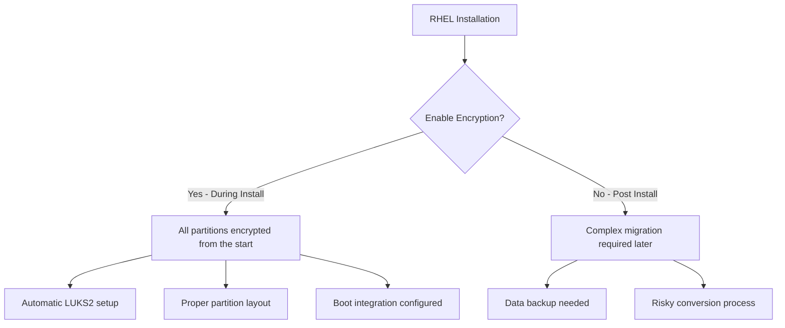

# How to Enable Full Disk Encryption with LUKS2 During RHEL Installation

Author: [nawazdhandala](https://www.github.com/nawazdhandala)

Tags: RHEL, LUKS2, Full Disk Encryption, Installation, Security, Linux

Description: Enable full disk encryption with LUKS2 during RHEL installation to protect all data at rest from unauthorized physical access.

---

Full disk encryption (FDE) with LUKS2 ensures that all data on your RHEL system is encrypted at rest. If the physical disk is stolen or the system is decommissioned, the data remains inaccessible without the encryption passphrase. The easiest way to set this up is during the initial installation. This guide walks through the process.

## Why Encrypt During Installation?



Setting up encryption during installation is much simpler and safer than trying to encrypt an existing system.

## Prerequisites

- RHEL installation media (ISO or USB)
- A system with enough processing power for encryption overhead (most modern systems handle this easily)
- A strong passphrase that you will remember

## Step-by-Step Installation with LUKS2

### Step 1: Boot from Installation Media

Boot your system from the RHEL installation ISO. Proceed through the language selection and initial setup screens.

### Step 2: Select Installation Destination

On the Installation Summary screen, click "Installation Destination."

1. Select the target disk(s)
2. Under "Storage Configuration," choose "Custom" or "Automatic"
3. Check the box labeled "Encrypt my data"

### Step 3: Configure Encryption (Automatic Partitioning)

If you selected "Automatic" partitioning:

1. Click "Done" after selecting the disk and enabling encryption
2. You will be prompted to enter an encryption passphrase
3. Enter a strong passphrase and confirm it
4. The installer will automatically create encrypted partitions

The automatic layout typically creates:

```
/dev/sda1 - /boot/efi (EFI System Partition, unencrypted)
/dev/sda2 - /boot (unencrypted, needed for bootloader)
/dev/sda3 - LUKS2 encrypted physical volume
  └── LVM volume group
      ├── / (root filesystem)
      ├── /home
      └── swap
```

### Step 4: Configure Encryption (Custom Partitioning)

For more control, select "Custom" partitioning:

1. Click the "+" button to add mount points
2. For each partition (except /boot and /boot/efi):
   - Create the mount point
   - Check the "Encrypt" checkbox
   - Choose LUKS2 as the encryption type

Recommended custom layout:

```bash
# /boot/efi - 600 MB, EFI System Partition (no encryption)
# /boot     - 1 GB, ext4 (no encryption)
# /         - Remaining space, xfs, encrypted with LUKS2
# swap      - RAM size, encrypted with LUKS2
```

### Step 5: Set the Encryption Passphrase

When prompted, enter a strong passphrase:

- Use at least 20 characters
- Include a mix of words, numbers, and symbols
- Avoid common phrases or dictionary words
- Consider using a passphrase of several random words

### Step 6: Complete the Installation

Proceed with the rest of the installation as normal. Select your software packages, set the root password, and create user accounts.

After installation completes, reboot the system.

### Step 7: First Boot with Encryption

On the first boot, you will see a passphrase prompt:

```
Please enter passphrase for disk /dev/sda3 (luks-xxxxxxxx-xxxx-xxxx-xxxx-xxxxxxxxxxxx):
```

Enter your encryption passphrase to unlock the disk and continue booting.

## Kickstart Installation with Encryption

For automated installations using Kickstart, add encryption to the partition commands:

```bash
# Kickstart file example with LUKS2 encryption

# Clear all partitions
clearpart --all --initlabel

# Create EFI partition (unencrypted)
part /boot/efi --fstype=efi --size=600

# Create boot partition (unencrypted)
part /boot --fstype=ext4 --size=1024

# Create encrypted physical volume
part pv.01 --size=1 --grow --encrypted --luks-version=luks2 --passphrase=YourStrongPassphrase

# Create volume group on encrypted PV
volgroup rhel pv.01

# Create logical volumes
logvol / --fstype=xfs --name=root --vgname=rhel --size=20480
logvol /home --fstype=xfs --name=home --vgname=rhel --size=10240
logvol swap --fstype=swap --name=swap --vgname=rhel --size=4096
```

For better security, avoid putting the passphrase in the Kickstart file. Instead, use a key file or prompt during installation.

## Verifying Encryption After Installation

Once the system is installed and booted:

```bash
# Check LUKS status
sudo cryptsetup luksDump /dev/sda3

# Verify LUKS2 format
sudo cryptsetup luksDump /dev/sda3 | head -5
# Should show: Version: 2

# Check which devices are encrypted
lsblk -f

# View dm-crypt mapped devices
sudo dmsetup ls --target crypt
```

## Performance Considerations

LUKS2 on RHEL supports hardware AES acceleration on modern CPUs:

```bash
# Check if AES-NI is available
grep -o aes /proc/cpuinfo | head -1

# Check encryption performance
sudo cryptsetup benchmark
```

Typical results on a modern CPU show that AES-XTS-256 can achieve several GB/s throughput, making the encryption overhead negligible for most workloads.

## Managing the Encryption Post-Installation

### Add a Backup Passphrase

```bash
# Add an additional passphrase (LUKS supports up to 8 key slots)
sudo cryptsetup luksAddKey /dev/sda3
```

### Change the Passphrase

```bash
# Change the passphrase
sudo cryptsetup luksChangeKey /dev/sda3
```

### Back Up the LUKS Header

```bash
# Critical: back up the LUKS header
sudo cryptsetup luksHeaderBackup /dev/sda3 --header-backup-file /root/luks-header-backup.img

# Store this backup in a secure, separate location
```

## Summary

Enabling full disk encryption with LUKS2 during RHEL installation is the simplest and most reliable way to protect your data at rest. The installer handles the complex partition layout and boot configuration automatically. After installation, verify the encryption is working, add a backup passphrase, and back up the LUKS header. The system will prompt for the passphrase at each boot to unlock the encrypted volumes.
