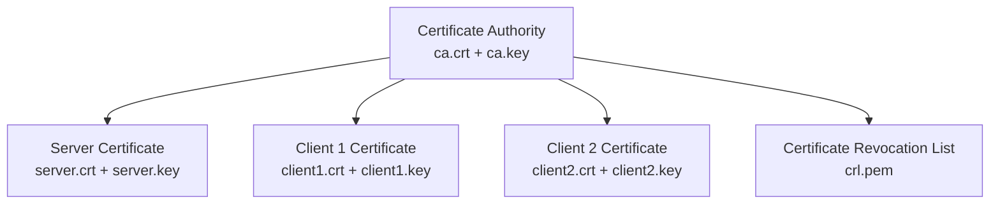

# How to Generate Certificates and Keys for OpenVPN Using Easy-RSA on RHEL

Author: [nawazdhandala](https://www.github.com/nawazdhandala)

Tags: RHEL, OpenVPN, Easy-RSA, Certificates, Linux

Description: A detailed walkthrough of using Easy-RSA 3 on RHEL to build a complete PKI for OpenVPN, including CA creation, server and client certificates, CRL management, and certificate renewal.

---

Every OpenVPN deployment needs a PKI (Public Key Infrastructure). Easy-RSA is the tool that ships alongside OpenVPN for this purpose. It handles the CA, server certificates, client certificates, and revocation - basically everything you need to manage trust in your VPN. Here's how to do it properly on RHEL.

## How the PKI Fits Together



The CA signs everything. The server and clients each get a certificate signed by the CA. When a client connects, the server verifies its certificate against the CA, and vice versa.

## Installing Easy-RSA

```bash
# Install Easy-RSA from EPEL
sudo dnf install -y epel-release
sudo dnf install -y easy-rsa
```

## Setting Up the Easy-RSA Environment

It's best practice to keep the PKI in a dedicated directory, not as root.

```bash
# Create a working directory
mkdir -p ~/openvpn-pki
cd ~/openvpn-pki

# Symlink the Easy-RSA scripts
ln -s /usr/share/easy-rsa/3/* .
```

## Customizing PKI Variables

Before initializing, configure the default values for your certificates.

```bash
# Create a vars file with your organization's details
tee ~/openvpn-pki/vars > /dev/null << 'EOF'
# Organization details
set_var EASYRSA_REQ_COUNTRY    "US"
set_var EASYRSA_REQ_PROVINCE   "California"
set_var EASYRSA_REQ_CITY       "San Francisco"
set_var EASYRSA_REQ_ORG        "MyCompany"
set_var EASYRSA_REQ_EMAIL      "admin@example.com"
set_var EASYRSA_REQ_OU         "IT Department"

# Key size (2048 is minimum, 4096 is more secure)
set_var EASYRSA_KEY_SIZE       4096

# Certificate validity (in days)
set_var EASYRSA_CA_EXPIRE      3650
set_var EASYRSA_CERT_EXPIRE    825

# Digest algorithm
set_var EASYRSA_DIGEST         "sha256"
EOF
```

## Initializing the PKI

```bash
cd ~/openvpn-pki

# Initialize a fresh PKI directory
./easyrsa init-pki
```

This creates the `pki/` directory structure where all keys and certificates will be stored.

## Building the Certificate Authority

The CA is the root of trust. Protect its private key carefully.

```bash
# Build the CA (nopass skips the passphrase - use a passphrase in production)
./easyrsa build-ca nopass

# You'll be prompted for a Common Name
# Enter something like: MyCompany-OpenVPN-CA
```

This creates:
- `pki/ca.crt` - The CA certificate (distribute this widely)
- `pki/private/ca.key` - The CA private key (keep this secret)

## Generating the Server Certificate

```bash
# Generate a certificate request for the server
./easyrsa gen-req server nopass

# Sign the request as a server certificate
./easyrsa sign-req server server

# Confirm with 'yes' when prompted
```

This creates:
- `pki/issued/server.crt` - Server certificate
- `pki/private/server.key` - Server private key

## Generating Diffie-Hellman Parameters

This is used for the TLS key exchange. It takes a while to generate.

```bash
# Generate DH parameters
./easyrsa gen-dh
```

This creates `pki/dh.pem`.

## Generating Client Certificates

For each VPN user, generate a unique certificate.

```bash
# Generate certificate for client1
./easyrsa gen-req client1 nopass
./easyrsa sign-req client client1

# Generate certificate for client2
./easyrsa gen-req client2 nopass
./easyrsa sign-req client client2
```

## Generating the TLS Auth Key

This is separate from the PKI but equally important. It provides an additional HMAC layer.

```bash
# Generate the TLS auth key
openvpn --genkey secret ~/openvpn-pki/ta.key
```

## Deploying Certificates to the Server

```bash
# Copy everything the server needs
sudo cp ~/openvpn-pki/pki/ca.crt /etc/openvpn/server/
sudo cp ~/openvpn-pki/pki/issued/server.crt /etc/openvpn/server/
sudo cp ~/openvpn-pki/pki/private/server.key /etc/openvpn/server/
sudo cp ~/openvpn-pki/pki/dh.pem /etc/openvpn/server/
sudo cp ~/openvpn-pki/ta.key /etc/openvpn/server/

# Lock down permissions
sudo chmod 600 /etc/openvpn/server/server.key
sudo chmod 600 /etc/openvpn/server/ta.key
```

## Creating Distributable Client Packages

Bundle everything a client needs into a single .ovpn file.

```bash
# Script to generate a unified client config
CLIENT_NAME="client1"

cat > ~/openvpn-pki/${CLIENT_NAME}.ovpn << EOF
client
dev tun
proto udp
remote YOUR_SERVER_IP 1194
resolv-retry infinite
nobind
persist-key
persist-tun
cipher AES-256-GCM
auth SHA256
key-direction 1
verb 3

<ca>
$(cat ~/openvpn-pki/pki/ca.crt)
</ca>

<cert>
$(cat ~/openvpn-pki/pki/issued/${CLIENT_NAME}.crt)
</cert>

<key>
$(cat ~/openvpn-pki/pki/private/${CLIENT_NAME}.key)
</key>

<tls-auth>
$(cat ~/openvpn-pki/ta.key)
</tls-auth>
EOF

echo "Client config created: ~/openvpn-pki/${CLIENT_NAME}.ovpn"
```

## Revoking a Client Certificate

When someone leaves the organization or a key is compromised:

```bash
cd ~/openvpn-pki

# Revoke the certificate
./easyrsa revoke client1

# Generate an updated CRL
./easyrsa gen-crl

# Copy the CRL to the server
sudo cp ~/openvpn-pki/pki/crl.pem /etc/openvpn/server/

# Add the CRL to the server config if not already there
echo "crl-verify /etc/openvpn/server/crl.pem" | sudo tee -a /etc/openvpn/server/server.conf

# Restart OpenVPN to apply
sudo systemctl restart openvpn-server@server
```

## Renewing Certificates

Before certificates expire, renew them:

```bash
cd ~/openvpn-pki

# Renew a client certificate
./easyrsa renew client2

# Copy the new certificate for distribution
cp ~/openvpn-pki/pki/issued/client2.crt ~/client2-renewed.crt
```

## Listing and Checking Certificates

```bash
cd ~/openvpn-pki

# Show all certificates and their status
./easyrsa show-ca
./easyrsa show-cert server
./easyrsa show-cert client1

# Check certificate expiration dates
openssl x509 -in pki/issued/server.crt -noout -dates
openssl x509 -in pki/issued/client1.crt -noout -dates
```

## Security Best Practices

1. **Use a passphrase on the CA key in production.** Omitting `nopass` during CA creation means every signing operation requires the passphrase.

2. **Store the CA offline** if possible. Once you've signed the server and initial client certs, the CA key doesn't need to be on the server.

3. **Use unique certificates per client.** Never share a single client certificate across multiple users.

4. **Set reasonable expiration times.** 825 days for client certificates is a common choice.

5. **Maintain the CRL.** Update and redeploy it whenever you revoke a certificate.

## Wrapping Up

Easy-RSA on RHEL gives you a functional PKI without the complexity of a full CA solution. The workflow is always: init PKI, build CA, generate requests, sign them. Keep your CA key secure, revoke certificates promptly when needed, and monitor expiration dates. The unified .ovpn file format with inline certificates makes client distribution much simpler.
