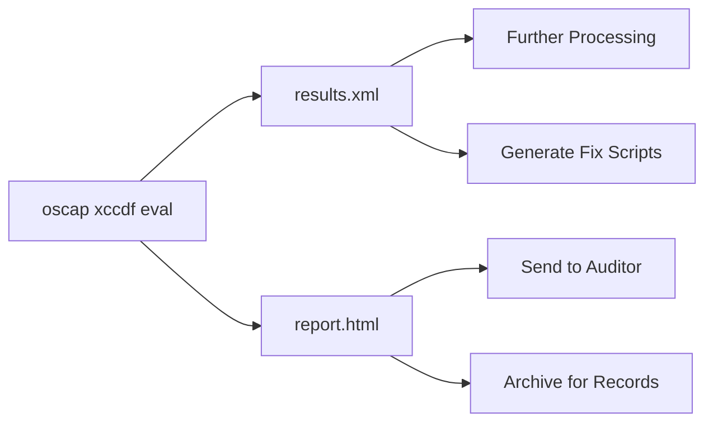

# How to Generate CIS Compliance Reports for RHEL Using oscap

Author: [nawazdhandala](https://www.github.com/nawazdhandala)

Tags: RHEL, CIS, oscap, Reporting, Linux

Description: Generate professional CIS compliance reports for RHEL using oscap, including HTML reports, XML results, and custom reporting for audit purposes.

---

When an auditor asks to see your CIS compliance status, handing them a well-formatted report goes a long way. oscap, the command-line interface for OpenSCAP, can generate detailed HTML reports that show exactly which CIS controls pass and which ones fail. These reports include rule descriptions, remediation guidance, and severity ratings, everything an auditor needs in one document.

## Prerequisites

```bash
# Install OpenSCAP and the SCAP Security Guide
dnf install -y openscap-scanner scap-security-guide

# Verify the RHEL datastream is available
ls -la /usr/share/xml/scap/ssg/content/ssg-rhel9-ds.xml
```

## Generate a Basic HTML Report

The simplest way to create a CIS compliance report:

```bash
# Run a CIS Level 1 scan with HTML report output
oscap xccdf eval \
  --profile xccdf_org.ssgproject.content_profile_cis_server_l1 \
  --results /var/log/compliance/cis-l1-results.xml \
  --report /var/log/compliance/cis-l1-report.html \
  /usr/share/xml/scap/ssg/content/ssg-rhel9-ds.xml
```

The HTML report is self-contained and can be opened in any browser. It includes a summary table, pass/fail counts, and detailed information for each rule.



## Generate Reports for Multiple Profiles

If your auditors need to see both Level 1 and Level 2 compliance:

```bash
# Create a report directory with date stamp
REPORT_DIR="/var/log/compliance/$(date +%Y%m%d)"
mkdir -p "$REPORT_DIR"

# CIS Level 1 Server
oscap xccdf eval \
  --profile xccdf_org.ssgproject.content_profile_cis_server_l1 \
  --results "${REPORT_DIR}/cis-l1-results.xml" \
  --report "${REPORT_DIR}/cis-l1-report.html" \
  /usr/share/xml/scap/ssg/content/ssg-rhel9-ds.xml || true

# CIS Level 2 Server
oscap xccdf eval \
  --profile xccdf_org.ssgproject.content_profile_cis \
  --results "${REPORT_DIR}/cis-l2-results.xml" \
  --report "${REPORT_DIR}/cis-l2-report.html" \
  /usr/share/xml/scap/ssg/content/ssg-rhel9-ds.xml || true

echo "Reports saved to: ${REPORT_DIR}"
ls -la "${REPORT_DIR}"
```

## Generate a Report from Existing Results

If you already have results XML from a previous scan, you can generate a new HTML report without re-scanning:

```bash
# Generate HTML from existing results
oscap xccdf generate report \
  --output /tmp/regenerated-report.html \
  /var/log/compliance/cis-l1-results.xml
```

## Extract a Summary from the Command Line

For quick checks without opening a browser:

```bash
# Get pass/fail counts from results XML
echo "=== CIS Level 1 Summary ==="
echo "Passed: $(grep -c 'result="pass"' /var/log/compliance/cis-l1-results.xml)"
echo "Failed: $(grep -c 'result="fail"' /var/log/compliance/cis-l1-results.xml)"
echo "Not Applicable: $(grep -c 'result="notapplicable"' /var/log/compliance/cis-l1-results.xml)"
echo "Not Checked: $(grep -c 'result="notchecked"' /var/log/compliance/cis-l1-results.xml)"
```

## Create Custom Summary Reports

Build a script that extracts the information you care about:

```bash
cat > /usr/local/bin/compliance-summary.sh << 'SCRIPT'
#!/bin/bash
# Generate a text-based compliance summary from oscap results

RESULTS_FILE="$1"
if [ -z "$RESULTS_FILE" ]; then
    echo "Usage: $0 <results.xml>"
    exit 1
fi

echo "========================================"
echo "Compliance Summary Report"
echo "Host: $(hostname)"
echo "Date: $(date)"
echo "========================================"
echo ""

PASS=$(grep -c 'result="pass"' "$RESULTS_FILE" 2>/dev/null || echo 0)
FAIL=$(grep -c 'result="fail"' "$RESULTS_FILE" 2>/dev/null || echo 0)
NA=$(grep -c 'result="notapplicable"' "$RESULTS_FILE" 2>/dev/null || echo 0)
NC=$(grep -c 'result="notchecked"' "$RESULTS_FILE" 2>/dev/null || echo 0)
TOTAL=$((PASS + FAIL + NA + NC))

echo "Total Rules: $TOTAL"
echo "Passed:      $PASS"
echo "Failed:      $FAIL"
echo "N/A:         $NA"
echo "Not Checked: $NC"
echo ""

if [ "$TOTAL" -gt 0 ]; then
    SCORE=$(( (PASS * 100) / (PASS + FAIL) ))
    echo "Compliance Score: ${SCORE}%"
fi

echo ""
echo "========================================"
echo "Failed Rules:"
echo "========================================"

# Extract failed rule titles from the results
oscap xccdf eval --profile "" "$RESULTS_FILE" 2>/dev/null | grep -B1 "fail" | grep "Title" || \
    echo "(Run oscap to list specific failures)"
SCRIPT
chmod +x /usr/local/bin/compliance-summary.sh
```

## Automate Report Generation and Distribution

Set up a weekly report that gets emailed to your team:

```bash
cat > /usr/local/bin/weekly-compliance-report.sh << 'SCRIPT'
#!/bin/bash
REPORT_DIR="/var/log/compliance"
DATE=$(date +%Y%m%d)
HOSTNAME=$(hostname -f)

mkdir -p "$REPORT_DIR"

# Run the scan
oscap xccdf eval \
  --profile xccdf_org.ssgproject.content_profile_cis_server_l1 \
  --results "${REPORT_DIR}/cis-${DATE}.xml" \
  --report "${REPORT_DIR}/cis-${DATE}.html" \
  /usr/share/xml/scap/ssg/content/ssg-rhel9-ds.xml 2>/dev/null || true

# Calculate scores
PASS=$(grep -c 'result="pass"' "${REPORT_DIR}/cis-${DATE}.xml")
FAIL=$(grep -c 'result="fail"' "${REPORT_DIR}/cis-${DATE}.xml")

# Send email summary
cat << MAIL | mail -s "CIS Compliance Report - ${HOSTNAME}" sysadmin@example.com
Weekly CIS Level 1 Compliance Report
Host: ${HOSTNAME}
Date: $(date)

Results:
  Passed: ${PASS}
  Failed: ${FAIL}

Full HTML report available at: ${REPORT_DIR}/cis-${DATE}.html
MAIL

# Clean up reports older than 90 days
find "$REPORT_DIR" -name "cis-*.html" -mtime +90 -delete
find "$REPORT_DIR" -name "cis-*.xml" -mtime +90 -delete
SCRIPT
chmod +x /usr/local/bin/weekly-compliance-report.sh

# Schedule with cron
echo "0 4 * * 1 root /usr/local/bin/weekly-compliance-report.sh" >> /etc/crontab
```

## Compare Reports Over Time

Track compliance improvement by comparing reports:

```bash
# Compare two scans to see what changed
echo "=== Compliance Trend ==="
for f in /var/log/compliance/cis-*.xml; do
    DATE=$(basename "$f" | sed 's/cis-//' | sed 's/.xml//')
    PASS=$(grep -c 'result="pass"' "$f" 2>/dev/null)
    FAIL=$(grep -c 'result="fail"' "$f" 2>/dev/null)
    echo "$DATE: ${PASS} passed, ${FAIL} failed"
done
```

## Generate ARF (Asset Reporting Format) Output

For integration with enterprise compliance tools, generate ARF output:

```bash
# Generate ARF results
oscap xccdf eval \
  --profile xccdf_org.ssgproject.content_profile_cis_server_l1 \
  --results-arf /var/log/compliance/cis-arf.xml \
  /usr/share/xml/scap/ssg/content/ssg-rhel9-ds.xml || true

# ARF files can be imported into tools like SCAP Workbench,
# Satellite, or other compliance management platforms
```

## Report Storage Best Practices

Keep your compliance reports organized and protected:

```bash
# Set proper permissions on the compliance directory
chmod 750 /var/log/compliance
chown root:root /var/log/compliance

# Create a rotation policy
cat > /etc/logrotate.d/compliance << 'EOF'
/var/log/compliance/*.xml /var/log/compliance/*.html {
    monthly
    rotate 12
    compress
    missingok
    notifempty
}
EOF
```

Good compliance reporting is about consistency and accessibility. Generate reports on a regular schedule, store them securely, and make them easy to find when an auditor comes knocking. oscap gives you all the tooling you need - the rest is just process.
