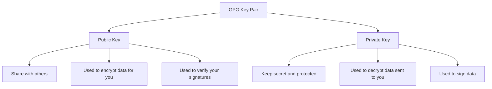

# How to Generate GPG Key Pairs on RHEL for File Encryption

Author: [nawazdhandala](https://www.github.com/nawazdhandala)

Tags: RHEL, GPG, Encryption, Key Generation, Security, Linux

Description: Generate GPG key pairs on RHEL for encrypting files, signing documents, and securing communications using modern cryptographic algorithms.

---

GPG (GNU Privacy Guard) is the open-source implementation of the OpenPGP standard, used for encrypting files, signing data, and managing cryptographic keys. On RHEL, GPG comes pre-installed and supports modern algorithms like Ed25519 and Curve25519. This guide walks through generating key pairs for file encryption.

## Understanding GPG Key Pairs



## Checking GPG Installation

```bash
# Verify GPG is installed
gpg --version

# Expected output includes version 2.3.x or later on RHEL
# Also shows supported algorithms
```

## Method 1: Interactive Key Generation

The simplest way to generate a key pair:

```bash
# Generate a new key pair with interactive prompts
gpg --full-generate-key
```

You will be prompted for:

1. **Key type**: Choose `(1) RSA and RSA` for compatibility or `(9) ECC and ECC` for modern security
2. **Key size**: For RSA, use 4096 bits. For ECC, choose Curve25519
3. **Expiration**: Set an expiration date (recommended: 1-2 years)
4. **Name and email**: Your real name and email address
5. **Passphrase**: A strong passphrase to protect the private key

## Method 2: Quick Key Generation

For a quick default key:

```bash
# Generate a key with default settings
gpg --generate-key
```

This creates an Ed25519 key (on RHEL) with a 2-year expiration.

## Method 3: Batch Key Generation

For automated or scripted key generation:

```bash
# Create a batch configuration file
cat > /tmp/gpg-key-batch.conf << 'EOF'
%no-protection
Key-Type: eddsa
Key-Curve: ed25519
Key-Usage: sign
Subkey-Type: ecdh
Subkey-Curve: cv25519
Subkey-Usage: encrypt
Name-Real: John Doe
Name-Email: john.doe@example.com
Expire-Date: 2y
%commit
EOF

# Generate the key from the batch file
gpg --batch --generate-key /tmp/gpg-key-batch.conf

# Clean up the batch file
rm /tmp/gpg-key-batch.conf
```

Note: The `%no-protection` directive creates a key without a passphrase. For production use, remove this line and set a passphrase interactively, or use `Passphrase: your-passphrase-here`.

For a passphrase-protected batch key:

```bash
cat > /tmp/gpg-key-batch.conf << 'EOF'
Key-Type: eddsa
Key-Curve: ed25519
Key-Usage: sign
Subkey-Type: ecdh
Subkey-Curve: cv25519
Subkey-Usage: encrypt
Name-Real: Server Backup Key
Name-Email: backup@example.com
Expire-Date: 1y
Passphrase: your-strong-passphrase-here
%commit
EOF

gpg --batch --generate-key /tmp/gpg-key-batch.conf
rm /tmp/gpg-key-batch.conf
```

## Method 4: RSA Key Generation for Maximum Compatibility

If you need compatibility with older systems:

```bash
cat > /tmp/gpg-rsa-batch.conf << 'EOF'
Key-Type: RSA
Key-Length: 4096
Key-Usage: sign
Subkey-Type: RSA
Subkey-Length: 4096
Subkey-Usage: encrypt
Name-Real: Jane Smith
Name-Email: jane.smith@example.com
Expire-Date: 2y
Passphrase: your-strong-passphrase-here
%commit
EOF

gpg --batch --generate-key /tmp/gpg-rsa-batch.conf
rm /tmp/gpg-rsa-batch.conf
```

## Verifying Your New Key

```bash
# List all keys in your keyring
gpg --list-keys

# List keys with fingerprints
gpg --list-keys --fingerprint

# List secret (private) keys
gpg --list-secret-keys

# Show detailed key information
gpg --list-keys --keyid-format long
```

Sample output:

```bash
pub   ed25519/0x1234567890ABCDEF 2026-03-04 [SC] [expires: 2028-03-04]
      Key fingerprint = ABCD 1234 5678 90AB CDEF  1234 5678 90AB CDEF 1234
uid                   [ultimate] John Doe <john.doe@example.com>
sub   cv25519/0xFEDCBA0987654321 2026-03-04 [E] [expires: 2028-03-04]
```

## Exporting Your Public Key

Share your public key with others so they can encrypt files for you:

```bash
# Export to a text file (ASCII-armored)
gpg --armor --export john.doe@example.com > john-doe-public.asc

# Export to a binary file
gpg --export john.doe@example.com > john-doe-public.gpg

# View the exported key
cat john-doe-public.asc
```

## Exporting Your Private Key (Backup)

Back up your private key securely:

```bash
# Export the private key (ASCII-armored)
gpg --armor --export-secret-keys john.doe@example.com > john-doe-private.asc

# Store the backup securely and then delete the export
# NEVER leave private key exports on disk unprotected
```

## Generating a Revocation Certificate

Create a revocation certificate immediately after generating your key. You will need this if your key is ever compromised:

```bash
# Generate a revocation certificate
gpg --gen-revoke john.doe@example.com > john-doe-revoke.asc

# Store this certificate securely, separate from the key
# If your key is compromised, import this certificate to revoke it
```

## Adding Entropy for Key Generation

GPG key generation requires random data. If you are on a server with low entropy:

```bash
# Check available entropy
cat /proc/sys/kernel/random/entropy_avail

# Install rng-tools if entropy is low
sudo dnf install rng-tools
sudo systemctl enable --now rngd

# Verify entropy increased
cat /proc/sys/kernel/random/entropy_avail
```

## Key Algorithm Recommendations

| Use Case | Algorithm | Why |
|----------|-----------|-----|
| Modern systems | Ed25519 + Curve25519 | Fast, small keys, strong security |
| Maximum compatibility | RSA 4096 | Works with older GPG versions |
| Government/compliance | RSA 4096 or NIST P-384 | Meets FIPS requirements |

## Best Practices

1. **Always set an expiration date.** You can extend it later, but having one limits damage if the key is compromised.
2. **Use a strong passphrase.** The passphrase protects your private key at rest.
3. **Back up your private key and revocation certificate** to secure offline storage.
4. **Generate separate subkeys** for signing and encryption (the default behavior).
5. **Publish your public key** to a keyserver or share it directly with collaborators.

## Summary

Generating GPG key pairs on RHEL is straightforward with the `gpg --full-generate-key` command for interactive use or batch files for automation. Use Ed25519/Curve25519 for modern deployments or RSA 4096 for backward compatibility. Always create a revocation certificate, back up your private key securely, and set a key expiration date.
