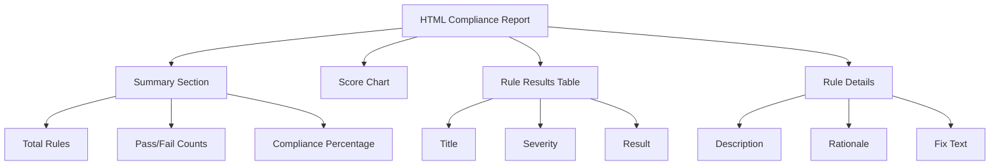

# How to Generate HTML Compliance Reports with oscap on RHEL 9

Author: [nawazdhandala](https://www.github.com/nawazdhandala)

Tags: RHEL, oscap, HTML Reports, Compliance, Linux

Description: Generate professional HTML compliance reports using oscap on RHEL 9, with tips for customization, automation, and distribution to auditors.

---

A well-formatted compliance report can save hours of back-and-forth with auditors. The oscap tool on RHEL 9 generates self-contained HTML reports that include everything an auditor needs: which rules passed, which failed, what the expected configuration is, and how to fix the failures. This guide covers all the report generation options and how to make the most of them.

## Generate a Basic HTML Report

```bash
# Install prerequisites
dnf install -y openscap-scanner scap-security-guide

# Generate an HTML report during a compliance scan
oscap xccdf eval \
  --profile xccdf_org.ssgproject.content_profile_stig \
  --results /var/log/compliance/results.xml \
  --report /var/log/compliance/report.html \
  /usr/share/xml/scap/ssg/content/ssg-rhel9-ds.xml || true
```

The `--report` flag creates the HTML file, and the `--results` flag creates an XML file with structured data you can process further.

## Regenerate Reports from Existing Results

You do not need to re-scan to create a new report. If you already have results XML:

```bash
# Generate HTML from existing results
oscap xccdf generate report \
  --output /var/log/compliance/new-report.html \
  /var/log/compliance/results.xml
```

This is useful when you want to share a report without running another scan.

## What the HTML Report Contains

The report includes several sections:



## Generate Reports for Different Profiles

```bash
# Create a report directory
REPORT_DIR="/var/log/compliance/$(date +%Y%m%d)"
mkdir -p "$REPORT_DIR"

# STIG report
oscap xccdf eval \
  --profile xccdf_org.ssgproject.content_profile_stig \
  --results "${REPORT_DIR}/stig-results.xml" \
  --report "${REPORT_DIR}/stig-report.html" \
  /usr/share/xml/scap/ssg/content/ssg-rhel9-ds.xml || true

# CIS Level 1 report
oscap xccdf eval \
  --profile xccdf_org.ssgproject.content_profile_cis_server_l1 \
  --results "${REPORT_DIR}/cis-l1-results.xml" \
  --report "${REPORT_DIR}/cis-l1-report.html" \
  /usr/share/xml/scap/ssg/content/ssg-rhel9-ds.xml || true

# PCI-DSS report
oscap xccdf eval \
  --profile xccdf_org.ssgproject.content_profile_pci-dss \
  --results "${REPORT_DIR}/pci-dss-results.xml" \
  --report "${REPORT_DIR}/pci-dss-report.html" \
  /usr/share/xml/scap/ssg/content/ssg-rhel9-ds.xml || true

echo "Reports saved to: $REPORT_DIR"
ls -la "$REPORT_DIR"
```

## Generate ARF Reports

Asset Reporting Format (ARF) is a standardized format for compliance data exchange:

```bash
# Generate ARF output (combines results with system information)
oscap xccdf eval \
  --profile xccdf_org.ssgproject.content_profile_stig \
  --results-arf /var/log/compliance/stig-arf.xml \
  /usr/share/xml/scap/ssg/content/ssg-rhel9-ds.xml || true

# Generate HTML from ARF
oscap xccdf generate report \
  --output /var/log/compliance/stig-arf-report.html \
  /var/log/compliance/stig-arf.xml
```

## Automate Report Generation

```bash
# Create a comprehensive reporting script
cat > /usr/local/bin/generate-compliance-reports.sh << 'SCRIPT'
#!/bin/bash
DATE=$(date +%Y%m%d)
HOSTNAME=$(hostname -s)
REPORT_DIR="/var/log/compliance/${DATE}"
CONTENT="/usr/share/xml/scap/ssg/content/ssg-rhel9-ds.xml"

mkdir -p "$REPORT_DIR"

echo "Generating compliance reports for ${HOSTNAME}..."

# Define profiles to scan
declare -A PROFILES
PROFILES[stig]="xccdf_org.ssgproject.content_profile_stig"
PROFILES[cis-l1]="xccdf_org.ssgproject.content_profile_cis_server_l1"
PROFILES[pci-dss]="xccdf_org.ssgproject.content_profile_pci-dss"

# Generate summary file
SUMMARY="${REPORT_DIR}/summary.txt"
echo "Compliance Report Summary" > "$SUMMARY"
echo "=========================" >> "$SUMMARY"
echo "Host: ${HOSTNAME}" >> "$SUMMARY"
echo "Date: $(date)" >> "$SUMMARY"
echo "RHEL: $(cat /etc/redhat-release)" >> "$SUMMARY"
echo "" >> "$SUMMARY"

for PROFILE_NAME in "${!PROFILES[@]}"; do
    PROFILE_ID="${PROFILES[$PROFILE_NAME]}"

    oscap xccdf eval \
      --profile "$PROFILE_ID" \
      --results "${REPORT_DIR}/${PROFILE_NAME}-results.xml" \
      --report "${REPORT_DIR}/${PROFILE_NAME}-report.html" \
      "$CONTENT" 2>/dev/null || true

    PASS=$(grep -c 'result="pass"' "${REPORT_DIR}/${PROFILE_NAME}-results.xml" 2>/dev/null || echo 0)
    FAIL=$(grep -c 'result="fail"' "${REPORT_DIR}/${PROFILE_NAME}-results.xml" 2>/dev/null || echo 0)
    TOTAL=$((PASS + FAIL))
    [ "$TOTAL" -gt 0 ] && SCORE=$((PASS * 100 / TOTAL)) || SCORE=0

    echo "${PROFILE_NAME}: ${PASS} pass, ${FAIL} fail (${SCORE}%)" >> "$SUMMARY"
done

echo "" >> "$SUMMARY"
echo "Reports available in: ${REPORT_DIR}" >> "$SUMMARY"

cat "$SUMMARY"
SCRIPT
chmod +x /usr/local/bin/generate-compliance-reports.sh
```

## Distribute Reports

### Email reports to stakeholders

```bash
# Send the summary via email
cat /var/log/compliance/$(date +%Y%m%d)/summary.txt | \
  mail -s "Compliance Report - $(hostname) - $(date +%Y%m%d)" compliance-team@example.com
```

### Serve reports via web server

```bash
# If you have Apache installed
ln -s /var/log/compliance /var/www/html/compliance
# Reports accessible at: http://server/compliance/

# Restrict access with basic auth
cat > /var/www/html/compliance/.htaccess << 'EOF'
AuthType Basic
AuthName "Compliance Reports"
AuthUserFile /etc/httpd/.htpasswd
Require valid-user
EOF

htpasswd -c /etc/httpd/.htpasswd auditor
```

## Report Retention

```bash
# Keep reports for the required retention period
# Most frameworks require 1-3 years

# Create a rotation policy
cat > /etc/cron.monthly/compliance-cleanup << 'SCRIPT'
#!/bin/bash
# Remove compliance reports older than 3 years
find /var/log/compliance -type d -name "20*" -mtime +1095 -exec rm -rf {} +
SCRIPT
chmod +x /etc/cron.monthly/compliance-cleanup
```

## Protect Report Files

```bash
# Set appropriate permissions on compliance data
chmod 750 /var/log/compliance
chown root:root /var/log/compliance
find /var/log/compliance -type f -exec chmod 640 {} +
```

Good compliance reporting is about making the auditor's job easy. Generate reports regularly, keep them organized by date, and maintain a summary that shows your compliance trend over time. When the audit comes, you will have everything ready.
