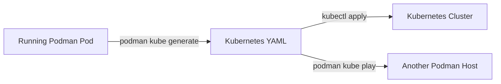

# How to Generate Kubernetes YAML from Podman Pods on RHEL

Author: [nawazdhandala](https://www.github.com/nawazdhandala)

Tags: RHEL, Podman, Kubernetes, YAML, Linux

Description: Learn how to use podman kube generate to export running Podman pods and containers as Kubernetes-compatible YAML manifests on RHEL.

---

One of the best development workflows with Podman is prototyping locally and then exporting to Kubernetes. You get your containers running exactly right on your RHEL workstation, then run `podman kube generate` to produce Kubernetes YAML that you can deploy to a cluster. It saves a lot of manual YAML writing.

## Basic YAML Generation from a Container

Start simple with a single container:

## Run a container
```bash
podman run -d --name web -p 8080:80 docker.io/library/nginx:latest
```

## Generate Kubernetes YAML from the running container
```bash
podman kube generate web
```

This outputs a Pod manifest to stdout. Save it to a file:

```bash
podman kube generate web > web-pod.yaml
```

## View the generated YAML
```bash
cat web-pod.yaml
```

## Generating YAML from a Pod

Pods with multiple containers produce more useful output:

## Create a pod with multiple containers
```bash
podman pod create --name app-stack -p 8080:80

podman run -d --pod app-stack --name web \
  docker.io/library/nginx:latest

podman run -d --pod app-stack --name api \
  -e API_PORT=3000 \
  registry.access.redhat.com/ubi9/ubi-minimal \
  sleep infinity
```

## Generate YAML for the entire pod
```bash
podman kube generate app-stack > app-stack.yaml
```

The generated YAML includes all containers, environment variables, port mappings, and volume mounts.



## Understanding the Generated Output

Here is what a typical generated Pod YAML looks like:

```yaml
apiVersion: v1
kind: Pod
metadata:
  labels:
    app: app-stack
  name: app-stack
spec:
  containers:
  - name: web
    image: docker.io/library/nginx:latest
    ports:
    - containerPort: 80
      hostPort: 8080
  - name: api
    image: registry.access.redhat.com/ubi9/ubi-minimal
    command:
    - sleep
    - infinity
    env:
    - name: API_PORT
      value: "3000"
```

## Including Volumes

Volumes are captured in the generated YAML:

## Create a container with volumes
```bash
podman volume create web-data

podman run -d --name persistent-web \
  -p 8080:80 \
  -v web-data:/usr/share/nginx/html:Z \
  docker.io/library/nginx:latest
```

## Generate YAML with volume definitions
```bash
podman kube generate persistent-web > persistent-web.yaml
```

The YAML will include a PersistentVolumeClaim for the named volume.

## Generating Deployment YAML

By default, `podman kube generate` creates Pod manifests. For Deployments:

## Generate a Deployment instead of a Pod
```bash
podman kube generate --type deployment web > web-deployment.yaml
```

This wraps the pod spec in a Deployment with replicas:

```yaml
apiVersion: apps/v1
kind: Deployment
metadata:
  labels:
    app: web
  name: web
spec:
  replicas: 1
  selector:
    matchLabels:
      app: web
  template:
    metadata:
      labels:
        app: web
    spec:
      containers:
      - name: web
        image: docker.io/library/nginx:latest
        ports:
        - containerPort: 80
```

## Generating Service YAML

Include a Service definition with your pod:

## Generate YAML with a Service
```bash
podman kube generate --service web > web-with-service.yaml
```

This adds a Kubernetes Service that exposes the pod's ports.

## Environment Variables and Secrets

Environment variables are included in the generated YAML:

```bash
podman run -d --name app \
  -e DATABASE_URL=postgres://db:5432/myapp \
  -e SECRET_KEY=my-secret-value \
  registry.access.redhat.com/ubi9/ubi-minimal \
  sleep infinity
```

```bash
podman kube generate app > app.yaml
```

Note that sensitive environment variables will be in plain text in the YAML. Before deploying to Kubernetes, convert them to Kubernetes Secrets manually.

## Editing Generated YAML

The generated YAML is a starting point. You will typically need to:

1. **Add resource limits** that were runtime-only:
```yaml
resources:
  limits:
    memory: "512Mi"
    cpu: "500m"
  requests:
    memory: "256Mi"
    cpu: "250m"
```

2. **Add health checks:**
```yaml
livenessProbe:
  httpGet:
    path: /
    port: 80
  initialDelaySeconds: 10
  periodSeconds: 30
```

3. **Convert environment variables to ConfigMaps/Secrets.**

4. **Add proper labels and annotations.**

## Validating Generated YAML

Before deploying, validate the YAML:

## Dry-run against a Kubernetes cluster
```bash
kubectl apply --dry-run=client -f web-pod.yaml
```

## Validate YAML syntax
```bash
python3 -c "import yaml; yaml.safe_load(open('web-pod.yaml'))"
```

## Test with podman kube play locally
```bash
podman kube play web-pod.yaml
podman kube down web-pod.yaml
```

## Workflow: Develop Locally, Deploy to Kubernetes

Here is the complete workflow:

```bash
# 1. Develop and test locally with Podman
podman pod create --name myapp -p 8080:80
podman run -d --pod myapp --name web docker.io/library/nginx:latest
podman run -d --pod myapp --name api my-api:latest

# 2. Test that everything works
curl http://localhost:8080

# 3. Generate Kubernetes YAML
podman kube generate myapp > myapp-k8s.yaml

# 4. Edit the YAML for production (add limits, probes, etc.)
vi myapp-k8s.yaml

# 5. Deploy to Kubernetes
kubectl apply -f myapp-k8s.yaml

# 6. Clean up local pod
podman pod rm -f myapp
```

## Generating from Multiple Containers

Generate YAML for multiple standalone containers at once:

```bash
podman kube generate container1 container2 container3 > multi.yaml
```

Each container gets its own Pod manifest in the output.

## Round-Trip Testing

Verify your YAML works by playing it back:

```bash
# Generate YAML
podman kube generate app-stack > app-stack.yaml

# Tear down the original
podman pod rm -f app-stack

# Recreate from YAML
podman kube play app-stack.yaml

# Verify everything works the same
podman pod ps
podman ps
```

## Summary

`podman kube generate` bridges the gap between local Podman development and Kubernetes deployment on RHEL. Build and test your containers locally, generate the YAML, refine it for production with proper resource limits and health checks, then deploy to your cluster. It is not a replacement for writing Kubernetes manifests from scratch for complex deployments, but it is an excellent starting point that saves time and reduces errors.
