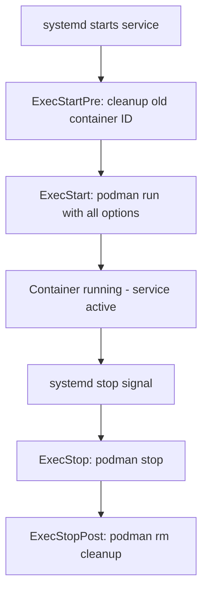

# How to Generate systemd Unit Files for Podman Containers on RHEL 9

Author: [nawazdhandala](https://www.github.com/nawazdhandala)

Tags: RHEL, Podman, systemd, Unit Files, Linux

Description: Learn how to generate systemd unit files from running Podman containers on RHEL 9 for automatic service management, startup on boot, and proper lifecycle handling.

---

While Quadlet is the newer and recommended approach, `podman generate systemd` is still widely used and remains a valid way to create systemd unit files for your containers. This is especially handy when you already have a running container configured exactly how you want it and need to turn it into a service quickly.

Note that `podman generate systemd` has been deprecated in favor of Quadlet, but it still works on RHEL 9 and many production environments rely on it.

## Creating a Container to Generate From

First, set up a container the way you want it to run as a service:

# Run a web server container
```bash
podman run -d --name webserver \
  -p 8080:80 \
  -v web-content:/usr/share/nginx/html:Z \
  docker.io/library/nginx:latest
```

# Verify it is running and working
```bash
podman ps
curl http://localhost:8080
```

## Generating the systemd Unit File

# Generate a unit file from the running container
```bash
podman generate systemd --name webserver
```

This prints the unit file to stdout. To save it:

# Generate and save the unit file
```bash
podman generate systemd --name webserver --files
```

This creates a file named `container-webserver.service` in the current directory.

## Key Generation Options

```bash
# Generate with restart policy
podman generate systemd --name webserver --restart-policy=always --files

# Generate with a specific stop timeout
podman generate systemd --name webserver --stop-timeout 30 --files

# Generate a new container each time (recommended)
podman generate systemd --name webserver --new --files

# Generate with dependencies on other services
podman generate systemd --name webserver --after network-online.target --files
```

The `--new` flag is important. Without it, the unit file uses `podman start/stop` on an existing container. With `--new`, it creates a fresh container each time the service starts, which is cleaner and more reproducible.

## Understanding the Generated Unit File

Here is what a typical generated unit file looks like:

```ini
[Unit]
Description=Podman container-webserver.service
Documentation=man:podman-generate-systemd(1)
Wants=network-online.target
After=network-online.target
RequiresMountsFor=%t/containers

[Service]
Environment=PODMAN_SYSTEMD_UNIT=%n
Restart=on-failure
TimeoutStopSec=70
ExecStartPre=/bin/rm -f %t/%n.ctr-id
ExecStart=/usr/bin/podman run \
    --cidfile=%t/%n.ctr-id \
    --cgroups=no-conmon \
    --rm \
    --sdnotify=conmon \
    -d \
    --replace \
    --name webserver \
    -p 8080:80 \
    -v web-content:/usr/share/nginx/html:Z \
    docker.io/library/nginx:latest
ExecStop=/usr/bin/podman stop --ignore --cidfile=%t/%n.ctr-id
ExecStopPost=/usr/bin/podman rm -f --ignore --cidfile=%t/%n.ctr-id
Type=notify
NotifyAccess=all

[Install]
WantedBy=default.target
```



## Installing Rootless Unit Files

For rootless containers (running as your regular user):

# Create the user systemd directory
```bash
mkdir -p ~/.config/systemd/user/
```

# Copy the generated unit file
```bash
cp container-webserver.service ~/.config/systemd/user/
```

# Reload the user systemd daemon
```bash
systemctl --user daemon-reload
```

# Start and enable the service
```bash
systemctl --user start container-webserver.service
systemctl --user enable container-webserver.service
```

# Check the status
```bash
systemctl --user status container-webserver.service
```

## Installing Rootful Unit Files

For system-level services:

# Generate the unit file as root
```bash
sudo podman generate systemd --name webserver --new --files
```

# Copy to the systemd system directory
```bash
sudo cp container-webserver.service /etc/systemd/system/
```

# Reload and enable
```bash
sudo systemctl daemon-reload
sudo systemctl enable --now container-webserver.service
```

## Enabling Lingering for Rootless Services

Rootless services stop when the user logs out unless lingering is enabled:

# Enable lingering for your user
```bash
sudo loginctl enable-linger $USER
```

# Verify
```bash
loginctl show-user $USER --property=Linger
```

Without this, your container services will stop as soon as you log out of the system.

## Generating Unit Files for Pods

You can also generate unit files for entire pods:

# Create a pod with containers
```bash
podman pod create --name app-pod -p 8080:80
podman run -d --pod app-pod --name web docker.io/library/nginx:latest
podman run -d --pod app-pod --name sidecar registry.access.redhat.com/ubi9/ubi-minimal sleep infinity
```

# Generate unit files for the entire pod
```bash
podman generate systemd --name app-pod --new --files
```

This creates multiple unit files:
- `pod-app-pod.service` for the pod itself
- `container-web.service` for the web container
- `container-sidecar.service` for the sidecar

The container services have dependencies on the pod service, so they start and stop in the right order.

## Managing the Service

Once installed, manage it like any systemd service:

```bash
# View logs
journalctl --user -u container-webserver.service -f

# Restart the service
systemctl --user restart container-webserver.service

# Stop the service
systemctl --user stop container-webserver.service

# Disable auto-start
systemctl --user disable container-webserver.service
```

## Updating the Container Image

When you need to update the container image:

```bash
# Pull the latest image
podman pull docker.io/library/nginx:latest

# Restart the service (if using --new, it recreates with the latest image)
systemctl --user restart container-webserver.service
```

If you generated without `--new`, you need to stop the service, remove the old container, create a new one, and regenerate the unit file.

## Migrating to Quadlet

Since `podman generate systemd` is deprecated, consider migrating to Quadlet:

```bash
# The equivalent Quadlet file for the above example
cat > ~/.config/containers/systemd/webserver.container << 'EOF'
[Unit]
Description=Nginx Web Server

[Container]
Image=docker.io/library/nginx:latest
PublishPort=8080:80
Volume=web-content:/usr/share/nginx/html:Z

[Service]
Restart=always

[Install]
WantedBy=default.target
EOF
```

The Quadlet version is shorter, easier to read, and does not hardcode the podman binary path or specific flags.

## Summary

`podman generate systemd` is a quick way to turn a running container into a systemd service. Use the `--new` flag so the container is recreated each time for reproducibility. While this approach still works fine on RHEL 9, new deployments should consider using Quadlet instead, as it is the direction Red Hat is heading.
