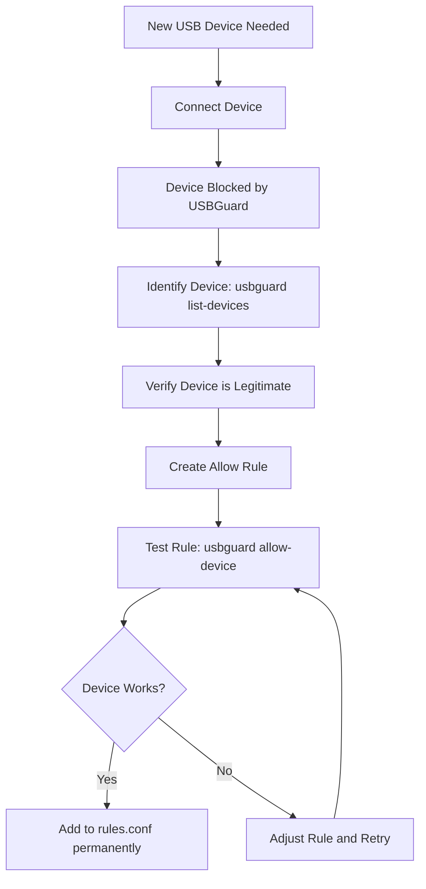

# How to Generate a USBGuard Device Whitelist Policy on RHEL

Author: [nawazdhandala](https://www.github.com/nawazdhandala)

Tags: RHEL, USBGuard, Whitelist, Security, Linux

Description: Generate and manage a USBGuard whitelist policy on RHEL that allows only approved USB devices while blocking unauthorized peripherals.

---

A well-crafted USBGuard whitelist is the foundation of USB security on RHEL. The idea is simple: allow specific, known devices and block everything else. Getting the initial whitelist right prevents both security incidents and user frustration from blocked legitimate devices.

## Starting with Auto-Generated Policy

The easiest way to create your initial whitelist is to generate it from currently connected devices:

```bash
# Generate policy from current USB devices
sudo usbguard generate-policy
```

This outputs rules for every USB device currently connected. Review the output before saving it:

```bash
# Generate and save to the rules file
sudo usbguard generate-policy > /etc/usbguard/rules.conf
```

## Understanding the Generated Rules

Each rule in the generated policy describes one USB device. Here is an example:

```
allow id 1d6b:0002 serial "0000:00:14.0" name "xHCI Host Controller" hash "jEP/6WzviqdJ5VSeTUY8PatCNBKeaREvo2OqdplND/o=" parent-hash "G1ehGQdrl3dJ9HvW9w2HdC//pk9BwTEXKEAoahGRthI=" with-interface 09:00:00 with-connect-type ""
```

Breaking this down:

| Field | Value | Purpose |
|-------|-------|---------|
| `id` | 1d6b:0002 | Vendor:Product ID |
| `serial` | "0000:00:14.0" | Device serial number |
| `name` | "xHCI Host Controller" | Human-readable name |
| `hash` | "jEP/..." | Hash of device attributes |
| `parent-hash` | "G1eh..." | Hash of parent device |
| `with-interface` | 09:00:00 | USB interface class |
| `with-connect-type` | "" | How device is connected |

## Building a Whitelist by Device Class

Instead of whitelisting individual devices, you can whitelist entire device classes. This is useful when you want to allow, for example, all USB keyboards from a specific vendor:

```bash
# Allow all USB mass storage devices from a specific vendor
echo 'allow id 0781:* with-interface 08:*:*' | sudo tee -a /etc/usbguard/rules.conf

# Allow all HID (keyboard/mouse) devices
echo 'allow with-interface 03:*:*' | sudo tee -a /etc/usbguard/rules.conf
```

Common USB interface classes:

| Class Code | Description |
|------------|-------------|
| 01 | Audio |
| 02 | Communications (CDC) |
| 03 | HID (keyboard, mouse) |
| 07 | Printer |
| 08 | Mass Storage |
| 09 | Hub |
| 0e | Video |
| e0 | Wireless Controller |
| ff | Vendor Specific |

## Creating a Minimal Whitelist for Servers

Servers typically only need internal USB controllers:

```bash
# Start with a clean rules file
sudo cp /dev/null /etc/usbguard/rules.conf

# Allow only internal USB host controllers
sudo usbguard generate-policy | grep "Host Controller" | sudo tee /etc/usbguard/rules.conf

# Block everything else (set in daemon config)
sudo sed -i 's/^ImplicitPolicyTarget=.*/ImplicitPolicyTarget=block/' /etc/usbguard/usbguard-daemon.conf
```

## Creating a Workstation Whitelist

Workstations need more flexibility. Allow keyboards, mice, and specific approved devices:

```bash
# Create a workstation policy
sudo tee /etc/usbguard/rules.conf << 'EOF'
# Allow internal USB controllers
allow id 1d6b:* name "xHCI Host Controller" with-interface 09:00:00

# Allow internal USB hubs
allow id 1d6b:* with-interface 09:00:00

# Allow HID devices (keyboards and mice)
allow with-interface 03:00:01
allow with-interface 03:01:01
allow with-interface 03:01:02

# Allow specific approved USB drives by vendor:product ID
allow id 0781:5567 name "Cruzer Blade"
allow id 0951:1666 name "DataTraveler 3.0"

# Block everything else via ImplicitPolicyTarget=block
EOF
```

## Adding Devices to the Whitelist

When a new legitimate device needs to be added:

```bash
# Plug in the device, then find it in the blocked list
sudo usbguard list-devices | grep block

# Note the device details and create a rule
# Example output: 15: block id 046d:c52b ...

# Allow it permanently
sudo usbguard append-rule 'allow id 046d:c52b name "Unifying Receiver"'

# Verify the rule was added
sudo usbguard list-rules
```

## Whitelist Management Workflow



## Using Hash-Based Rules for Maximum Security

For the strictest security, use device hashes. This ensures only the exact physical device is allowed, not just any device with the same vendor/product IDs:

```bash
# Get the hash of a specific device
sudo usbguard list-devices -b

# Create a hash-based rule
echo 'allow hash "jEP/6WzviqdJ5VSeTUY8PatCNBKeaREvo2OqdplND/o="' | sudo tee -a /etc/usbguard/rules.conf
```

Hash-based rules prevent spoofed devices that fake vendor/product IDs from being accepted.

## Exporting and Importing Policies

For deploying the same policy across multiple systems:

```bash
# Export the current policy
sudo cat /etc/usbguard/rules.conf > /tmp/usbguard-policy-export.conf

# Import on another system
sudo cp /tmp/usbguard-policy-export.conf /etc/usbguard/rules.conf
sudo systemctl restart usbguard
```

## Auditing Your Whitelist

Periodically review the whitelist to ensure it is still appropriate:

```bash
# List all current rules with their numbers
sudo usbguard list-rules

# Remove a rule that is no longer needed
sudo usbguard remove-rule 5
```

Keep the whitelist as small as possible. Every allowed device is a potential attack surface. Remove rules for devices that are no longer used or needed.

## Testing the Whitelist

After creating or modifying the whitelist, test it:

```bash
# Restart USBGuard with the new policy
sudo systemctl restart usbguard

# Verify all expected devices are allowed
sudo usbguard list-devices

# Try plugging in an unapproved device to confirm it is blocked
sudo usbguard list-devices | grep block
```

A solid whitelist takes some initial effort to build but provides ongoing protection with minimal maintenance. Review it during regular security audits and update it as hardware changes.
