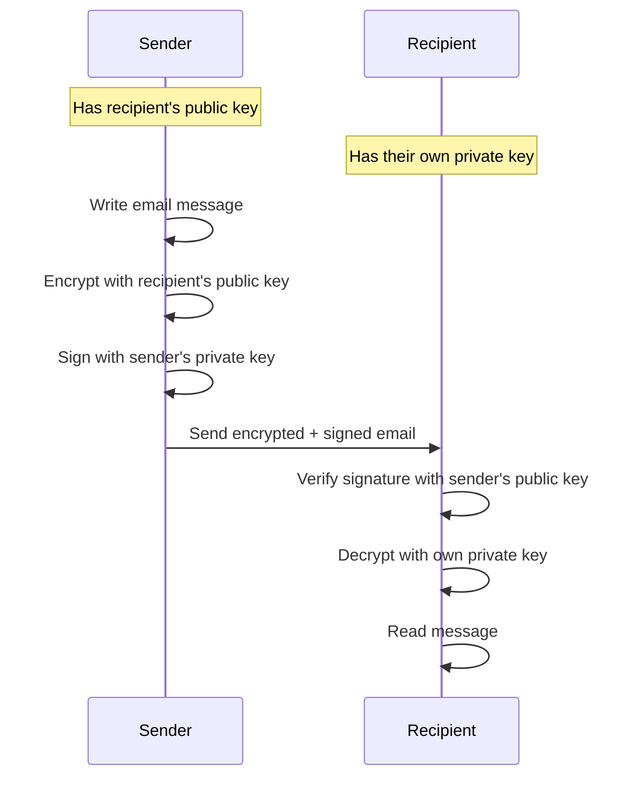

# How to Set Up GPG-Based Email Encryption on RHEL

Author: [nawazdhandala](https://www.github.com/nawazdhandala)

Tags: RHEL, GPG, Email Encryption, Mutt, Security, Linux

Description: Configure GPG-based email encryption on RHEL using command-line email clients to send and receive encrypted and signed messages.

---

GPG email encryption protects the contents of your messages from being read by anyone other than the intended recipients. On RHEL, you can set up GPG-encrypted email using command-line tools, which is especially useful for server administrators who need to send sensitive information like credentials, keys, or alerts. This guide covers the setup process.

## How GPG Email Encryption Works



## Prerequisites

Ensure you have a GPG key pair:

```bash
# Check for existing keys
gpg --list-secret-keys

# If no keys exist, generate one
gpg --full-generate-key
```

Exchange public keys with your correspondents:

```bash
# Export your public key
gpg --armor --export your@email.com > your-public-key.asc

# Import a correspondent's public key
gpg --import correspondent-public-key.asc
```

## Method 1: Encrypting Email with Mutt

Mutt is a powerful command-line email client with built-in GPG support.

### Install and Configure Mutt

```bash
# Install mutt
sudo dnf install mutt

# Create the mutt configuration directory
mkdir -p ~/.mutt
```

### Configure GPG Integration

```bash
cat > ~/.mutt/gpg.rc << 'EOF'
# GPG configuration for Mutt

# Decode application/pgp
set pgp_decode_command="gpg --status-fd=2 %?p?--passphrase-fd 0? --no-verbose --quiet --batch --output - %f"

# Verify a pgp/mime signature
set pgp_verify_command="gpg --status-fd=2 --no-verbose --quiet --batch --output - --verify %s %f"

# Decrypt a pgp/mime attachment
set pgp_decrypt_command="gpg --status-fd=2 %?p?--passphrase-fd 0? --no-verbose --quiet --batch --output - %f"

# Create a pgp/mime signed attachment
set pgp_sign_command="gpg --no-verbose --batch --quiet --output - %?p?--passphrase-fd 0? --armor --detach-sign --textmode %?a?-u %a? %f"

# Create a application/pgp signed (old-style) message
set pgp_clearsign_command="gpg --no-verbose --batch --quiet --output - %?p?--passphrase-fd 0? --armor --textmode --clearsign %?a?-u %a? %f"

# Create a pgp/mime encrypted attachment
set pgp_encrypt_only_command="/usr/lib/mutt/pgpewrap gpg --batch --quiet --no-verbose --output - --encrypt --textmode --armor --always-trust -- -r %r -- %f"

# Create a pgp/mime encrypted and signed attachment
set pgp_encrypt_sign_command="/usr/lib/mutt/pgpewrap gpg %?p?--passphrase-fd 0? --batch --quiet --no-verbose --textmode --output - --encrypt --sign %?a?-u %a? --armor --always-trust -- -r %r -- %f"

# Import a key into the public key ring
set pgp_import_command="gpg --no-verbose --import %f"

# Export a key from the public key ring
set pgp_export_command="gpg --no-verbose --export --armor %r"

# Verify a key
set pgp_verify_key_command="gpg --verbose --batch --fingerprint --check-sigs %r"

# Read in the public key ring
set pgp_list_pubring_command="gpg --no-verbose --batch --quiet --with-colons --list-keys %r"

# Read in the secret key ring
set pgp_list_secring_command="gpg --no-verbose --batch --quiet --with-colons --list-secret-keys %r"

# GPG key to use for signing
set pgp_default_key="your@email.com"

# Auto sign all outgoing messages
set crypt_autosign=yes

# Auto encrypt replies to encrypted messages
set crypt_replyencrypt=yes

# Auto sign replies to signed messages
set crypt_replysign=yes

# Verify signatures on received messages
set crypt_verify_sig=yes

# Use gpg-agent
set pgp_use_gpg_agent=yes

# Timeout for passphrase caching (in seconds)
set pgp_timeout=1800
EOF
```

### Add GPG Config to Main Mutt Configuration

```bash
cat >> ~/.muttrc << 'EOF'
# Source GPG configuration
source ~/.mutt/gpg.rc

# SMTP configuration (adjust for your mail server)
set smtp_url = "smtps://your@email.com@smtp.example.com:465/"
set smtp_pass = "your-password"
set from = "your@email.com"
set realname = "Your Name"
EOF
```

### Sending Encrypted Email with Mutt

```bash
# Compose and encrypt an email
mutt -s "Encrypted Message" -e "set crypt_autoencrypt=yes" recipient@example.com

# Send an encrypted email with an attachment
mutt -s "Encrypted with attachment" -e "set crypt_autoencrypt=yes" -a file.txt -- recipient@example.com
```

## Method 2: Encrypting Email from the Command Line

For quick encrypted messages without a full email client:

### Encrypt and Send with mail/mailx

```bash
# Encrypt a message and send it
echo "This is a secret message" | gpg --encrypt --armor --recipient recipient@example.com | \
    mail -s "Encrypted Message" recipient@example.com

# Encrypt a file and send it as an attachment
gpg --encrypt --armor --recipient recipient@example.com sensitive-report.txt
mail -s "Encrypted Report" -a sensitive-report.txt.asc recipient@example.com < /dev/null
```

### Sign and Encrypt

```bash
# Sign and encrypt a message
echo "Signed and encrypted message" | \
    gpg --sign --encrypt --armor --recipient recipient@example.com | \
    mail -s "Signed and Encrypted" recipient@example.com
```

## Method 3: Automated Encrypted Alerts

Set up a script to send encrypted alert emails:

```bash
#!/bin/bash
# /usr/local/bin/send-encrypted-alert.sh
# Send an encrypted alert email

RECIPIENT="admin@example.com"
SUBJECT="$1"
MESSAGE="$2"

if [ -z "$SUBJECT" ] || [ -z "$MESSAGE" ]; then
    echo "Usage: $0 'subject' 'message'"
    exit 1
fi

echo "$MESSAGE" | gpg --encrypt --armor --trust-model always --recipient "$RECIPIENT" | \
    mail -s "[ENCRYPTED] $SUBJECT" "$RECIPIENT"
```

Usage:

```bash
sudo chmod +x /usr/local/bin/send-encrypted-alert.sh
/usr/local/bin/send-encrypted-alert.sh "Security Alert" "Unauthorized login detected on server-01"
```

## Decrypting Received Email

### From the Command Line

```bash
# Decrypt an encrypted message saved to a file
gpg --decrypt encrypted-message.asc

# Decrypt and save to a file
gpg --output decrypted-message.txt --decrypt encrypted-message.asc
```

### Verify a Signed Message

```bash
# Verify the signature on a signed message
gpg --verify signed-message.asc

# Verify a detached signature
gpg --verify signature.sig original-file.txt
```

## Publishing Your Public Key

Make your public key available so others can send you encrypted email:

```bash
# Upload to a keyserver
gpg --keyserver hkps://keys.openpgp.org --send-keys YOUR_KEY_ID

# Or host it on your web server
gpg --armor --export your@email.com > /var/www/html/pgp-key.asc
```

## Testing the Setup

```bash
# Send a test encrypted email to yourself
echo "This is a test of GPG email encryption" | \
    gpg --encrypt --armor --recipient your@email.com | \
    mail -s "GPG Test" your@email.com

# Check your mail and decrypt
mail
# Save the message to a file, then:
gpg --decrypt saved-message.asc
```

## Summary

GPG-based email encryption on RHEL can be set up using Mutt for a full-featured encrypted email experience, or with command-line tools for quick encrypted messages and automated alerts. The key steps are generating a GPG key pair, exchanging public keys with correspondents, and configuring your email client to use GPG for encryption and signing. This approach protects sensitive communications from being read by unauthorized parties.
