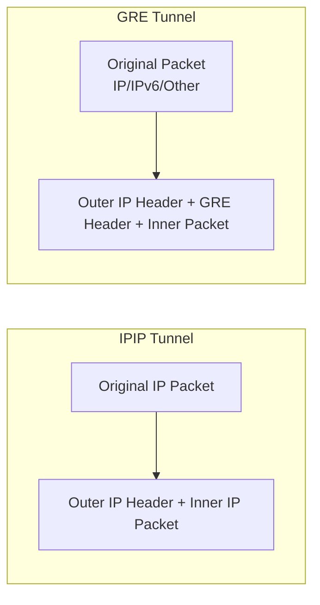

# How to Set Up GRE and IPIP Tunnels on RHEL 9

Author: [nawazdhandala](https://www.github.com/nawazdhandala)

Tags: RHEL, GRE, IPIP, Tunneling, Networking, Linux

Description: Learn how to create GRE and IPIP tunnels on RHEL 9 for encapsulating network traffic and connecting remote networks across the internet.

---

GRE (Generic Routing Encapsulation) and IPIP (IP-in-IP) tunnels encapsulate packets inside other packets, allowing you to create point-to-point connections between remote networks over the public internet. GRE supports multicast and multiple protocols, while IPIP is simpler with lower overhead.

## Tunnel Comparison



## Prerequisites

- Two RHEL 9 hosts with public or routable IP addresses
- Root or sudo access on both hosts

## Step 1: Create an IPIP Tunnel

On Host A (public IP: 203.0.113.1):

```bash
# Load the ipip kernel module
sudo modprobe ipip

# Create the IPIP tunnel interface
sudo ip tunnel add tun0 mode ipip \
    local 203.0.113.1 \
    remote 198.51.100.1

# Assign a tunnel endpoint IP
sudo ip addr add 10.10.10.1/30 dev tun0

# Bring the tunnel up
sudo ip link set tun0 up

# Add a route for the remote private network through the tunnel
sudo ip route add 192.168.2.0/24 dev tun0
```

On Host B (public IP: 198.51.100.1):

```bash
# Load the ipip kernel module
sudo modprobe ipip

# Create the matching tunnel
sudo ip tunnel add tun0 mode ipip \
    local 198.51.100.1 \
    remote 203.0.113.1

# Assign the other endpoint IP
sudo ip addr add 10.10.10.2/30 dev tun0

# Bring the tunnel up
sudo ip link set tun0 up

# Add a route for Host A's private network
sudo ip route add 192.168.1.0/24 dev tun0
```

## Step 2: Create a GRE Tunnel

On Host A:

```bash
# Load the GRE kernel module
sudo modprobe ip_gre

# Create a GRE tunnel
sudo ip tunnel add gre1 mode gre \
    local 203.0.113.1 \
    remote 198.51.100.1 \
    ttl 255

# Assign a tunnel IP
sudo ip addr add 10.20.20.1/30 dev gre1

# Bring the tunnel up
sudo ip link set gre1 up

# Route remote network through the tunnel
sudo ip route add 192.168.2.0/24 dev gre1
```

On Host B:

```bash
# Create the matching GRE tunnel
sudo ip tunnel add gre1 mode gre \
    local 198.51.100.1 \
    remote 203.0.113.1 \
    ttl 255

# Assign the other endpoint IP
sudo ip addr add 10.20.20.2/30 dev gre1

# Bring it up
sudo ip link set gre1 up

# Route Host A's network through the tunnel
sudo ip route add 192.168.1.0/24 dev gre1
```

## Step 3: Test Tunnel Connectivity

```bash
# From Host A, ping Host B through the tunnel
ping -c 4 10.10.10.2   # IPIP tunnel
ping -c 4 10.20.20.2   # GRE tunnel

# Check the tunnel interface statistics
ip -s link show tun0
ip -s link show gre1

# Trace the route through the tunnel
traceroute 10.20.20.2
```

## Step 4: Configure Firewall Rules

```bash
# Allow GRE protocol (protocol number 47)
sudo firewall-cmd --add-protocol=gre --permanent

# Allow IPIP protocol (protocol number 4)
sudo firewall-cmd --direct --add-rule ipv4 filter INPUT 0 -p 4 -j ACCEPT
sudo firewall-cmd --direct --add-rule ipv4 filter OUTPUT 0 -p 4 -j ACCEPT

# Reload firewall
sudo firewall-cmd --reload
```

## Step 5: Make Tunnels Persistent with nmcli

```bash
# Create a persistent GRE tunnel with NetworkManager
sudo nmcli connection add type ip-tunnel \
    con-name gre1 \
    ifname gre1 \
    ip-tunnel.mode gre \
    ip-tunnel.local 203.0.113.1 \
    ip-tunnel.remote 198.51.100.1 \
    ip-tunnel.ttl 255 \
    ipv4.addresses 10.20.20.1/30 \
    ipv4.method manual \
    connection.autoconnect yes

# Verify the connection
nmcli connection show gre1
```

## Step 6: GRE with a Key for Multi-Tunnel Support

```bash
# Create multiple GRE tunnels between the same hosts using keys
sudo ip tunnel add gre_prod mode gre \
    local 203.0.113.1 \
    remote 198.51.100.1 \
    key 100

sudo ip tunnel add gre_dev mode gre \
    local 203.0.113.1 \
    remote 198.51.100.1 \
    key 200

# Each tunnel is identified by its key, allowing multiple tunnels
# between the same pair of hosts
```

## Troubleshooting

```bash
# Check that the tunnel interface exists
ip tunnel show

# Capture encapsulated traffic
sudo tcpdump -i ens3 proto gre
sudo tcpdump -i ens3 proto 4  # For IPIP

# Check for MTU issues (tunnels add overhead)
ping -c 4 -M do -s 1400 10.20.20.2

# Adjust MTU if needed (GRE adds 24 bytes, IPIP adds 20)
sudo ip link set gre1 mtu 1476
sudo ip link set tun0 mtu 1480
```

## Summary

You have set up both GRE and IPIP tunnels on RHEL 9. IPIP tunnels are simpler and have less overhead but only support IPv4 unicast. GRE tunnels support multicast, multiple protocols, and can use keys to differentiate between multiple tunnels. Both types are useful for connecting remote networks across the internet without a full VPN solution.
