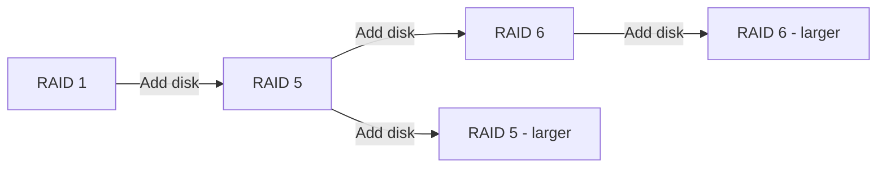

# How to Grow and Reshape an Existing mdadm RAID Array on RHEL

Author: [nawazdhandala](https://www.github.com/nawazdhandala)

Tags: RHEL, RAID, mdadm, Reshape, Linux

Description: Learn how to grow an mdadm RAID array by adding disks, changing RAID levels, or modifying chunk sizes on RHEL without losing data.

---

## Why Reshape?

Storage needs change. Maybe you started with a three-disk RAID 5 and now have a fourth disk to add. Or you want to migrate from RAID 5 to RAID 6 for better fault tolerance. mdadm supports online reshaping, which lets you modify a running array without destroying data.

Not every transformation is possible, and some come with risks, but the capability to grow an array without downtime is incredibly valuable.

## Prerequisites

- An existing mdadm RAID array on RHEL
- Sufficient free space for the reshape operation (mdadm uses a backup file)
- A backup of your data (always back up before reshaping)

## Growing a RAID 5 Array by Adding a Disk

The most common reshape is adding a disk to increase capacity.

```bash
# Check current array status
sudo mdadm --detail /dev/md5

# Wipe the new disk
sudo wipefs -a /dev/sde

# Add the new disk to the array
sudo mdadm --manage /dev/md5 --add /dev/sde
```

At this point, the disk is a spare. Now tell mdadm to grow the array:

```bash
# Grow the RAID 5 array from 3 to 4 active devices
sudo mdadm --grow /dev/md5 --raid-devices=4 --backup-file=/root/md5-backup
```

The `--backup-file` is critical. During reshape, there is a brief window where data could be lost if the system crashes. The backup file protects against this.

```bash
# Monitor the reshape progress
watch cat /proc/mdstat
```

Reshaping can take hours depending on array size. The array remains fully accessible during the process.

## Expanding the Filesystem After Growing

After the reshape finishes, the array is larger, but the filesystem still occupies the old size.

```bash
# For XFS (grows online, no unmount needed)
sudo xfs_growfs /mnt/raid5

# For ext4
sudo resize2fs /dev/md5
```

## Changing RAID Levels

mdadm can convert between certain RAID levels online.

### RAID 5 to RAID 6

```bash
# Convert RAID 5 to RAID 6 (requires adding one more disk for the extra parity)
sudo mdadm --manage /dev/md5 --add /dev/sdf
sudo mdadm --grow /dev/md5 --level=6 --raid-devices=5 --backup-file=/root/md5-reshape-backup
```

### RAID 1 to RAID 5

```bash
# Convert a two-disk RAID 1 to RAID 5 with a third disk
sudo mdadm --manage /dev/md1 --add /dev/sdd
sudo mdadm --grow /dev/md1 --level=5 --raid-devices=3 --backup-file=/root/md1-reshape-backup
```

## Supported Reshape Operations



Not all conversions are supported. Some restrictions:
- You cannot shrink an array (remove active devices) in most cases
- RAID 0 cannot be reshaped to RAID 5 directly
- RAID 10 reshaping is limited

## Changing the Chunk Size

If you want to optimize for a different workload:

```bash
# Change chunk size from 512K to 256K
sudo mdadm --grow /dev/md5 --chunk=256 --backup-file=/root/md5-chunk-backup
```

This triggers a full reshape because all the stripe boundaries change.

## Changing the Layout

For RAID 5, you can change the parity algorithm:

```bash
# Change to left-symmetric layout
sudo mdadm --grow /dev/md5 --layout=left-symmetric --backup-file=/root/md5-layout-backup
```

## Safety During Reshape

The reshape process is designed to be crash-safe, but you should still take precautions:

1. **Always use --backup-file**: This protects the critical region during reshape
2. **Keep backups**: RAID is not a backup. Reshaping adds risk.
3. **Monitor /proc/mdstat**: Watch for errors during the process
4. **Do not interrupt**: Avoid rebooting during a reshape if possible

If the system does crash during a reshape:

```bash
# Resume the reshape after reboot
sudo mdadm --assemble /dev/md5 --backup-file=/root/md5-backup
```

## Updating Configuration After Reshape

```bash
# Save the new array configuration
sudo sed -i '/^ARRAY/d' /etc/mdadm.conf
sudo mdadm --detail --scan | sudo tee -a /etc/mdadm.conf

# Update initramfs
sudo dracut --regenerate-all --force
```

## Wrap-Up

mdadm's reshape capability on RHEL lets you adapt your storage without starting over. Whether you are adding disks, changing RAID levels, or tuning chunk sizes, the process is straightforward. The key is to always use the backup file, always have real backups, and give the reshape time to complete. Rushing or interrupting a reshape is the fastest way to turn a routine operation into a disaster recovery exercise.
