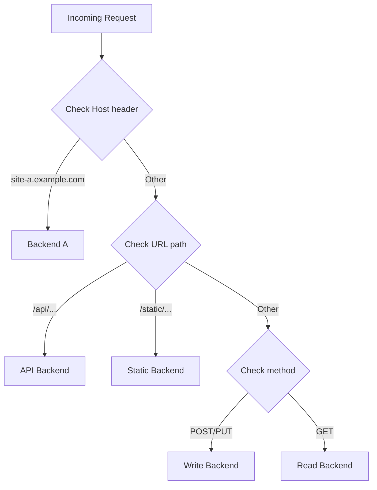

# How to Configure HAProxy ACLs for Content-Based Routing on RHEL 9

Author: [nawazdhandala](https://www.github.com/nawazdhandala)

Tags: RHEL, HAProxy, ACLs, Routing, Linux

Description: How to use HAProxy ACLs on RHEL 9 to route traffic based on URL paths, headers, cookies, and other request properties.

---

## What Are ACLs?

ACLs (Access Control Lists) in HAProxy are rules that match request properties. You use them to route traffic to different backends based on the hostname, URL path, headers, cookies, or any other aspect of the request. This is what makes HAProxy a powerful layer 7 (application-level) load balancer.

## Prerequisites

- RHEL 9 with HAProxy installed and running
- Multiple backend services to route between
- Root or sudo access

## Step 1 - Route by Hostname

```
frontend http_front
    bind *:80

    # Define ACLs for different hostnames
    acl is_site_a hdr(host) -i site-a.example.com
    acl is_site_b hdr(host) -i site-b.example.com

    # Route based on hostname
    use_backend site_a_servers if is_site_a
    use_backend site_b_servers if is_site_b
    default_backend default_servers

backend site_a_servers
    server web1 192.168.1.11:8080 check

backend site_b_servers
    server web2 192.168.1.12:8080 check

backend default_servers
    server web3 192.168.1.13:8080 check
```

The `-i` flag makes the match case-insensitive.

## Step 2 - Route by URL Path

```
frontend http_front
    bind *:80

    # Route /api requests to the API backend
    acl is_api path_beg /api

    # Route /static requests to the static file server
    acl is_static path_beg /static

    use_backend api_servers if is_api
    use_backend static_servers if is_static
    default_backend web_servers

backend api_servers
    server api1 192.168.1.21:3000 check

backend static_servers
    server static1 192.168.1.31:80 check

backend web_servers
    server web1 192.168.1.11:8080 check
```

## Step 3 - Route by File Extension

```
frontend http_front
    bind *:80

    # Route image requests to a media server
    acl is_image path_end .jpg .jpeg .png .gif .webp

    use_backend media_servers if is_image
    default_backend web_servers
```

## Step 4 - Route by HTTP Method

```
frontend http_front
    bind *:80

    # Route read requests to read replicas
    acl is_read method GET HEAD

    # Route write requests to the primary
    acl is_write method POST PUT DELETE

    use_backend read_servers if is_read
    use_backend write_servers if is_write
```

## Step 5 - Route by Header Value

```
frontend http_front
    bind *:80

    # Route mobile traffic to a mobile backend
    acl is_mobile hdr_sub(User-Agent) -i mobile android iphone

    # Route API version based on Accept header
    acl is_v2_api hdr(Accept) -i application/vnd.api.v2+json

    use_backend mobile_servers if is_mobile
    use_backend api_v2_servers if is_v2_api
    default_backend web_servers
```

## Step 6 - Route by Cookie

```
frontend http_front
    bind *:80

    # Check for an A/B testing cookie
    acl is_beta_user cook(ab_test) -i beta

    use_backend beta_servers if is_beta_user
    default_backend production_servers
```

## Step 7 - Combine ACLs with AND/OR Logic

### AND Logic (Both Conditions Must Match)

```
frontend http_front
    bind *:80

    acl is_api path_beg /api
    acl is_post method POST

    # Only match POST requests to /api
    use_backend write_api if is_api is_post
```

When ACLs are listed together on one line, they are combined with AND logic.

### OR Logic (Either Condition)

```
frontend http_front
    bind *:80

    acl is_api path_beg /api
    acl is_admin path_beg /admin

    # Match either /api or /admin
    use_backend internal_servers if is_api or is_admin
```

### NOT Logic

```
frontend http_front
    bind *:80

    acl is_static path_end .css .js .png .jpg

    # Route everything that is NOT static to the app server
    use_backend app_servers if !is_static
    default_backend static_servers
```

## ACL Routing Decision Flow



## Step 8 - Deny Requests with ACLs

You can also use ACLs to block traffic:

```
frontend http_front
    bind *:80

    # Block requests from specific IPs
    acl is_blocked src 203.0.113.0/24
    http-request deny if is_blocked

    # Block requests with suspicious user agents
    acl is_bad_bot hdr_sub(User-Agent) -i sqlmap nikto masscan
    http-request deny if is_bad_bot

    default_backend web_servers
```

## Step 9 - ACL with Regular Expressions

```
frontend http_front
    bind *:80

    # Match URLs with regex
    acl is_api_v2 path_reg ^/api/v2/

    use_backend api_v2 if is_api_v2
    default_backend web_servers
```

## Step 10 - Use ACL Files for Large Lists

If you have many values to match against, use a file:

```bash
# Create a file with blocked IPs
sudo tee /etc/haproxy/blocked-ips.txt > /dev/null <<'EOF'
203.0.113.0/24
198.51.100.0/24
EOF
```

Reference it in the config:

```
frontend http_front
    bind *:80

    acl is_blocked src -f /etc/haproxy/blocked-ips.txt
    http-request deny if is_blocked
```

## Common ACL Matching Functions

| Function | Description |
|----------|-------------|
| `hdr(name)` | Exact match on header value |
| `hdr_sub(name)` | Substring match on header |
| `hdr_beg(name)` | Header begins with |
| `path` | Exact path match |
| `path_beg` | Path begins with |
| `path_end` | Path ends with |
| `path_reg` | Path matches regex |
| `src` | Source IP address |
| `cook(name)` | Cookie value |
| `method` | HTTP method |

## Apply and Validate

```bash
# Validate the configuration
haproxy -c -f /etc/haproxy/haproxy.cfg

# Reload HAProxy
sudo systemctl reload haproxy
```

## Wrap-Up

ACLs are what make HAProxy a layer 7 load balancer instead of a simple TCP forwarder. With ACLs you can route traffic based on virtually any property of the HTTP request. Start simple with hostname and path-based routing, and add more complex rules as needed. Use external files for large block lists, and remember that ACLs listed on the same line use AND logic while the `or` keyword provides OR logic.
