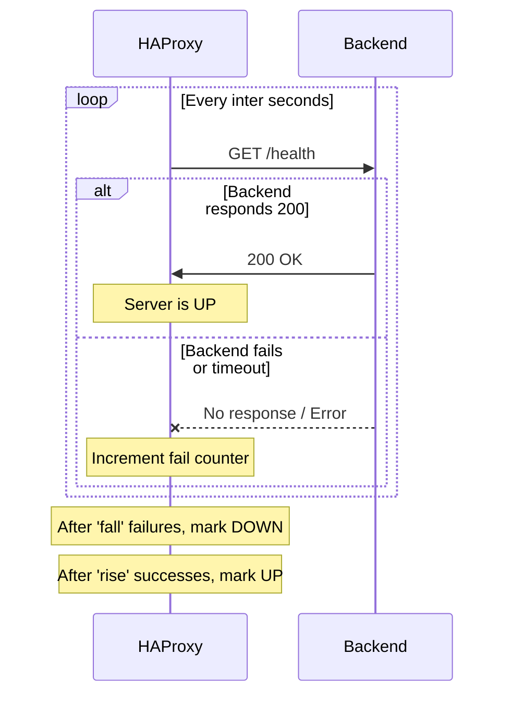

# How to Configure HAProxy Health Checks for Backend Servers on RHEL

Author: [nawazdhandala](https://www.github.com/nawazdhandala)

Tags: RHEL, HAProxy, Health Check, Linux

Description: How to set up active and passive health checks in HAProxy on RHEL to automatically detect and route around failed backend servers.

---

## Why Health Checks Matter

If a backend server goes down and HAProxy keeps sending traffic to it, your users see errors. Health checks let HAProxy detect failed backends and stop sending traffic to them automatically. When the server recovers, HAProxy adds it back to the pool. This is fundamental to running a reliable load-balanced setup.

## Prerequisites

- RHEL with HAProxy installed
- Backend servers with a health check endpoint
- Root or sudo access

## Step 1 - Basic TCP Health Check

The simplest check verifies that the backend port is open:

```bash
backend web_servers
    balance roundrobin
    server web1 192.168.1.11:8080 check
    server web2 192.168.1.12:8080 check
```

The `check` keyword enables health checking. By default, HAProxy opens a TCP connection to the server every 2 seconds. If the connection succeeds, the server is healthy.

## Step 2 - HTTP Health Checks

TCP checks only verify the port is open. HTTP checks verify the application is actually working:

```bash
backend web_servers
    balance roundrobin
    option httpchk GET /health
    http-check expect status 200
    server web1 192.168.1.11:8080 check
    server web2 192.168.1.12:8080 check
```

HAProxy sends a `GET /health` request and expects a 200 response. If the backend returns anything else, it is marked as down.

## Step 3 - Tune Check Intervals

```bash
backend web_servers
    option httpchk GET /health

    # Check every 5 seconds, mark down after 3 failures, mark up after 2 successes
    server web1 192.168.1.11:8080 check inter 5s fall 3 rise 2
    server web2 192.168.1.12:8080 check inter 5s fall 3 rise 2
```

| Parameter | Default | Meaning |
|-----------|---------|---------|
| `inter` | 2s | Time between health checks |
| `fall` | 3 | Failures before marking server as down |
| `rise` | 2 | Successes before marking server as up |
| `timeout check` | (from defaults) | Timeout for the check itself |

## Step 4 - Check Specific Content

You can verify the response body contains expected content:

```bash
backend web_servers
    option httpchk GET /health
    http-check expect string "status":"ok"
    server web1 192.168.1.11:8080 check
    server web2 192.168.1.12:8080 check
```

Or use a regular expression:

```bash
backend web_servers
    option httpchk GET /health
    http-check expect rstring "status.*(ok|healthy)"
    server web1 192.168.1.11:8080 check
```

## Step 5 - Custom Health Check Headers

Some backends require specific headers:

```bash
backend web_servers
    option httpchk
    http-check send meth GET uri /health hdr Host www.example.com hdr User-Agent HAProxy-Health
    http-check expect status 200
    server web1 192.168.1.11:8080 check
    server web2 192.168.1.12:8080 check
```

## Health Check Flow



## Step 6 - Agent Health Checks

HAProxy can also use an external agent for health status. The agent runs on the backend and reports its state:

```bash
backend web_servers
    server web1 192.168.1.11:8080 check agent-check agent-port 8888 agent-inter 5s
```

The agent is a simple service that responds with one of: `up`, `down`, `drain`, `maint`, or a percentage (e.g., `75%` to accept 75% of normal traffic).

## Step 7 - Monitoring Health Status

Use the stats socket to check server health in real time:

```bash
# Show the status of all backends
echo "show stat" | sudo socat stdio /var/lib/haproxy/stats | cut -d',' -f1,2,18 | column -s',' -t
```

Or use the stats web interface (if configured):

```bash
listen stats
    bind *:8404
    stats enable
    stats uri /stats
    stats refresh 5s
```

The stats page shows green for healthy servers, red for down servers, and yellow for servers in transition.

## Step 8 - Handle Slow Starts

When a backend comes back online, it might need time to warm up. Use `slowstart` to gradually increase traffic:

```bash
backend web_servers
    option httpchk GET /health
    server web1 192.168.1.11:8080 check slowstart 30s
    server web2 192.168.1.12:8080 check slowstart 30s
```

Over 30 seconds, HAProxy gradually increases the percentage of traffic sent to the recovered server from 0% to 100%.

## Step 9 - Administrative Actions

You can manually control server state through the stats socket:

```bash
# Disable a server (stop sending new connections)
echo "disable server web_servers/web1" | sudo socat stdio /var/lib/haproxy/stats

# Enable it again
echo "enable server web_servers/web1" | sudo socat stdio /var/lib/haproxy/stats

# Put a server in drain mode (finish existing connections, no new ones)
echo "set server web_servers/web1 state drain" | sudo socat stdio /var/lib/haproxy/stats
```

## Step 10 - Validate and Apply

```bash
# Validate configuration
haproxy -c -f /etc/haproxy/haproxy.cfg

# Reload HAProxy
sudo systemctl reload haproxy
```

## Designing Good Health Check Endpoints

Your `/health` endpoint should:

- Check database connectivity
- Verify critical dependencies are reachable
- Return quickly (under 1 second)
- Return 200 only when the application is truly ready to serve traffic
- Return 503 when the application is not ready

Do not make health checks too aggressive (checking every 500ms) or too lax (checking every 60s). Every 3-5 seconds is a good default.

## Wrap-Up

Health checks are what make load balancing reliable. Use HTTP checks rather than TCP whenever possible, as they verify the application is actually working rather than just checking if the port is open. Tune your `inter`, `fall`, and `rise` values based on how quickly you need to detect failures and how confident you want to be before removing or adding servers. The stats interface is your best friend for monitoring health in real time.
