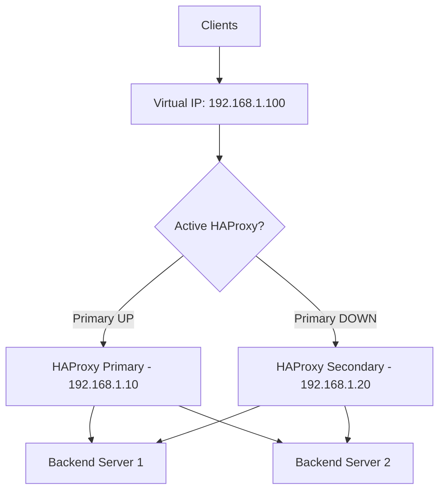
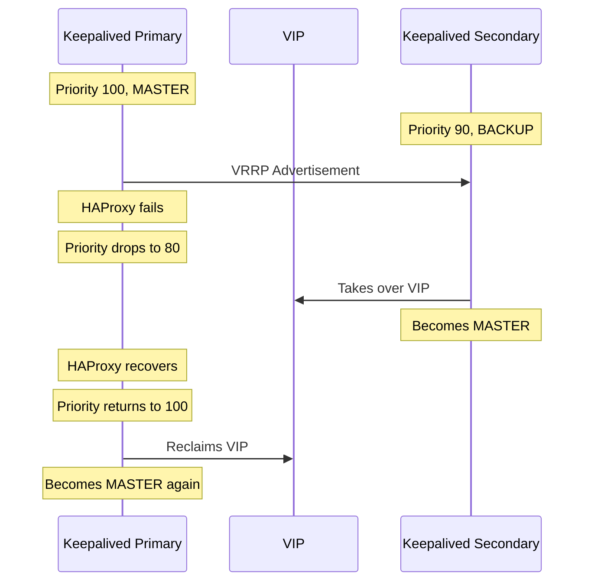

# How to Set Up HAProxy with Keepalived for High Availability on RHEL

Author: [nawazdhandala](https://www.github.com/nawazdhandala)

Tags: RHEL, HAProxy, Keepalived, High Availability, Linux

Description: How to create a highly available load balancer setup using HAProxy and Keepalived with a virtual IP on RHEL.

---

## The Problem with a Single Load Balancer

HAProxy distributes traffic across your backend servers, but what happens if HAProxy itself goes down? Your entire service becomes unreachable. The solution is to run two HAProxy instances and use Keepalived to manage a floating virtual IP (VIP) between them. If the primary fails, the secondary takes over the VIP automatically.

## Architecture Overview



## Prerequisites

- Two RHEL servers for HAProxy (primary and secondary)
- Backend servers running your application
- An available IP address for the VIP
- Root or sudo access on both HAProxy servers

## Step 1 - Install HAProxy and Keepalived on Both Servers

Run this on both the primary and secondary:

```bash
# Install HAProxy and Keepalived
sudo dnf install -y haproxy keepalived
```

## Step 2 - Configure HAProxy (Same on Both Servers)

Both HAProxy instances use the same configuration:

```bash
# Write the HAProxy configuration
sudo tee /etc/haproxy/haproxy.cfg > /dev/null <<'EOF'
global
    log /dev/log local0
    chroot /var/lib/haproxy
    stats socket /var/lib/haproxy/stats
    user haproxy
    group haproxy
    daemon
    maxconn 4096

defaults
    log     global
    mode    http
    option  httplog
    timeout connect 5s
    timeout client  30s
    timeout server  30s

frontend http_front
    bind *:80
    default_backend web_servers

backend web_servers
    balance roundrobin
    option httpchk GET /health
    server web1 192.168.1.31:8080 check
    server web2 192.168.1.32:8080 check

listen stats
    bind *:8404
    stats enable
    stats uri /stats
    stats refresh 5s
EOF
```

## Step 3 - Allow Non-Local IP Binding

HAProxy needs to bind to the VIP, which may not be assigned to the server yet when it starts:

```bash
# Allow binding to non-local IP addresses
sudo tee /etc/sysctl.d/99-haproxy-vip.conf > /dev/null <<'EOF'
net.ipv4.ip_nonlocal_bind = 1
EOF
sudo sysctl -p /etc/sysctl.d/99-haproxy-vip.conf
```

Run this on both servers.

## Step 4 - Configure Keepalived on the Primary

```bash
# Write the Keepalived configuration for the primary server
sudo tee /etc/keepalived/keepalived.conf > /dev/null <<'EOF'
global_defs {
    router_id LB_PRIMARY
    enable_script_security
}

# Script to check if HAProxy is running
vrrp_script check_haproxy {
    script "/usr/bin/systemctl is-active haproxy"
    interval 2
    weight -20
    fall 3
    rise 2
}

vrrp_instance VI_1 {
    state MASTER
    interface eth0
    virtual_router_id 51
    priority 100
    advert_int 1

    authentication {
        auth_type PASS
        auth_pass secretkey123
    }

    virtual_ipaddress {
        192.168.1.100/24
    }

    track_script {
        check_haproxy
    }
}
EOF
```

Replace `eth0` with your actual network interface name. Check it with `ip addr`.

## Step 5 - Configure Keepalived on the Secondary

```bash
# Write the Keepalived configuration for the secondary server
sudo tee /etc/keepalived/keepalived.conf > /dev/null <<'EOF'
global_defs {
    router_id LB_SECONDARY
    enable_script_security
}

vrrp_script check_haproxy {
    script "/usr/bin/systemctl is-active haproxy"
    interval 2
    weight -20
    fall 3
    rise 2
}

vrrp_instance VI_1 {
    state BACKUP
    interface eth0
    virtual_router_id 51
    priority 90
    advert_int 1

    authentication {
        auth_type PASS
        auth_pass secretkey123
    }

    virtual_ipaddress {
        192.168.1.100/24
    }

    track_script {
        check_haproxy
    }
}
EOF
```

The key differences: `state BACKUP` and `priority 90` (lower than the primary's 100).

## Step 6 - Handle SELinux

Keepalived needs permission to manage the VIP:

```bash
# Allow Keepalived to manage virtual IPs
sudo setsebool -P haproxy_connect_any on
```

If Keepalived has issues, check for SELinux denials:

```bash
sudo ausearch -m avc -ts recent | grep keepalived
```

## Step 7 - Open Firewall for VRRP

Keepalived uses the VRRP protocol (IP protocol 112):

```bash
# Allow VRRP traffic between the two HAProxy servers
sudo firewall-cmd --permanent --add-rich-rule='rule protocol value="vrrp" accept'
sudo firewall-cmd --permanent --add-service=http
sudo firewall-cmd --reload
```

Run this on both servers.

## Step 8 - Start Everything

On both servers:

```bash
# Start and enable HAProxy
sudo systemctl enable --now haproxy

# Start and enable Keepalived
sudo systemctl enable --now keepalived
```

## Step 9 - Verify the VIP

On the primary server:

```bash
# Check if the VIP is assigned
ip addr show eth0
```

You should see `192.168.1.100/24` listed as a secondary address on the primary.

```bash
# Test access through the VIP
curl http://192.168.1.100/
```

## Step 10 - Test Failover

Stop HAProxy on the primary to trigger failover:

```bash
# On the primary server, stop HAProxy
sudo systemctl stop haproxy
```

Wait a few seconds, then check the secondary:

```bash
# On the secondary, check if the VIP moved here
ip addr show eth0
```

The VIP should now be on the secondary server. Test access:

```bash
curl http://192.168.1.100/
```

Start HAProxy on the primary again:

```bash
# On the primary, start HAProxy again
sudo systemctl start haproxy
```

The VIP should move back to the primary (since it has higher priority).

## Failover Sequence



## Wrap-Up

HAProxy with Keepalived gives you a production-grade high-availability load balancer on RHEL. The health check script is crucial because it ties the VIP to the health of HAProxy, not just the health of the server. If HAProxy crashes, Keepalived drops the priority and the secondary takes over. Remember to use the same `virtual_router_id` and `auth_pass` on both servers, and test failover before going to production.
