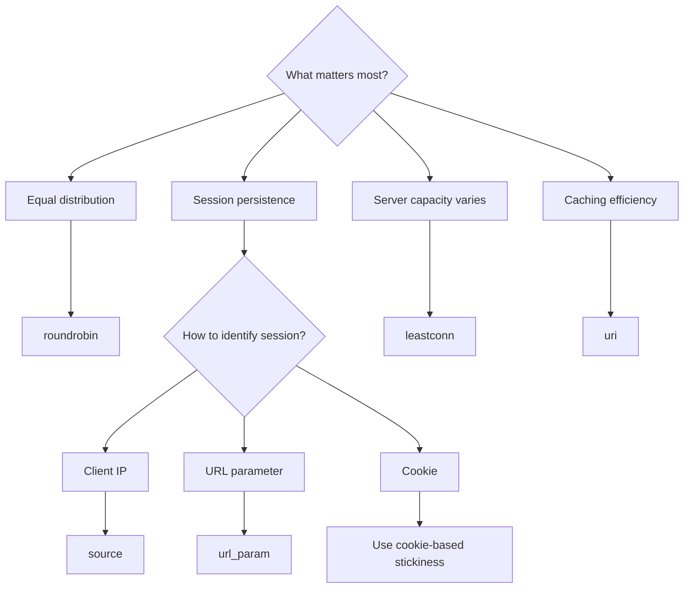

# How to Configure HAProxy Load Balancing Algorithms on RHEL 9

Author: [nawazdhandala](https://www.github.com/nawazdhandala)

Tags: RHEL, HAProxy, Load Balancing, Algorithms, Linux

Description: A detailed guide to HAProxy load balancing algorithms on RHEL 9, including when to use each one.

---

## Choosing the Right Algorithm

HAProxy supports several load balancing algorithms. The right choice depends on your application, whether sessions are sticky, how uniform your servers are, and what kind of traffic you handle. There is no single best algorithm. Let us walk through each one with practical examples.

## Prerequisites

- RHEL 9 with HAProxy installed
- Root or sudo access

## Round Robin

This is the default. Requests are distributed evenly across servers in order:

```
backend web_servers
    balance roundrobin
    server web1 192.168.1.11:8080 check
    server web2 192.168.1.12:8080 check
    server web3 192.168.1.13:8080 check
```

**When to use it**: When all servers have similar capacity and request processing times are roughly equal.

You can assign weights to handle servers with different capacities:

```
backend web_servers
    balance roundrobin
    server web1 192.168.1.11:8080 check weight 3
    server web2 192.168.1.12:8080 check weight 2
    server web3 192.168.1.13:8080 check weight 1
```

Server web1 gets three times the traffic of web3.

## Static Round Robin

Similar to round robin but the distribution is computed at startup and cannot change at runtime:

```
backend web_servers
    balance static-rr
    server web1 192.168.1.11:8080 check weight 3
    server web2 192.168.1.12:8080 check weight 1
```

**When to use it**: When you need fully deterministic distribution and do not plan to change weights at runtime.

## Least Connections

Sends new requests to the server with the fewest active connections:

```
backend web_servers
    balance leastconn
    server web1 192.168.1.11:8080 check
    server web2 192.168.1.12:8080 check
    server web3 192.168.1.13:8080 check
```

**When to use it**: When request processing times vary significantly. Faster servers naturally handle more requests because their connection count drops sooner.

## Source IP Hash

Routes clients to servers based on a hash of the client's IP address:

```
backend web_servers
    balance source
    server web1 192.168.1.11:8080 check
    server web2 192.168.1.12:8080 check
    server web3 192.168.1.13:8080 check
```

**When to use it**: When you need basic session persistence without cookies. The same client IP always goes to the same server.

**Limitation**: If a server goes down, all its clients are redistributed. When it comes back, the hash changes again.

## URI Hash

Routes requests based on the URI path:

```
backend web_servers
    balance uri
    server web1 192.168.1.11:8080 check
    server web2 192.168.1.12:8080 check
    server web3 192.168.1.13:8080 check
```

**When to use it**: When you want the same URL to always hit the same server. This is useful for caching, as each server caches a specific set of URLs.

## URL Parameter Hash

Routes based on a specific URL parameter:

```
backend web_servers
    balance url_param userid
    server web1 192.168.1.11:8080 check
    server web2 192.168.1.12:8080 check
```

A request to `/page?userid=42` always goes to the same server.

**When to use it**: When session affinity needs to be based on a specific request parameter.

## Header Hash

Routes based on an HTTP header value:

```
backend web_servers
    balance hdr(X-Session-ID)
    server web1 192.168.1.11:8080 check
    server web2 192.168.1.12:8080 check
```

**When to use it**: When your application includes a session identifier in a custom header.

## Random

Selects a random server (with optional sub-selection):

```
backend web_servers
    balance random(2)
    server web1 192.168.1.11:8080 check
    server web2 192.168.1.12:8080 check
    server web3 192.168.1.13:8080 check
```

The `random(2)` picks two random servers and then selects the one with fewer connections (power of two choices). This provides surprisingly good distribution.

**When to use it**: Large-scale deployments where the simplicity and even distribution of random selection is desirable.

## Algorithm Comparison



## Combining Algorithms with Weights

Any algorithm can be combined with server weights:

```
backend web_servers
    balance leastconn
    server web1 192.168.1.11:8080 check weight 4
    server web2 192.168.1.12:8080 check weight 2
    server web3 192.168.1.13:8080 check weight 1
```

## Testing Your Algorithm

After changing the algorithm, verify the distribution:

```bash
# Send 100 requests and check the distribution
for i in $(seq 1 100); do
    curl -s http://your-haproxy/health
done
```

Check the stats page to see how traffic is distributed across backends:

```bash
# Check backend stats via the socket
echo "show stat" | sudo socat stdio /var/lib/haproxy/stats | \
    awk -F',' '/web_servers/ && !/BACKEND|FRONTEND/ {print $2, "sessions:", $5}'
```

## Apply the Configuration

```bash
# Validate
haproxy -c -f /etc/haproxy/haproxy.cfg

# Reload
sudo systemctl reload haproxy
```

## Wrap-Up

The load balancing algorithm you choose depends on your application. For most web applications, `roundrobin` is the safe default. Use `leastconn` when request processing times vary. Use `source` when you need basic IP-based session persistence. For caching proxies, `uri` helps maximize cache hit rates. When in doubt, start with `roundrobin` and switch if you observe uneven load or session issues.
