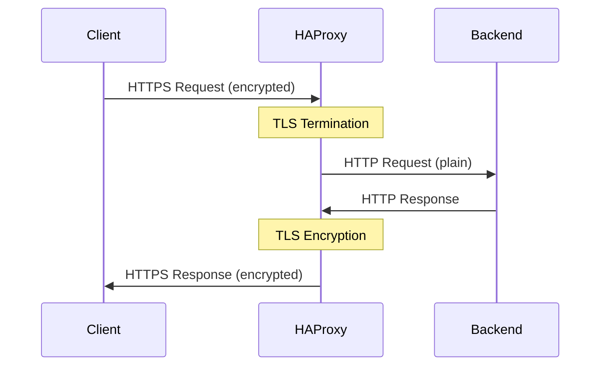

# How to Set Up HAProxy with SSL Termination on RHEL

Author: [nawazdhandala](https://www.github.com/nawazdhandala)

Tags: RHEL, HAProxy, SSL, TLS, Linux

Description: How to configure HAProxy to handle TLS termination on RHEL so backend servers receive plain HTTP traffic.

---

## What Is SSL Termination?

SSL termination means HAProxy handles the TLS encryption and decryption. Clients connect to HAProxy over HTTPS, and HAProxy forwards the requests to backend servers over plain HTTP. This offloads the TLS processing from your backends and centralizes certificate management.

## Prerequisites

- RHEL with HAProxy installed
- A TLS certificate and private key
- Root or sudo access

## Step 1 - Prepare the Certificate

HAProxy expects the certificate and private key in a single PEM file:

```bash
# Combine the certificate and key into one file
sudo cat /etc/pki/tls/certs/server.crt /etc/pki/tls/private/server.key > /etc/haproxy/certs/site.pem

# If you have a CA chain, include it
sudo cat /etc/pki/tls/certs/server.crt /etc/pki/tls/certs/chain.crt /etc/pki/tls/private/server.key > /etc/haproxy/certs/site.pem
```

Create the certs directory and set permissions:

```bash
# Create the certificate directory
sudo mkdir -p /etc/haproxy/certs

# Set strict permissions
sudo chmod 700 /etc/haproxy/certs
sudo chmod 600 /etc/haproxy/certs/site.pem
```

## Step 2 - Configure HAProxy for HTTPS

```bash
# Write the HAProxy configuration with SSL termination
sudo tee /etc/haproxy/haproxy.cfg > /dev/null <<'EOF'
global
    log /dev/log local0
    chroot /var/lib/haproxy
    stats socket /var/lib/haproxy/stats
    user haproxy
    group haproxy
    daemon
    maxconn 4096

    # TLS tuning
    ssl-default-bind-ciphers ECDHE-ECDSA-AES128-GCM-SHA256:ECDHE-RSA-AES128-GCM-SHA256:ECDHE-ECDSA-AES256-GCM-SHA384:ECDHE-RSA-AES256-GCM-SHA384
    ssl-default-bind-options ssl-min-ver TLSv1.2 no-tls-tickets
    tune.ssl.default-dh-param 2048

defaults
    log     global
    mode    http
    option  httplog
    option  dontlognull
    timeout connect 5s
    timeout client  30s
    timeout server  30s

# Redirect HTTP to HTTPS
frontend http_front
    bind *:80
    redirect scheme https code 301

# HTTPS frontend with SSL termination
frontend https_front
    bind *:443 ssl crt /etc/haproxy/certs/site.pem
    default_backend web_servers

    # Add HSTS header
    http-response set-header Strict-Transport-Security "max-age=31536000; includeSubDomains"

    # Forward the protocol to backends
    http-request set-header X-Forwarded-Proto https

backend web_servers
    balance roundrobin
    option httpchk GET /health
    server web1 192.168.1.11:8080 check
    server web2 192.168.1.12:8080 check
EOF
```

## Step 3 - Open the Firewall

```bash
# Allow both HTTP and HTTPS
sudo firewall-cmd --permanent --add-service=http
sudo firewall-cmd --permanent --add-service=https
sudo firewall-cmd --reload
```

## Step 4 - Validate and Start

```bash
# Validate the configuration
haproxy -c -f /etc/haproxy/haproxy.cfg

# Restart HAProxy
sudo systemctl restart haproxy
```

## Step 5 - Using Let's Encrypt

Get a certificate with certbot:

```bash
# Install certbot
sudo dnf install -y certbot

# Get a certificate using standalone mode (stop HAProxy first)
sudo systemctl stop haproxy
sudo certbot certonly --standalone -d www.example.com
sudo systemctl start haproxy
```

Combine the Let's Encrypt files into HAProxy format:

```bash
# Create the combined PEM file for HAProxy
sudo cat /etc/letsencrypt/live/www.example.com/fullchain.pem \
         /etc/letsencrypt/live/www.example.com/privkey.pem \
         > /etc/haproxy/certs/site.pem
sudo chmod 600 /etc/haproxy/certs/site.pem
```

Set up automatic renewal with a deploy hook:

```bash
# Create a renewal hook that rebuilds the PEM and reloads HAProxy
sudo tee /etc/letsencrypt/renewal-hooks/deploy/haproxy.sh > /dev/null <<'SCRIPT'
#!/bin/bash
cat /etc/letsencrypt/live/www.example.com/fullchain.pem \
    /etc/letsencrypt/live/www.example.com/privkey.pem \
    > /etc/haproxy/certs/site.pem
chmod 600 /etc/haproxy/certs/site.pem
systemctl reload haproxy
SCRIPT
sudo chmod +x /etc/letsencrypt/renewal-hooks/deploy/haproxy.sh
```

## SSL Termination Flow



## Step 6 - Multiple Certificates

HAProxy can serve different certificates based on SNI:

```
frontend https_front
    bind *:443 ssl crt /etc/haproxy/certs/

    # Route based on hostname
    use_backend site_a if { hdr(host) -i site-a.example.com }
    use_backend site_b if { hdr(host) -i site-b.example.com }
```

Place each site's PEM file in `/etc/haproxy/certs/` (e.g., `site-a.pem`, `site-b.pem`). HAProxy will automatically match certificates to hostnames using SNI.

## Step 7 - SSL/TLS Passthrough

If your backends need to handle TLS themselves, use TCP mode instead:

```
frontend tcp_front
    bind *:443
    mode tcp
    default_backend tls_servers

backend tls_servers
    mode tcp
    balance roundrobin
    server web1 192.168.1.11:443 check
```

This passes the encrypted traffic through without terminating TLS.

## Step 8 - Test TLS Configuration

```bash
# Test the HTTPS connection
curl -I https://www.example.com

# Check TLS details
openssl s_client -connect www.example.com:443 -servername www.example.com </dev/null 2>/dev/null | grep -E "Protocol|Cipher"

# Verify the redirect from HTTP to HTTPS
curl -I http://www.example.com
```

## Wrap-Up

SSL termination on HAProxy centralizes your TLS management and keeps backend configuration simple. The combined PEM file format is the main thing to remember - certificate, chain, and key all in one file. Use strong TLS settings in the global section, add HSTS headers, and always redirect HTTP to HTTPS. For Let's Encrypt, set up a deploy hook to rebuild the PEM file and reload HAProxy automatically.
