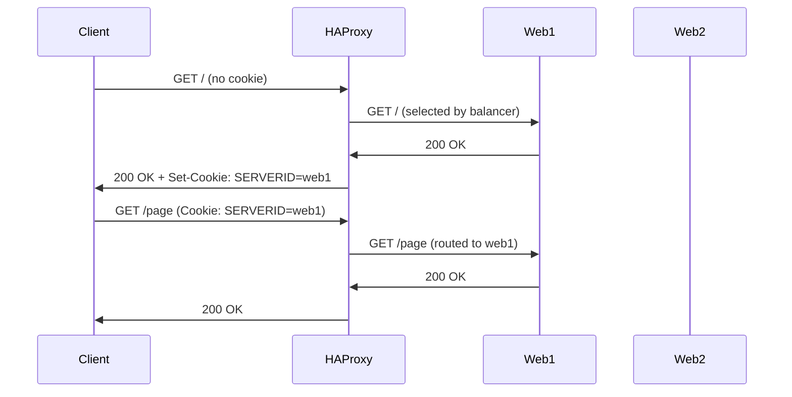
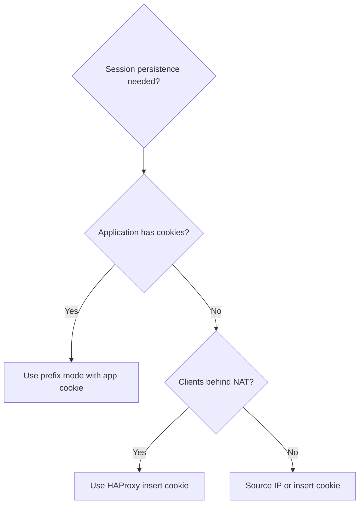

# How to Configure HAProxy Sticky Sessions on RHEL

Author: [nawazdhandala](https://www.github.com/nawazdhandala)

Tags: RHEL, HAProxy, Sticky Sessions, Linux

Description: How to configure session persistence in HAProxy on RHEL using cookies, source IP, and other methods to ensure clients stick to the same backend server.

---

## Why Sticky Sessions?

Some applications store session data locally on the server (in memory, on disk, or in a local cache). If a user's requests get routed to a different backend on each request, their session breaks. Sticky sessions (also called session persistence or session affinity) ensure that a client keeps hitting the same backend for the duration of their session.

The better long-term solution is to make your application stateless or use a shared session store (like Redis). But when you need sticky sessions now, HAProxy has several ways to do it.

## Prerequisites

- RHEL with HAProxy installed
- Multiple backend servers
- Root or sudo access

## Method 1 - Cookie-Based Stickiness

This is the most reliable method. HAProxy inserts a cookie that identifies which backend server the client should use:

```
backend web_servers
    balance roundrobin
    cookie SERVERID insert indirect nocache

    server web1 192.168.1.11:8080 check cookie web1
    server web2 192.168.1.12:8080 check cookie web2
    server web3 192.168.1.13:8080 check cookie web3
```

How it works:
1. Client makes a first request
2. HAProxy picks a backend server (e.g., web1)
3. HAProxy adds a `Set-Cookie: SERVERID=web1` header to the response
4. Client sends the cookie on subsequent requests
5. HAProxy reads the cookie and routes to web1

The `indirect` flag means HAProxy removes the cookie before forwarding to the backend (the backend never sees it). The `nocache` flag adds `Cache-Control: nocache` to prevent proxies from caching the response with the Set-Cookie header.

## Method 2 - Source IP Persistence

Route based on client IP:

```
backend web_servers
    balance source
    hash-type consistent

    server web1 192.168.1.11:8080 check
    server web2 192.168.1.12:8080 check
    server web3 192.168.1.13:8080 check
```

The `hash-type consistent` option uses consistent hashing, which minimizes session disruption when servers are added or removed.

**Limitation**: All users behind the same NAT or proxy appear as one IP and go to the same backend.

## Method 3 - Stick Tables

Stick tables let you persist sessions based on various criteria and store them in a shared table:

```
backend web_servers
    balance roundrobin

    # Create a stick table that tracks source IPs for 30 minutes
    stick-table type ip size 100k expire 30m
    stick on src

    server web1 192.168.1.11:8080 check
    server web2 192.168.1.12:8080 check
```

When a new client connects, HAProxy records which backend served them. On subsequent requests from the same IP, HAProxy routes to the same backend.

## Method 4 - Application Cookie

If your application already sets a session cookie, HAProxy can use it:

```
backend web_servers
    balance roundrobin
    cookie JSESSIONID prefix nocache

    server web1 192.168.1.11:8080 check cookie web1
    server web2 192.168.1.12:8080 check cookie web2
```

The `prefix` option appends the server identifier to the application's existing cookie value instead of creating a new cookie.

## How Cookie-Based Stickiness Works



## Method 5 - Header-Based Stickiness

Stick based on a specific HTTP header:

```
backend web_servers
    balance roundrobin
    stick-table type string len 64 size 100k expire 30m
    stick on req.hdr(X-Session-ID)

    server web1 192.168.1.11:8080 check
    server web2 192.168.1.12:8080 check
```

## Handling Server Failures

What happens when a sticky server goes down?

```
backend web_servers
    balance roundrobin
    cookie SERVERID insert indirect nocache
    option redispatch

    server web1 192.168.1.11:8080 check cookie web1
    server web2 192.168.1.12:8080 check cookie web2
```

The `option redispatch` directive tells HAProxy to send the client to a different backend when their sticky server is down. Without it, the client gets an error.

## Cookie Options Reference

| Option | Behavior |
|--------|----------|
| `insert` | HAProxy creates and manages the cookie |
| `prefix` | HAProxy prefixes the server ID to an existing cookie |
| `indirect` | HAProxy removes the cookie before sending to the backend |
| `nocache` | Adds Cache-Control headers to prevent cookie caching |
| `httponly` | Sets the HttpOnly flag on the cookie |
| `secure` | Sets the Secure flag (only sent over HTTPS) |
| `dynamic` | Allows changing cookie values at runtime |

A production cookie configuration:

```
backend web_servers
    cookie SERVERID insert indirect nocache httponly secure
    server web1 192.168.1.11:8080 check cookie web1
    server web2 192.168.1.12:8080 check cookie web2
```

## Testing Stickiness

Verify that requests stick to the same backend:

```bash
# Save cookies and make multiple requests
curl -c cookies.txt -b cookies.txt http://your-haproxy/ && \
curl -c cookies.txt -b cookies.txt http://your-haproxy/ && \
curl -c cookies.txt -b cookies.txt http://your-haproxy/

# Check the cookie
cat cookies.txt
```

Check the stats to verify session distribution:

```bash
# View session counts per server
echo "show stat" | sudo socat stdio /var/lib/haproxy/stats | \
    awk -F',' '/web_servers/ && !/BACKEND|FRONTEND/ {print $2, "total_sessions:", $8}'
```

## Stick Table Monitoring

View what is in the stick table:

```bash
# Show stick table entries
echo "show table web_servers" | sudo socat stdio /var/lib/haproxy/stats
```

## Validate and Apply

```bash
# Validate the configuration
haproxy -c -f /etc/haproxy/haproxy.cfg

# Reload HAProxy
sudo systemctl reload haproxy
```

## Choosing the Right Method



## Wrap-Up

Cookie-based stickiness is the most reliable method for web applications. Use `insert indirect nocache` for HAProxy-managed cookies, or `prefix` if you want to piggyback on your application's existing session cookie. Always enable `option redispatch` so users are not stuck on a dead server. The ultimate goal should be to eliminate the need for sticky sessions by using a shared session store, but when you need them, HAProxy handles it well.
