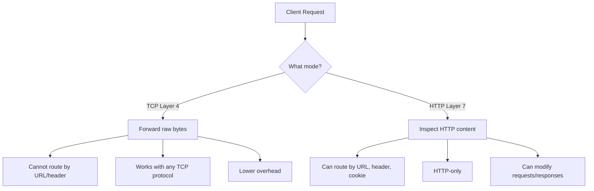

# How to Set Up HAProxy for TCP and HTTP Load Balancing on RHEL

Author: [nawazdhandala](https://www.github.com/nawazdhandala)

Tags: RHEL, HAProxy, TCP, HTTP, Load Balancing, Linux

Description: How to configure HAProxy on RHEL for both TCP (layer 4) and HTTP (layer 7) load balancing with practical examples.

---

## TCP vs. HTTP Load Balancing

HAProxy can operate at two levels:

- **Layer 4 (TCP)**: Forwards raw TCP connections without inspecting the content. Used for databases, mail servers, and any non-HTTP protocol.
- **Layer 7 (HTTP)**: Inspects HTTP requests and can route based on headers, URLs, cookies, and other content. Used for web applications.

You can mix both in the same HAProxy instance.

## Prerequisites

- RHEL with HAProxy installed
- Root or sudo access
- Backend services to load balance

## HTTP Load Balancing (Layer 7)

This is the most common setup for web traffic:

```
defaults
    mode http
    option httplog
    timeout connect 5s
    timeout client 30s
    timeout server 30s

frontend http_front
    bind *:80
    default_backend web_servers

backend web_servers
    balance roundrobin
    option httpchk GET /health
    http-check expect status 200
    server web1 192.168.1.11:8080 check
    server web2 192.168.1.12:8080 check
```

In HTTP mode, you get access to:
- URL-based routing
- Header inspection and modification
- Cookie-based session persistence
- HTTP health checks
- Request/response rewriting

## TCP Load Balancing (Layer 4)

For non-HTTP protocols, use TCP mode:

```
defaults
    mode tcp
    option tcplog
    timeout connect 5s
    timeout client 30s
    timeout server 30s

frontend mysql_front
    bind *:3306
    default_backend mysql_servers

backend mysql_servers
    balance roundrobin
    option mysql-check user haproxy
    server db1 192.168.1.21:3306 check
    server db2 192.168.1.22:3306 check
```

In TCP mode, HAProxy forwards the raw bytes without understanding the protocol. It can still do health checks using protocol-specific options.

## Mixing TCP and HTTP

You can have both in the same configuration by setting the mode per section:

```bash
# Create a mixed-mode HAProxy configuration
sudo tee /etc/haproxy/haproxy.cfg > /dev/null <<'EOF'
global
    log /dev/log local0
    chroot /var/lib/haproxy
    stats socket /var/lib/haproxy/stats
    user haproxy
    group haproxy
    daemon

# HTTP defaults
defaults http_defaults
    mode http
    option httplog
    timeout connect 5s
    timeout client 30s
    timeout server 30s

# TCP defaults
defaults tcp_defaults
    mode tcp
    option tcplog
    timeout connect 5s
    timeout client 30s
    timeout server 30s

# HTTP frontend for web traffic
frontend http_front
    mode http
    bind *:80
    default_backend web_servers

backend web_servers
    mode http
    balance roundrobin
    option httpchk GET /health
    server web1 192.168.1.11:8080 check
    server web2 192.168.1.12:8080 check

# TCP frontend for database traffic
frontend mysql_front
    mode tcp
    bind *:3306
    default_backend mysql_servers

backend mysql_servers
    mode tcp
    balance roundrobin
    server db1 192.168.1.21:3306 check
    server db2 192.168.1.22:3306 check

# TCP frontend for Redis
frontend redis_front
    mode tcp
    bind *:6379
    default_backend redis_servers

backend redis_servers
    mode tcp
    balance roundrobin
    option tcp-check
    server redis1 192.168.1.31:6379 check
    server redis2 192.168.1.32:6379 check
EOF
```

## Protocol-Specific Health Checks

HAProxy understands several protocols for health checking in TCP mode:

### MySQL Check

```
backend mysql_servers
    mode tcp
    option mysql-check user haproxy
    server db1 192.168.1.21:3306 check
```

Create the haproxy user in MySQL:

```sql
-- Create a user for HAProxy health checks
CREATE USER 'haproxy'@'192.168.1.%';
```

### PostgreSQL Check

```
backend postgres_servers
    mode tcp
    option pgsql-check user haproxy
    server pg1 192.168.1.21:5432 check
```

### Redis Check

```
backend redis_servers
    mode tcp
    option tcp-check
    tcp-check send PING\r\n
    tcp-check expect string +PONG
    server redis1 192.168.1.31:6379 check
```

### SMTP Check

```
backend mail_servers
    mode tcp
    option smtpchk EHLO haproxy.local
    server mail1 192.168.1.41:25 check
```

## Layer 4 vs Layer 7 Comparison



## TLS Passthrough vs Termination

For HTTPS traffic, you have two options:

### TLS Passthrough (TCP Mode)

HAProxy forwards encrypted traffic without decrypting it. The backend handles TLS:

```
frontend https_passthrough
    mode tcp
    bind *:443
    default_backend tls_servers

backend tls_servers
    mode tcp
    server web1 192.168.1.11:443 check
```

### TLS Termination (HTTP Mode)

HAProxy decrypts the traffic and forwards plain HTTP to backends:

```
frontend https_terminate
    mode http
    bind *:443 ssl crt /etc/haproxy/certs/site.pem
    default_backend web_servers

backend web_servers
    mode http
    server web1 192.168.1.11:8080 check
```

TLS termination gives you layer 7 features (routing, header inspection). Passthrough is simpler but limits you to layer 4.

## SELinux Configuration

For non-standard ports:

```bash
# Allow HAProxy to connect to any port
sudo setsebool -P haproxy_connect_any on
```

## Open the Firewall

```bash
# Open all the ports HAProxy uses
sudo firewall-cmd --permanent --add-service=http
sudo firewall-cmd --permanent --add-port=3306/tcp
sudo firewall-cmd --permanent --add-port=6379/tcp
sudo firewall-cmd --reload
```

## Validate and Apply

```bash
# Validate the configuration
haproxy -c -f /etc/haproxy/haproxy.cfg

# Reload HAProxy
sudo systemctl reload haproxy
```

## Wrap-Up

HAProxy handles both TCP and HTTP load balancing in a single configuration. Use HTTP mode when you need content-based routing and HTTP-specific features. Use TCP mode for databases, caches, and any non-HTTP protocol. You can mix both modes in the same instance. For HTTPS, choose between TLS passthrough (simple, layer 4 only) and TLS termination (layer 7 features, more configuration) based on your routing needs.
