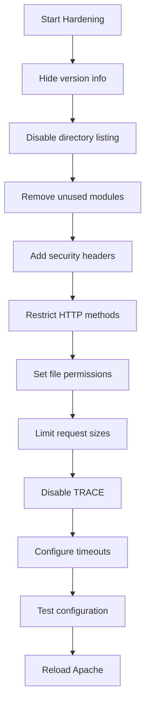

# How to Harden Apache httpd Security on RHEL

Author: [nawazdhandala](https://www.github.com/nawazdhandala)

Tags: RHEL, Apache, Security Hardening, Linux

Description: Practical security hardening steps for Apache httpd on RHEL, covering everything from hiding version info to security headers and file permissions.

---

## Why Harden Apache?

A default Apache installation works, but it exposes more information than it should and leaves some attack surfaces open. Hardening is about reducing what an attacker can learn and exploit. Most of these changes take minutes but make a real difference.

## Prerequisites

- RHEL with Apache httpd installed and running
- Root or sudo access
- mod_ssl and mod_headers available

## Step 1 - Hide Server Version and OS Information

By default Apache sends its version and OS in response headers and error pages. Turn that off:

```bash
# Create a security hardening config file
sudo tee /etc/httpd/conf.d/security.conf > /dev/null <<'EOF'
# Hide Apache version from response headers
ServerTokens Prod

# Hide version info from error pages
ServerSignature Off
EOF
```

With `ServerTokens Prod`, the Server header only shows `Apache` instead of `Apache/2.4.57 (Red Hat Enterprise Linux)`.

## Step 2 - Disable Directory Listing

Prevent Apache from showing file listings when there is no index file:

```apache
# Add to your virtual host or security.conf
<Directory /var/www/html>
    Options -Indexes
    Require all granted
</Directory>
```

The `-Indexes` option stops the auto-generated directory listing.

## Step 3 - Disable Unnecessary Modules

Check what modules are loaded:

```bash
# List all loaded modules
httpd -M
```

Disable modules you do not need. For example, if you do not use server-side includes:

```bash
# Comment out unused module in the config
sudo sed -i 's/^LoadModule include_module/#LoadModule include_module/' /etc/httpd/conf.modules.d/00-base.conf
```

Common modules that can often be disabled:

- `mod_autoindex` (directory listing)
- `mod_status` (server status page)
- `mod_info` (server info page)
- `mod_userdir` (user home directories)

## Step 4 - Add Security Headers

Add headers that instruct browsers to enable their built-in security features:

```apache
# Security headers - add to /etc/httpd/conf.d/security.conf
Header always set X-Content-Type-Options "nosniff"
Header always set X-Frame-Options "SAMEORIGIN"
Header always set X-XSS-Protection "1; mode=block"
Header always set Referrer-Policy "strict-origin-when-cross-origin"
Header always set Permissions-Policy "geolocation=(), microphone=(), camera=()"
```

If you are fully on HTTPS, add HSTS:

```apache
# Enable HSTS - only add this if all your content is served over HTTPS
Header always set Strict-Transport-Security "max-age=31536000; includeSubDomains"
```

## Step 5 - Restrict HTTP Methods

Most sites only need GET, POST, and HEAD. Block everything else:

```apache
# Only allow common safe methods
<Directory /var/www/html>
    <LimitExcept GET POST HEAD>
        Require all denied
    </LimitExcept>
</Directory>
```

## Step 6 - Prevent Clickjacking with X-Frame-Options

Already covered in Step 4, but if you need finer control per directory:

```apache
# Allow framing only from the same origin
<Location />
    Header always set X-Frame-Options "SAMEORIGIN"
</Location>
```

## Step 7 - Disable ETag Headers

ETags can leak inode information on some configurations:

```apache
# Remove ETag header to prevent information leakage
FileETag None
```

## Step 8 - Set Proper File Permissions

```bash
# Set ownership of web content to root (Apache only needs read access)
sudo chown -R root:root /var/www/html/

# Directories should be 755, files should be 644
sudo find /var/www/html/ -type d -exec chmod 755 {} \;
sudo find /var/www/html/ -type f -exec chmod 644 {} \;
```

Apache runs as the `apache` user, which can read files owned by root with 644 permissions. This prevents the web server process from modifying files even if it is compromised.

## Step 9 - Limit Request Size

Prevent large request attacks:

```apache
# Limit request body to 10 MB
LimitRequestBody 10485760

# Limit the number of request header fields
LimitRequestFields 50

# Limit the size of request header fields
LimitRequestFieldSize 8190
```

## Step 10 - Disable TRACE Method

The TRACE method can be used in cross-site tracing attacks:

```apache
# Disable TRACE method
TraceEnable Off
```

## Step 11 - Configure Timeout Values

Reduce timeout values to mitigate slow-loris style attacks:

```apache
# Set reasonable timeout values
Timeout 60
KeepAliveTimeout 5
MaxKeepAliveRequests 100
```

## Security Checklist



## Step 12 - Validate and Apply

```bash
# Test the configuration
sudo apachectl configtest

# Reload Apache to apply all changes
sudo systemctl reload httpd
```

Verify the hardening with curl:

```bash
# Check response headers
curl -I http://your-server-ip
```

You should see the security headers and a minimal Server header.

## Wrap-Up

Security hardening is not a one-time task. Review your configuration regularly, keep Apache updated with `dnf update`, and monitor your logs. The steps above cover the most impactful changes, and combined with SELinux in enforcing mode and a properly configured firewall, they give you a solid security baseline.
