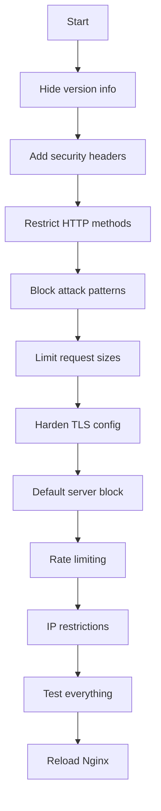

# How to Harden Nginx Web Server Security on RHEL

Author: [nawazdhandala](https://www.github.com/nawazdhandala)

Tags: RHEL, NGINX, Security, Hardening, Linux

Description: Practical security hardening steps for Nginx on RHEL, covering server information hiding, security headers, TLS configuration, and access restrictions.

---

## Why Harden Nginx?

A default Nginx installation is functional but leaves room for improvement on the security front. It reveals version information, lacks security headers, and does not restrict access by default. Hardening is about closing these gaps without breaking functionality.

## Prerequisites

- RHEL with Nginx installed
- Root or sudo access
- TLS configured for HTTPS

## Step 1 - Hide Nginx Version

By default, Nginx sends its version in the Server header and error pages:

```nginx
# In the http block of /etc/nginx/nginx.conf
server_tokens off;
```

This changes the Server header from `nginx/1.x.x` to just `nginx` and removes version info from error pages.

## Step 2 - Add Security Headers

Create a configuration snippet with security headers:

```bash
# Create a security headers configuration
sudo tee /etc/nginx/conf.d/security-headers.conf > /dev/null <<'EOF'
# Prevent MIME type sniffing
add_header X-Content-Type-Options "nosniff" always;

# Prevent clickjacking
add_header X-Frame-Options "SAMEORIGIN" always;

# Enable XSS protection
add_header X-XSS-Protection "1; mode=block" always;

# Control referrer information
add_header Referrer-Policy "strict-origin-when-cross-origin" always;

# Restrict browser features
add_header Permissions-Policy "geolocation=(), microphone=(), camera=()" always;
EOF
```

If you are fully on HTTPS, add HSTS in your SSL server block:

```nginx
# Only add HSTS in SSL server blocks
add_header Strict-Transport-Security "max-age=31536000; includeSubDomains" always;
```

## Step 3 - Restrict HTTP Methods

Most sites only need GET, POST, and HEAD:

```nginx
server {
    # Block all methods except GET, POST, and HEAD
    if ($request_method !~ ^(GET|POST|HEAD)$) {
        return 405;
    }
}
```

## Step 4 - Block Common Attack Patterns

```nginx
# Block access to hidden files (except .well-known for Let's Encrypt)
location ~ /\.(?!well-known) {
    deny all;
    access_log off;
    log_not_found off;
}

# Block access to backup and config files
location ~* \.(bak|conf|dist|fla|in[ci]|log|psd|sh|sql|sw[op])$ {
    deny all;
}
```

## Step 5 - Limit Request Size

Prevent large uploads from consuming resources:

```nginx
# Limit request body size to 10 MB
client_max_body_size 10m;

# Limit header buffer size
client_header_buffer_size 1k;
large_client_header_buffers 4 8k;
```

## Step 6 - Configure TLS Properly

```nginx
server {
    listen 443 ssl;

    # Only allow TLS 1.2 and 1.3
    ssl_protocols TLSv1.2 TLSv1.3;

    # Use strong ciphers
    ssl_ciphers ECDHE-ECDSA-AES128-GCM-SHA256:ECDHE-RSA-AES128-GCM-SHA256:ECDHE-ECDSA-AES256-GCM-SHA384:ECDHE-RSA-AES256-GCM-SHA384;
    ssl_prefer_server_ciphers off;

    # Session caching
    ssl_session_cache shared:SSL:10m;
    ssl_session_timeout 10m;
    ssl_session_tickets off;

    # OCSP stapling
    ssl_stapling on;
    ssl_stapling_verify on;
    resolver 8.8.8.8 8.8.4.4 valid=300s;
}
```

## Step 7 - Set Up a Default Server to Drop Unknown Hosts

Block requests that do not match any configured server name:

```nginx
server {
    listen 80 default_server;
    listen 443 ssl default_server;
    server_name _;

    ssl_certificate /etc/pki/tls/certs/default.crt;
    ssl_certificate_key /etc/pki/tls/private/default.key;

    # Drop the connection
    return 444;
}
```

This stops scanners from probing your server by IP address.

## Step 8 - Rate Limiting

Protect against brute force and DDoS:

```nginx
http {
    # Rate limit zone
    limit_req_zone $binary_remote_addr zone=general:10m rate=10r/s;
    limit_req_status 429;
}

server {
    location / {
        limit_req zone=general burst=20 nodelay;
    }

    location /login {
        limit_req zone=general burst=5 nodelay;
    }
}
```

## Step 9 - Restrict Access to Sensitive Paths

```nginx
# Restrict admin area to specific IPs
location /admin {
    allow 10.0.0.0/8;
    allow 192.168.1.0/24;
    deny all;
}
```

## Step 10 - Disable Unnecessary Logging

Reduce log noise and save disk space:

```nginx
# Do not log static asset requests
location ~* \.(css|js|png|jpg|gif|ico|woff2)$ {
    access_log off;
    expires 30d;
}

# Do not log favicon or robots.txt 404s
location = /favicon.ico {
    log_not_found off;
    access_log off;
}

location = /robots.txt {
    log_not_found off;
    access_log off;
}
```

## Security Hardening Checklist



## Step 11 - Keep Nginx Updated

```bash
# Check for updates regularly
sudo dnf check-update nginx

# Apply updates
sudo dnf update -y nginx
```

## Step 12 - Validate and Apply

```bash
# Test the configuration
sudo nginx -t

# Reload Nginx
sudo systemctl reload nginx
```

Verify your headers:

```bash
# Check response headers
curl -I https://your-server.example.com
```

## Wrap-Up

Nginx hardening on RHEL follows a straightforward checklist: hide version info, add security headers, restrict methods, block common attack paths, limit request sizes, harden TLS, and add rate limiting. Combined with SELinux in enforcing mode and a properly configured firewall, these steps give you a strong security posture. Review your configuration periodically and keep Nginx updated to stay protected against newly discovered vulnerabilities.
