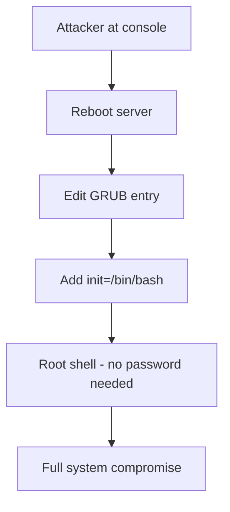

# How to Harden the RHEL 9 Bootloader with GRUB2 Password Protection

Author: [nawazdhandala](https://www.github.com/nawazdhandala)

Tags: RHEL, GRUB2, Bootloader, Security, Linux

Description: Protect your RHEL 9 bootloader with GRUB2 password authentication to prevent unauthorized changes to boot parameters and single-user mode access.

---

If someone can get to the GRUB2 menu on your RHEL 9 server, they can boot into single-user mode, reset the root password, and own the entire system. This takes about 30 seconds. All the SSH hardening and firewall rules in the world mean nothing if an attacker has physical or console access and the bootloader is unprotected.

GRUB2 password protection is one of those controls that is easy to implement and addresses a real threat, especially for servers in shared data centers, colo facilities, or anywhere the physical console might be accessible.

## How the Attack Works

Without a GRUB2 password, anyone with console access can:

1. Reboot the server
2. Press `e` at the GRUB menu to edit boot parameters
3. Append `init=/bin/bash` to the kernel line
4. Boot directly into a root shell with no authentication



## Generate a GRUB2 Password Hash

First, create a password hash. Never store the actual password in plain text in GRUB configuration files:

```bash
# Generate a PBKDF2 password hash
grub2-mkpasswd-pbkdf2

# You will be prompted to enter and confirm a password
# The output will look like:
# PBKDF2 hash of your password is grub.pbkdf2.sha512.10000.LONGHEXSTRING
```

Copy the entire hash string starting with `grub.pbkdf2.sha512...` - you will need it in the next step.

## Configure the GRUB2 Superuser

Create a custom configuration file that sets up the GRUB2 superuser and password:

```bash
# Create the GRUB2 user configuration
cat > /etc/grub.d/01_users << 'EOF'
#!/bin/sh
cat << 'GRUBEOF'
set superusers="grubadmin"
password_pbkdf2 grubadmin PASTE_YOUR_HASH_HERE
GRUBEOF
EOF

# Make it executable
chmod +x /etc/grub.d/01_users
```

Replace `PASTE_YOUR_HASH_HERE` with the actual hash you generated in the previous step.

## Regenerate the GRUB2 Configuration

After adding the user configuration, regenerate the GRUB2 config:

```bash
# For BIOS-based systems
grub2-mkconfig -o /boot/grub2/grub.cfg

# For UEFI-based systems
grub2-mkconfig -o /boot/efi/EFI/redhat/grub.cfg
```

## Allow Normal Booting Without a Password

By default, once you set a GRUB2 password, users will need to enter it just to boot normally. That is usually too restrictive. You want the password to be required only for editing boot entries or accessing the GRUB command line, not for standard booting.

To allow password-free normal booting, modify the menu entry class:

```bash
# Edit the 10_linux template to add --unrestricted to menu entries
# This allows booting without a password while still requiring
# a password for editing

# Back up the original
cp /etc/grub.d/10_linux /etc/grub.d/10_linux.bak

# Add --unrestricted to the CLASS variable
sed -i 's/^CLASS="--class gnu-linux --class gnu --class os"/CLASS="--class gnu-linux --class gnu --class os --unrestricted"/' /etc/grub.d/10_linux

# Regenerate the configuration
grub2-mkconfig -o /boot/grub2/grub.cfg
```

Now normal booting works without a password, but pressing `e` to edit or `c` for the GRUB command line will require authentication.

## Verify the Configuration

Test that the protection is working:

```bash
# Check the generated GRUB config for the superuser setting
grep -A2 "superusers" /boot/grub2/grub.cfg

# Check that menu entries have --unrestricted
grep "unrestricted" /boot/grub2/grub.cfg | head -5

# Verify the password hash is present
grep "password_pbkdf2" /boot/grub2/grub.cfg
```

## Protect the GRUB Configuration Files

The GRUB configuration files themselves need to be protected:

```bash
# Set strict permissions on the GRUB config
chmod 600 /boot/grub2/grub.cfg

# For UEFI systems
chmod 600 /boot/efi/EFI/redhat/grub.cfg

# Verify ownership
ls -la /boot/grub2/grub.cfg
# Should show: -rw------- root root
```

## Set Permissions on the Custom User File

```bash
# Protect the custom GRUB user configuration
chmod 700 /etc/grub.d/01_users
chown root:root /etc/grub.d/01_users

# Also protect the entire grub.d directory
chmod 700 /etc/grub.d/
```

## Configure Multiple GRUB Users

You can set up multiple users with different access levels:

```bash
# Example with multiple users
cat > /etc/grub.d/01_users << 'EOF'
#!/bin/sh
cat << 'GRUBEOF'
set superusers="grubadmin"
password_pbkdf2 grubadmin HASH_FOR_ADMIN
password_pbkdf2 grubmaint HASH_FOR_MAINTENANCE
GRUBEOF
EOF

chmod +x /etc/grub.d/01_users
grub2-mkconfig -o /boot/grub2/grub.cfg
```

## Audit GRUB2 Configuration Changes

Add an audit rule to monitor changes to GRUB configuration:

```bash
# Monitor GRUB config changes with auditd
cat >> /etc/audit/rules.d/grub.rules << 'EOF'
-w /boot/grub2/grub.cfg -p wa -k grub_config
-w /etc/grub.d/ -p wa -k grub_config
-w /etc/default/grub -p wa -k grub_config
EOF

# Load the new rules
augenrules --load
```

## What to Do If You Forget the GRUB Password

If you forget the GRUB password, you will need to boot from rescue media:

1. Boot from the RHEL 9 installation ISO
2. Choose "Troubleshooting" then "Rescue a Red Hat Enterprise Linux system"
3. Mount the installed system (the rescue environment will offer to do this)
4. Remove or edit `/etc/grub.d/01_users`
5. Regenerate the GRUB config
6. Reboot from the hard drive

This is exactly the kind of physical access attack that GRUB2 passwords protect against, which is why physical security of the server and the rescue media matters too.

## BIOS vs UEFI Considerations

On UEFI systems with Secure Boot enabled, you get an additional layer of protection. Secure Boot verifies that the bootloader and kernel are signed, which prevents an attacker from replacing the bootloader with a modified version that skips password checks:

```bash
# Check if Secure Boot is enabled
mokutil --sb-state

# Check if the system is UEFI or BIOS
[ -d /sys/firmware/efi ] && echo "UEFI" || echo "BIOS"
```

GRUB2 password protection is a quick win that closes a significant security gap. It takes five minutes to set up and blocks one of the most commonly demonstrated physical access attacks. If your servers are in any environment where someone other than your team could access the console, this is a must-have control.
