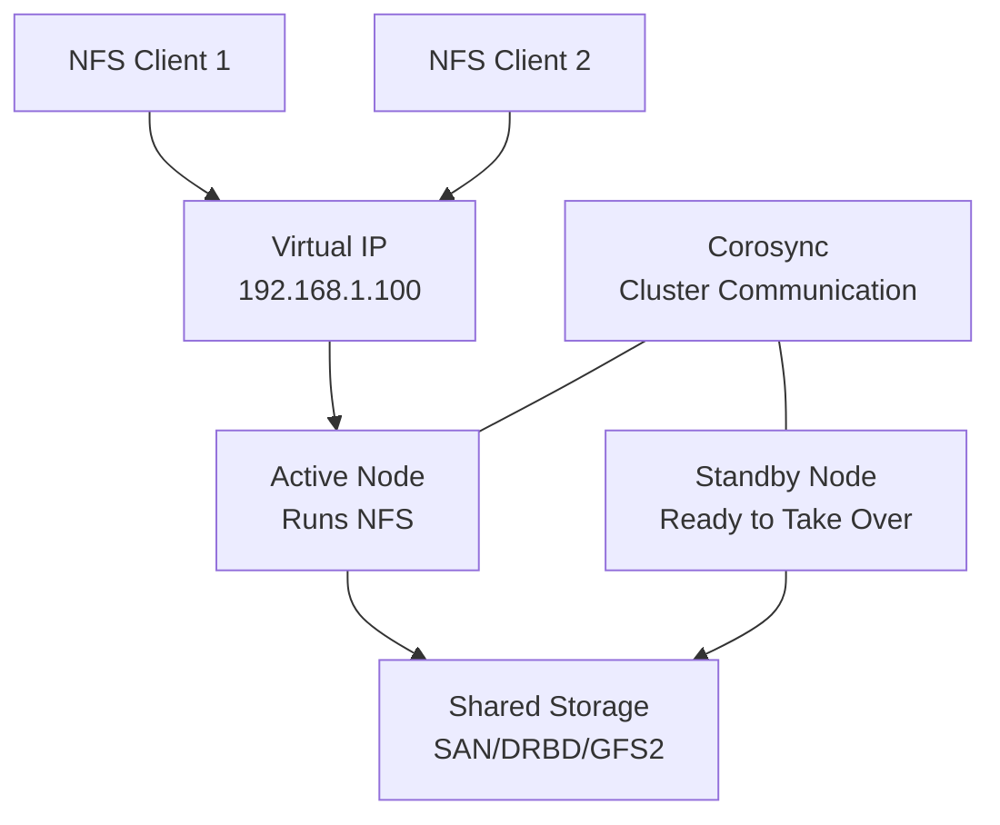

# How to Set Up a High-Availability NFS Cluster on RHEL

Author: [nawazdhandala](https://www.github.com/nawazdhandala)

Tags: RHEL, NFS, High Availability, Cluster, Linux

Description: Build a highly available NFS cluster on RHEL using Pacemaker and Corosync, ensuring NFS exports survive node failures with automatic failover.

---

## Why HA for NFS?

A single NFS server is a single point of failure. If it goes down, every client loses access to their data. For production workloads, that is unacceptable. A high-availability (HA) NFS cluster uses two or more nodes with shared storage, a virtual IP, and automatic failover so that NFS service continues even when a node fails.

## Architecture



Clients connect to the virtual IP. Pacemaker moves the IP and NFS service to the surviving node if the active node fails.

## Prerequisites

- Two RHEL servers with the High Availability Add-On
- Shared storage accessible from both nodes (SAN, iSCSI, or DRBD)
- Network connectivity between nodes for cluster heartbeat
- A separate network for cluster communication (recommended)

## Step 1 - Install Cluster Packages

On both nodes:

```bash
# Install Pacemaker, Corosync, and NFS packages
sudo dnf install -y pcs pacemaker corosync fence-agents-all nfs-utils

# Enable and start the cluster management service
sudo systemctl enable --now pcsd
```

## Step 2 - Set Cluster Authentication

```bash
# Set the hacluster user password on both nodes
sudo passwd hacluster

# Authenticate the nodes (run on one node)
sudo pcs host auth node1.example.com node2.example.com -u hacluster
```

## Step 3 - Create the Cluster

```bash
# Create and start the cluster
sudo pcs cluster setup ha-nfs node1.example.com node2.example.com

# Start the cluster on all nodes
sudo pcs cluster start --all

# Enable cluster to start on boot
sudo pcs cluster enable --all

# Verify cluster status
sudo pcs status
```

## Step 4 - Configure Fencing

Fencing is mandatory for a production cluster. It prevents split-brain scenarios by ensuring a failed node is powered off before the surviving node takes over.

```bash
# Example: IPMI fencing agent
sudo pcs stonith create fence-node1 fence_ipmilan \
    ipaddr=192.168.1.201 login=admin passwd=secret \
    pcmk_host_list=node1.example.com

sudo pcs stonith create fence-node2 fence_ipmilan \
    ipaddr=192.168.1.202 login=admin passwd=secret \
    pcmk_host_list=node2.example.com
```

## Step 5 - Prepare Shared Storage

The NFS data must be on storage accessible from both nodes. This example uses a shared LVM volume:

```bash
# On both nodes, create the shared volume group
# (The physical volume must be on shared storage, e.g., iSCSI or SAN)
sudo pvcreate /dev/sdb
sudo vgcreate nfs_vg /dev/sdb
sudo lvcreate -L 100G -n nfs_lv nfs_vg

# Format on one node only
sudo mkfs.xfs /dev/nfs_vg/nfs_lv
```

## Step 6 - Create Cluster Resources

Create resources for the filesystem, virtual IP, and NFS server:

```bash
# Create the filesystem resource
sudo pcs resource create nfs_fs ocf:heartbeat:Filesystem \
    device="/dev/nfs_vg/nfs_lv" directory="/srv/nfs/shared" fstype="xfs" \
    --group nfs_group

# Create the virtual IP resource
sudo pcs resource create nfs_vip ocf:heartbeat:IPaddr2 \
    ip=192.168.1.100 cidr_netmask=24 \
    --group nfs_group

# Create the NFS server resource
sudo pcs resource create nfs_server ocf:heartbeat:nfsserver \
    nfs_shared_infodir=/srv/nfs/nfsinfo \
    --group nfs_group

# Create the NFS export resource
sudo pcs resource create nfs_export ocf:heartbeat:exportfs \
    clientspec="192.168.1.0/24" options="rw,sync,no_root_squash" \
    directory="/srv/nfs/shared" fsid=1 \
    --group nfs_group
```

## Step 7 - Configure Resource Ordering and Colocation

The resource group handles ordering automatically, but verify:

```bash
# Resources in the group start in order and run on the same node
sudo pcs resource group list

# Verify constraints
sudo pcs constraint list
```

## Step 8 - Configure the Firewall

On both nodes:

```bash
# Open NFS and cluster ports
sudo firewall-cmd --permanent --add-service=nfs
sudo firewall-cmd --permanent --add-service=mountd
sudo firewall-cmd --permanent --add-service=rpc-bind
sudo firewall-cmd --permanent --add-service=high-availability
sudo firewall-cmd --reload
```

## Step 9 - Test the Cluster

```bash
# Check cluster status
sudo pcs status

# Mount from a client using the virtual IP
sudo mount -t nfs 192.168.1.100:/srv/nfs/shared /mnt/nfs-ha

# Create a test file
echo "HA test" > /mnt/nfs-ha/test.txt
```

## Step 10 - Test Failover

```bash
# On the active node, simulate a failure
sudo pcs node standby node1.example.com

# Watch the resources move to node2
sudo pcs status

# From the client, verify access still works
cat /mnt/nfs-ha/test.txt

# Bring node1 back
sudo pcs node unstandby node1.example.com
```

## Client Configuration

Clients should mount using the virtual IP and use the `hard` mount option:

```bash
# /etc/fstab on clients
192.168.1.100:/srv/nfs/shared  /mnt/nfs-ha  nfs  rw,hard,intr,_netdev,nofail  0 0
```

During failover, there will be a brief pause (typically 30-90 seconds) while resources move to the surviving node. The `hard` mount option ensures the client retries until the service is back.

## Monitoring the Cluster

```bash
# Cluster status overview
sudo pcs status

# Detailed resource status
sudo pcs resource status

# Check for failures
sudo pcs resource failcount show

# View cluster logs
journalctl -u pacemaker
journalctl -u corosync
```

## Wrap-Up

A high-availability NFS cluster on RHEL eliminates the single point of failure that a standalone NFS server represents. Using Pacemaker and Corosync, the NFS service, filesystem, and virtual IP failover automatically when a node goes down. The setup requires shared storage, proper fencing, and careful resource configuration, but once running, it provides reliable NFS service that survives node failures with minimal disruption to clients.
