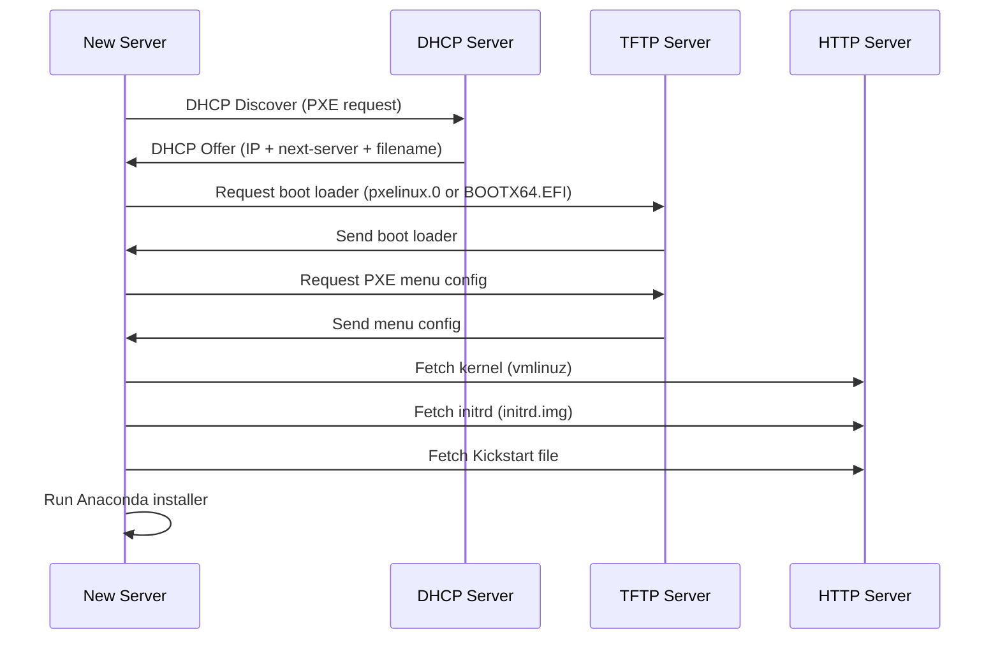

# How to Host a Kickstart File on a Network Server for PXE Boot on RHEL

Author: [nawazdhandala](https://www.github.com/nawazdhandala)

Tags: RHEL, Kickstart, PXE, Network Server, DHCP, Linux

Description: Learn how to set up a complete PXE boot environment on RHEL to serve Kickstart files over the network, covering DHCP, TFTP, HTTP configuration, and PXE menu setup.

---

PXE booting combined with Kickstart is how you deploy RHEL at scale without touching USB drives or mounting ISOs. A machine boots from the network, pulls down the installer and a Kickstart file, and installs itself without any manual intervention. Setting up the infrastructure takes some effort, but once it is running, deploying a new server is as simple as powering it on and selecting network boot.

## The PXE Boot Process

Before we start configuring services, it helps to understand what actually happens during a PXE boot:



You need three services working together: DHCP to direct the client, TFTP to serve the boot loader, and HTTP to serve the installation files and Kickstart config.

## Prerequisites

You need a RHEL server that will act as your deployment server. This machine needs:

- A static IP address
- Access to the RHEL ISO or repository
- Network connectivity to the subnet where you are deploying machines

```bash
# Install all required packages
sudo dnf install -y \
  dhcp-server \
  tftp-server \
  httpd \
  syslinux-tftpboot \
  shim-x64 \
  grub2-efi-x64
```

## Setting Up the HTTP Server

First, let's make the RHEL installation files available over HTTP.

```bash
# Create a directory for the RHEL repo
sudo mkdir -p /var/www/html/rhel9

# Mount the RHEL ISO
sudo mount -o loop /path/to/rhel-9.4-x86_64-dvd.iso /mnt

# Copy the contents to the web directory
sudo cp -a /mnt/* /var/www/html/rhel9/
sudo umount /mnt

# Set permissions
sudo chmod -R 755 /var/www/html/rhel9/
```

### Host the Kickstart File

```bash
# Create a directory for Kickstart files
sudo mkdir -p /var/www/html/kickstart

# Copy your Kickstart file (assuming you have one ready)
sudo cp kickstart.cfg /var/www/html/kickstart/

# You can have multiple Kickstart files for different server roles
# sudo cp ks-webserver.cfg /var/www/html/kickstart/
# sudo cp ks-database.cfg /var/www/html/kickstart/

# Set permissions
sudo chmod 644 /var/www/html/kickstart/*.cfg
```

### Enable and Start Apache

```bash
# Enable and start httpd
sudo systemctl enable --now httpd

# Open the firewall for HTTP
sudo firewall-cmd --permanent --add-service=http
sudo firewall-cmd --reload

# Test that the files are accessible
curl -I http://localhost/rhel9/
curl -I http://localhost/kickstart/kickstart.cfg
```

## Setting Up the TFTP Server

TFTP serves the initial boot loader files that the PXE client downloads.

### Configure TFTP for BIOS Boot

```bash
# The tftp-server package creates /var/lib/tftpboot
# Copy the BIOS PXE boot files
sudo cp /tftpboot/pxelinux.0 /var/lib/tftpboot/
sudo cp /tftpboot/ldlinux.c32 /var/lib/tftpboot/
sudo cp /tftpboot/libutil.c32 /var/lib/tftpboot/
sudo cp /tftpboot/menu.c32 /var/lib/tftpboot/
sudo cp /tftpboot/vesamenu.c32 /var/lib/tftpboot/

# Create the PXE config directory
sudo mkdir -p /var/lib/tftpboot/pxelinux.cfg

# Copy the kernel and initrd from the RHEL repo
sudo mkdir -p /var/lib/tftpboot/rhel9
sudo cp /var/www/html/rhel9/images/pxeboot/vmlinuz /var/lib/tftpboot/rhel9/
sudo cp /var/www/html/rhel9/images/pxeboot/initrd.img /var/lib/tftpboot/rhel9/
```

### Configure TFTP for UEFI Boot

Most modern servers use UEFI, so you need to set this up as well.

```bash
# Create UEFI boot directory
sudo mkdir -p /var/lib/tftpboot/uefi

# Copy the UEFI boot files
sudo cp /boot/efi/EFI/BOOT/BOOTX64.EFI /var/lib/tftpboot/uefi/
sudo cp /boot/efi/EFI/redhat/grubx64.efi /var/lib/tftpboot/uefi/
```

### Create the BIOS PXE Menu

```bash
# Create the default PXE boot menu for BIOS clients
sudo tee /var/lib/tftpboot/pxelinux.cfg/default << 'EOF'
DEFAULT menu.c32
PROMPT 0
TIMEOUT 300
MENU TITLE RHEL PXE Boot Menu

LABEL rhel9-kickstart
  MENU LABEL Install RHEL (Kickstart - Automated)
  KERNEL rhel9/vmlinuz
  APPEND initrd=rhel9/initrd.img inst.repo=http://192.168.1.50/rhel9/ inst.ks=http://192.168.1.50/kickstart/kickstart.cfg ip=dhcp

LABEL rhel9-manual
  MENU LABEL Install RHEL (Manual)
  KERNEL rhel9/vmlinuz
  APPEND initrd=rhel9/initrd.img inst.repo=http://192.168.1.50/rhel9/ ip=dhcp

LABEL local
  MENU LABEL Boot from local disk
  LOCALBOOT 0
EOF
```

Replace `192.168.1.50` with the IP address of your deployment server.

### Create the UEFI GRUB Menu

```bash
# Create the GRUB config for UEFI clients
sudo tee /var/lib/tftpboot/uefi/grub.cfg << 'EOF'
set timeout=30
set default=0

menuentry 'Install RHEL (Kickstart - Automated)' {
  linuxefi rhel9/vmlinuz inst.repo=http://192.168.1.50/rhel9/ inst.ks=http://192.168.1.50/kickstart/kickstart.cfg ip=dhcp
  initrdefi rhel9/initrd.img
}

menuentry 'Install RHEL (Manual)' {
  linuxefi rhel9/vmlinuz inst.repo=http://192.168.1.50/rhel9/ ip=dhcp
  initrdefi rhel9/initrd.img
}

menuentry 'Boot from local disk' {
  exit
}
EOF
```

### Enable TFTP

```bash
# Enable and start the TFTP server
sudo systemctl enable --now tftp.socket

# Open the firewall for TFTP
sudo firewall-cmd --permanent --add-service=tftp
sudo firewall-cmd --reload
```

## Setting Up DHCP

The DHCP server tells PXE clients where to find the TFTP server and which boot file to load. If you already have a DHCP server on your network (like a router or Windows DHCP), you may need to configure it instead of running a separate one. Check with your network team first.

### Configure dhcpd

```bash
# Back up the default config
sudo cp /etc/dhcp/dhcpd.conf /etc/dhcp/dhcpd.conf.bak

# Write the DHCP configuration
sudo tee /etc/dhcp/dhcpd.conf << 'EOF'
# DHCP server configuration for PXE boot

# Global options
option domain-name "example.com";
option domain-name-servers 192.168.1.10, 8.8.8.8;
default-lease-time 600;
max-lease-time 7200;
authoritative;

# Subnet definition
subnet 192.168.1.0 netmask 255.255.255.0 {
    range 192.168.1.200 192.168.1.250;
    option routers 192.168.1.1;
    option subnet-mask 255.255.255.0;
    next-server 192.168.1.50;

    # Detect BIOS vs UEFI and serve the appropriate bootloader
    class "pxe-bios" {
        match if substring (option vendor-class-identifier, 0, 20) = "PXEClient:Arch:00000";
        filename "pxelinux.0";
    }

    class "pxe-uefi" {
        match if substring (option vendor-class-identifier, 0, 20) = "PXEClient:Arch:00007";
        filename "uefi/BOOTX64.EFI";
    }
}
EOF
```

Key options explained:

- `next-server` - Points to the TFTP server IP (your deployment server)
- `filename` - The boot file the PXE client should download from TFTP
- The class matching detects whether the client is BIOS or UEFI and serves the correct boot loader

### Bind DHCP to the Correct Interface

If your server has multiple network interfaces, specify which one DHCP should listen on:

```bash
# Edit the dhcpd service to bind to a specific interface
sudo sed -i 's/^ExecStart=.*/ExecStart=\/usr\/sbin\/dhcpd -f -cf \/etc\/dhcp\/dhcpd.conf -user dhcpd -group dhcpd --no-pid ens192/' /etc/systemd/system/dhcpd.service

# Or create a systemd override
sudo systemctl edit dhcpd
```

Add in the override:

```ini
[Service]
ExecStart=
ExecStart=/usr/sbin/dhcpd -f -cf /etc/dhcp/dhcpd.conf -user dhcpd -group dhcpd --no-pid ens192
```

### Start DHCP

```bash
# Reload systemd, enable and start dhcpd
sudo systemctl daemon-reload
sudo systemctl enable --now dhcpd

# Check the status
sudo systemctl status dhcpd

# Open the firewall for DHCP
sudo firewall-cmd --permanent --add-service=dhcp
sudo firewall-cmd --reload
```

## Directory Structure Overview

After all the setup, your file layout should look like this:

```
/var/lib/tftpboot/
    pxelinux.0
    ldlinux.c32
    menu.c32
    vesamenu.c32
    libutil.c32
    pxelinux.cfg/
        default
    uefi/
        BOOTX64.EFI
        grubx64.efi
        grub.cfg
    rhel9/
        vmlinuz
        initrd.img

/var/www/html/
    rhel9/
        (full RHEL ISO contents)
    kickstart/
        kickstart.cfg
```

## Testing the Setup

Before deploying to production hardware, test with a VM:

1. Create a VM with PXE boot enabled as the first boot device
2. Connect it to the same network as your deployment server
3. Power it on and watch the PXE boot process

```bash
# Monitor DHCP leases to confirm the client is getting an address
sudo journalctl -u dhcpd -f

# Monitor TFTP transfers
sudo journalctl -u tftp -f

# Monitor HTTP requests for the Kickstart and repo files
sudo tail -f /var/log/httpd/access_log
```

## Using FTP Instead of HTTP

Some environments prefer FTP for hosting the repo and Kickstart files. Here is a quick setup:

```bash
# Install vsftpd
sudo dnf install -y vsftpd

# The default FTP root is /var/ftp/pub
sudo cp -a /var/www/html/rhel9 /var/ftp/pub/
sudo cp -a /var/www/html/kickstart /var/ftp/pub/

# Enable and start vsftpd
sudo systemctl enable --now vsftpd

# Open the firewall
sudo firewall-cmd --permanent --add-service=ftp
sudo firewall-cmd --reload
```

Then update your PXE menu to use FTP URLs:

```
inst.repo=ftp://192.168.1.50/pub/rhel9/ inst.ks=ftp://192.168.1.50/pub/kickstart/kickstart.cfg
```

## Per-Host Kickstart Files

You can serve different Kickstart files based on the client's MAC address. This is useful when different servers need different configurations.

In the BIOS PXE config directory, create files named by MAC address:

```bash
# Create a MAC-specific PXE config (use dashes, lowercase, prefix with 01-)
sudo tee /var/lib/tftpboot/pxelinux.cfg/01-aa-bb-cc-dd-ee-ff << 'EOF'
DEFAULT rhel9
LABEL rhel9
  KERNEL rhel9/vmlinuz
  APPEND initrd=rhel9/initrd.img inst.repo=http://192.168.1.50/rhel9/ inst.ks=http://192.168.1.50/kickstart/ks-webserver.cfg ip=dhcp
EOF
```

PXE clients look for configuration files in this order:
1. By MAC address (01-aa-bb-cc-dd-ee-ff)
2. By IP address in hexadecimal
3. The `default` file

## Troubleshooting

### Client Does Not Get a DHCP Offer

```bash
# Check that dhcpd is running and listening
sudo systemctl status dhcpd
sudo ss -ulnp | grep :67

# Check for DHCP conflicts with another server
sudo tcpdump -i ens192 port 67 or port 68 -n
```

### Client Gets IP But Cannot Download Boot Loader

```bash
# Verify TFTP is running
sudo systemctl status tftp.socket
sudo ss -ulnp | grep :69

# Test TFTP manually from another machine
tftp 192.168.1.50 -c get pxelinux.0

# Check file permissions
ls -la /var/lib/tftpboot/pxelinux.0
```

### Installer Starts But Cannot Find Kickstart

```bash
# Verify the Kickstart file is accessible via HTTP
curl http://192.168.1.50/kickstart/kickstart.cfg

# Check Apache logs for errors
sudo tail -f /var/log/httpd/error_log
```

### SELinux Blocking TFTP or HTTP

```bash
# Check for SELinux denials
sudo ausearch -m avc -ts recent

# If TFTP files have wrong context
sudo restorecon -R /var/lib/tftpboot/

# If HTTP files have wrong context
sudo restorecon -R /var/www/html/
```

## Security Considerations

A PXE boot server hands out operating system installations to any machine on the network. Keep these points in mind:

- Put the PXE server on a dedicated management VLAN, not on the production network
- Use DHCP class matching to only respond to known MAC addresses if possible
- Do not put sensitive data (passwords, keys) in Kickstart files hosted on HTTP without access controls
- Consider using HTTPS for serving Kickstart files if they contain secrets
- Monitor the DHCP and HTTP logs for unexpected boot requests

PXE boot with Kickstart is the backbone of large-scale RHEL deployments. The initial setup takes some work, but the payoff is massive when you need to roll out dozens or hundreds of servers with consistent configurations.
