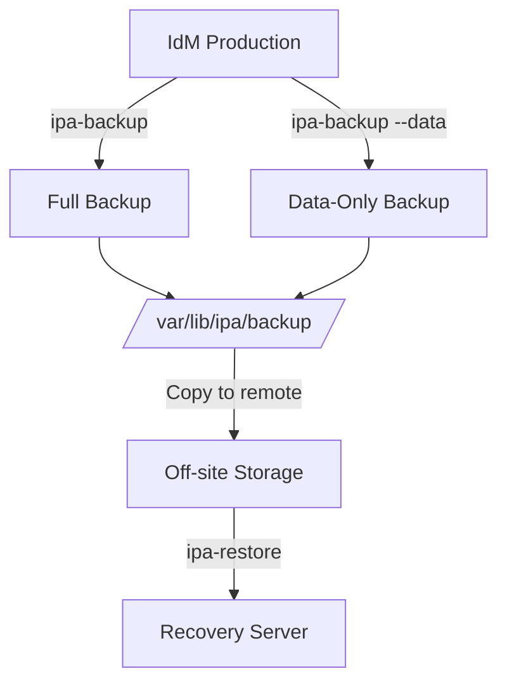

# How to Plan IdM Disaster Recovery and Backup Strategies on RHEL

Author: [nawazdhandala](https://www.github.com/nawazdhandala)

Tags: RHEL, IdM, Disaster Recovery, Backups, Linux

Description: A comprehensive guide to backing up and restoring Red Hat Identity Management on RHEL, including disaster recovery planning, backup types, and recovery procedures.

---

Losing your IdM infrastructure means users cannot log in, services cannot authenticate, and everything that depends on centralized identity falls apart. Having a tested backup and recovery plan is not optional. This guide covers the tools and procedures for protecting your IdM deployment on RHEL.

## Backup and Recovery Overview



## Types of Backups

IdM provides two backup types:

- **Full backup**: Includes everything needed to rebuild the server from scratch, including configuration files, certificates, keys, and directory data. Must be run while IdM services are stopped.
- **Data-only backup**: Includes only the LDAP data and the changelog. Can be run while IdM services are running. Useful for recovering from data corruption without rebuilding the whole server.

## Step 1 - Create a Full Backup

Full backups capture everything. Run them during maintenance windows since they stop IdM services.

```bash
# Create a full server backup (stops services temporarily)
sudo ipa-backup

# The backup is stored in /var/lib/ipa/backup/
ls -la /var/lib/ipa/backup/
```

The backup creates a GPG-encrypted archive by default. You will see a directory like `ipa-full-2026-03-04-02-30-00`.

## Step 2 - Create a Data-Only Backup

Data backups are lighter and can run online. Schedule these more frequently.

```bash
# Create a data-only backup (services keep running)
sudo ipa-backup --data

# List available backups
ls -la /var/lib/ipa/backup/
```

## Step 3 - Automate Backups with a Cron Job

Set up automated backups to run daily.

```bash
# Create a backup script
sudo tee /usr/local/bin/idm-backup.sh << 'SCRIPT'
#!/bin/bash
# Daily IdM data backup
LOGFILE="/var/log/idm-backup.log"
echo "$(date): Starting IdM backup" >> "$LOGFILE"

# Run data-only backup
/usr/sbin/ipa-backup --data >> "$LOGFILE" 2>&1

# Clean up backups older than 30 days
find /var/lib/ipa/backup/ -maxdepth 1 -type d -mtime +30 -exec rm -rf {} \; >> "$LOGFILE" 2>&1

echo "$(date): Backup complete" >> "$LOGFILE"
SCRIPT

# Make it executable
sudo chmod 700 /usr/local/bin/idm-backup.sh

# Schedule a daily data backup at 2 AM
echo "0 2 * * * root /usr/local/bin/idm-backup.sh" | sudo tee /etc/cron.d/idm-backup
```

Schedule a weekly full backup during a maintenance window:

```bash
# Weekly full backup on Sunday at 3 AM
echo "0 3 * * 0 root /usr/sbin/ipa-backup >> /var/log/idm-backup.log 2>&1" | sudo tee -a /etc/cron.d/idm-backup
```

## Step 4 - Copy Backups Off-Site

Backups on the same server they protect are not real backups. Copy them to a remote location.

```bash
# Copy backup to a remote server
sudo rsync -avz /var/lib/ipa/backup/ backupuser@backup-server:/backups/idm/

# Or use scp for a single backup
sudo scp -r /var/lib/ipa/backup/ipa-full-2026-03-04-02-30-00 \
  backupuser@backup-server:/backups/idm/
```

## Step 5 - Restore from a Full Backup

If you lose a server completely, restore from a full backup on a fresh RHEL install.

```bash
# Install IdM server packages first (do NOT run ipa-server-install)
sudo dnf install ipa-server ipa-server-dns ipa-server-ca -y

# Copy the backup to the new server
sudo scp -r backupuser@backup-server:/backups/idm/ipa-full-2026-03-04-02-30-00 \
  /var/lib/ipa/backup/

# Restore from the full backup
sudo ipa-restore /var/lib/ipa/backup/ipa-full-2026-03-04-02-30-00
```

The restore process will:
1. Stop any running IdM services
2. Restore all configuration files, certificates, and data
3. Restart IdM services

After restoring, verify the server is working:

```bash
# Check IdM services
sudo ipactl status

# Verify authentication works
kinit admin
ipa user-find --sizelimit=5
```

## Step 6 - Restore Data Only

If the server is intact but data is corrupted, use a data-only restore.

```bash
# Restore only the data (keeps existing config and certs)
sudo ipa-restore --data /var/lib/ipa/backup/ipa-data-2026-03-04-02-00-00
```

## Disaster Recovery Scenarios

### Scenario 1 - Single Replica Failure (Multi-Server Topology)

If one server fails but others are running, this is the easiest recovery. Just build a new replica.

```bash
# On a remaining healthy server, verify the topology
ipa server-find
ipa topologysuffix-verify domain

# Remove the failed server from the topology
ipa server-del failed-server.example.com

# Build a new replica on fresh hardware
sudo ipa-replica-install --setup-ca --setup-dns --forwarder=8.8.8.8
```

### Scenario 2 - CA Renewal Master Failure

If the CA renewal master fails, reassign the role before rebuilding.

```bash
# On a surviving CA replica, take over the renewal master role
ipa config-mod --ca-renewal-master-server=surviving-server.example.com

# Enable CRL generation on the surviving server
sudo ipa-crlgen-manage enable
```

### Scenario 3 - Complete Infrastructure Loss

If all IdM servers are lost, you must restore from backup.

```bash
# On a fresh RHEL system with the same hostname and IP as the original master
sudo dnf install ipa-server ipa-server-dns ipa-server-ca -y

# Restore from the most recent full backup
sudo ipa-restore /var/lib/ipa/backup/ipa-full-2026-03-04-02-30-00

# After restoration, reinitialize any replicas
# On each replica, force a full resync
ipa-replica-manage re-initialize --from=restored-master.example.com
```

## Testing Your Recovery Plan

A backup you have never tested is a backup you cannot trust. Schedule regular recovery drills.

```bash
# Spin up a test VM with the same FQDN (isolated network)
# Restore the backup
sudo ipa-restore /var/lib/ipa/backup/ipa-full-2026-03-04-02-30-00

# Verify services start
sudo ipactl status

# Verify data integrity
kinit admin
ipa user-find --sizelimit=0 | tail -1
ipa group-find --sizelimit=0 | tail -1
ipa cert-find --sizelimit=0 | tail -1
```

## Backup Checklist

Run through this checklist regularly:

- Daily data-only backups are running and completing successfully
- Weekly full backups are running
- Backups are copied to an off-site location
- Backup retention policy is in place (keeping at least 30 days)
- Recovery procedure has been tested within the last quarter
- The team knows who is responsible for IdM recovery
- Recovery documentation is up to date and accessible during an outage
- Network and DNS configuration for the IdM servers is documented separately

Do not wait for a disaster to find out if your backups work. Test them regularly, keep them off-site, and document the recovery procedure so anyone on the team can execute it.
