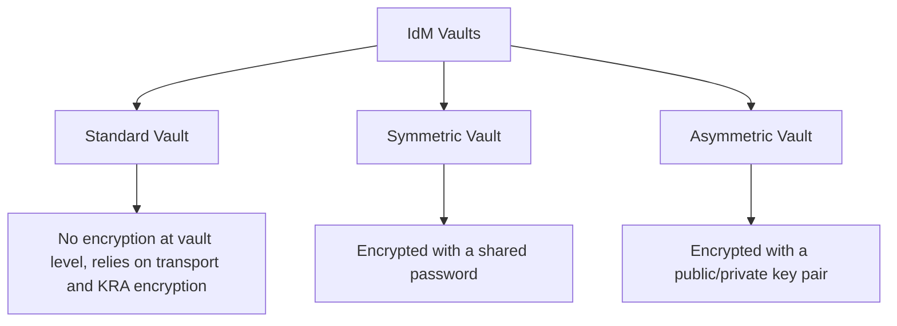

# How to Use IdM Vaults for Storing Secrets on RHEL

Author: [nawazdhandala](https://www.github.com/nawazdhandala)

Tags: RHEL, IdM, Vault, Secrets, Linux

Description: A hands-on guide to using IdM vaults on RHEL to securely store and retrieve secrets like passwords, keys, and certificates, including vault types, access control, and practical examples.

---

IdM vaults give you a way to store sensitive data like passwords, API keys, certificates, and other secrets inside the IdM directory itself. The vault system uses the Key Recovery Authority (KRA) component of the integrated CA to encrypt data at rest. It is not a replacement for something like HashiCorp Vault in a complex microservices environment, but for storing secrets that need to be accessible to specific users or services within your IdM domain, it works well.

## Vault Types



- **Standard**: The simplest type. Data is protected by access control and KRA encryption but has no additional vault-level encryption.
- **Symmetric**: Encrypted with a password. Anyone who knows the password and has access to the vault can retrieve the data.
- **Asymmetric**: Encrypted with a public key. Only the holder of the private key can decrypt the data.

## Prerequisites

The KRA service must be installed on at least one IdM server. Check if it is already running:

```bash
# Check if KRA is installed
sudo ipactl status | grep kra
```

If KRA is not installed, add it:

```bash
# Install the KRA service on an IdM server with a CA
sudo ipa-kra-install
```

## Step 1 - Create a Standard Vault

Standard vaults are the quickest to set up. They are suitable for secrets that need access control but do not require an additional encryption layer.

```bash
# Create a standard user vault
ipa vault-add my_api_key --type=standard

# Store a secret in the vault
ipa vault-archive my_api_key --data="sk_live_abc123def456"

# Retrieve the secret
ipa vault-retrieve my_api_key
```

## Step 2 - Create a Symmetric Vault

Symmetric vaults add password-based encryption. You need the password to both store and retrieve data.

```bash
# Create a symmetric vault
ipa vault-add db_password --type=symmetric

# You will be prompted for an encryption password
# Store data in the vault
ipa vault-archive db_password --data="SuperSecret123!"

# Retrieve the data (you will need the encryption password)
ipa vault-retrieve db_password
```

You can also provide the password non-interactively:

```bash
# Archive with password from a file
echo "vault-encryption-password" > /tmp/vault-pw.txt
ipa vault-archive db_password \
  --data="SuperSecret123!" \
  --password-file=/tmp/vault-pw.txt

# Clean up the password file
rm -f /tmp/vault-pw.txt
```

## Step 3 - Create an Asymmetric Vault

Asymmetric vaults use public/private key pairs. Anyone with the public key can store data, but only the private key holder can retrieve it.

```bash
# Generate a key pair for the vault
openssl genrsa -out /tmp/vault-private.pem 2048
openssl rsa -in /tmp/vault-private.pem -pubout -out /tmp/vault-public.pem

# Create an asymmetric vault
ipa vault-add tls_private_key \
  --type=asymmetric \
  --public-key-file=/tmp/vault-public.pem

# Store data using the public key
ipa vault-archive tls_private_key \
  --in=/etc/pki/tls/private/server.key

# Retrieve data using the private key
ipa vault-retrieve tls_private_key \
  --private-key-file=/tmp/vault-private.pem \
  --out=/tmp/retrieved-server.key
```

## Step 4 - Work with Shared Vaults

Shared vaults are accessible to multiple users or services. They are useful for team secrets.

```bash
# Create a shared vault
ipa vault-add shared_db_creds \
  --type=symmetric \
  --shared

# Add a member who can access the vault
ipa vault-add-member shared_db_creds \
  --shared \
  --users=jsmith

# Add a group of users
ipa vault-add-member shared_db_creds \
  --shared \
  --groups=dbadmins
```

## Step 5 - Work with Service Vaults

Service vaults are tied to a specific service principal. This is useful for storing secrets that applications need to retrieve.

```bash
# Create a vault for a service
ipa vault-add app_secret \
  --type=standard \
  --service=HTTP/app.example.com

# Archive a secret for the service
ipa vault-archive app_secret \
  --service=HTTP/app.example.com \
  --data="service-specific-secret"

# Retrieve the secret (must authenticate as the service)
ipa vault-retrieve app_secret \
  --service=HTTP/app.example.com
```

## Step 6 - Store Files in Vaults

You can store entire files, not just text strings.

```bash
# Store a certificate file
ipa vault-add server_cert --type=standard
ipa vault-archive server_cert --in=/etc/pki/tls/certs/server.crt

# Retrieve the file
ipa vault-retrieve server_cert --out=/tmp/retrieved-cert.crt
```

## Managing Vaults

### List Vaults

```bash
# List your own vaults
ipa vault-find

# List shared vaults
ipa vault-find --shared

# List service vaults
ipa vault-find --service=HTTP/app.example.com

# List all vaults (admin only)
ipa vault-find --users=jsmith
```

### Show Vault Details

```bash
# Show vault metadata
ipa vault-show my_api_key
```

### Delete a Vault

```bash
# Delete a vault and its contents
ipa vault-del my_api_key
```

### Change Vault Password

For symmetric vaults, you can change the encryption password:

```bash
# Change the vault password
ipa vault-mod db_password --change-password
```

## Access Control for Vaults

Vault access is controlled by membership. Only vault owners and members can access the contents.

```bash
# Add a user as a vault member
ipa vault-add-member my_api_key --users=jsmith

# Remove a user from vault membership
ipa vault-remove-member my_api_key --users=jsmith

# Add a group
ipa vault-add-member my_api_key --groups=developers
```

## Practical Example: Distributing Database Credentials

Here is a real-world pattern for sharing database credentials across a team:

```bash
# Create a shared symmetric vault for database credentials
ipa vault-add prod_db_credentials \
  --type=symmetric \
  --shared

# Store the credentials as a JSON structure
ipa vault-archive prod_db_credentials \
  --shared \
  --data='{"host":"db.example.com","port":5432,"user":"app","password":"s3cret"}'

# Grant access to the DBA team
ipa vault-add-member prod_db_credentials \
  --shared \
  --groups=dba_team

# A DBA team member retrieves the credentials
ipa vault-retrieve prod_db_credentials --shared
```

## Troubleshooting

### KRA Not Available

If vault commands fail with KRA errors:

```bash
# Check KRA status
sudo systemctl status pki-tomcatd@pki-tomcat
sudo ipactl status | grep kra

# If KRA is not installed, install it
sudo ipa-kra-install
```

### Permission Denied

If a user cannot access a vault, check membership:

```bash
# Show vault details including members
ipa vault-show my_api_key --all
```

IdM vaults are a convenient place to store secrets for users and services within your IdM domain. For small to medium deployments, they eliminate the need for a separate secrets management system. Just make sure the KRA service is running, backed up, and replicated to at least two servers for redundancy.
