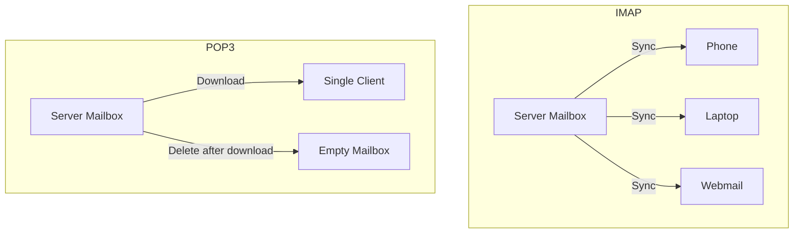

# How to Set Up IMAP and POP3 with Dovecot on RHEL

Author: [nawazdhandala](https://www.github.com/nawazdhandala)

Tags: RHEL, Dovecot, IMAP, POP3, Linux

Description: Install and configure Dovecot on RHEL to provide both IMAP and POP3 access to user mailboxes with TLS encryption.

---

## IMAP vs POP3

Both protocols let users read email, but they work differently:

**IMAP** keeps mail on the server. Changes sync across all devices. If you read an email on your phone, it shows as read on your laptop too. This is what most people expect today.

**POP3** downloads mail to the client and (by default) removes it from the server. Good for users who want local copies and do not use multiple devices.

Most setups today are IMAP-only, but Dovecot handles both with minimal extra configuration.

## Protocol Comparison



## Prerequisites

- RHEL with Postfix configured for local delivery
- TLS certificate for your mail server
- Firewall access to ports 993 (IMAPS) and 995 (POP3S)

## Installing Dovecot

```bash
# Install Dovecot with IMAP and POP3 support
sudo dnf install -y dovecot
```

## Enabling Protocols

Edit `/etc/dovecot/dovecot.conf`:

```bash
# Enable both IMAP and POP3
protocols = imap pop3
```

## TLS Configuration

Edit `/etc/dovecot/conf.d/10-ssl.conf`:

```bash
# Require TLS for all connections
ssl = required

# Certificate and key
ssl_cert = </etc/letsencrypt/live/mail.example.com/fullchain.pem
ssl_key = </etc/letsencrypt/live/mail.example.com/privkey.pem

# Only allow TLS 1.2 and above
ssl_min_protocol = TLSv1.2

# Use strong ciphers
ssl_prefer_server_ciphers = yes
```

## Authentication

Edit `/etc/dovecot/conf.d/10-auth.conf`:

```bash
# Do not allow plaintext auth without TLS
disable_plaintext_auth = yes

# Supported authentication mechanisms
auth_mechanisms = plain login
```

## Mail Location

Edit `/etc/dovecot/conf.d/10-mail.conf`:

```bash
# Maildir format in home directories
mail_location = maildir:~/Maildir

# Allow Dovecot to create the Maildir structure
mail_privileged_group = mail
```

## Listener Configuration

Edit `/etc/dovecot/conf.d/10-master.conf` to configure the listening ports:

```bash
service imap-login {
  inet_listener imap {
    # Disable plain IMAP (port 143)
    port = 0
  }
  inet_listener imaps {
    # Enable IMAPS (port 993)
    port = 993
    ssl = yes
  }
}

service pop3-login {
  inet_listener pop3 {
    # Disable plain POP3 (port 110)
    port = 0
  }
  inet_listener pop3s {
    # Enable POP3S (port 995)
    port = 995
    ssl = yes
  }
}
```

Setting the plain-text ports to 0 disables them entirely, forcing all connections through TLS.

## POP3-Specific Settings

Edit `/etc/dovecot/conf.d/20-pop3.conf`:

```bash
protocol pop3 {
  # Show deleted messages as expunged (required by some clients)
  pop3_uidl_format = %08Xu%08Xv

  # Do not delete messages after download (let clients decide)
  pop3_delete_type = flag
}
```

## Mailbox Configuration

Edit `/etc/dovecot/conf.d/15-mailboxes.conf`:

```bash
namespace inbox {
  inbox = yes

  mailbox Drafts {
    auto = subscribe
    special_use = \Drafts
  }
  mailbox Junk {
    auto = subscribe
    special_use = \Junk
  }
  mailbox Trash {
    auto = subscribe
    special_use = \Trash
  }
  mailbox Sent {
    auto = subscribe
    special_use = \Sent
  }
  mailbox Archive {
    auto = subscribe
    special_use = \Archive
  }
}
```

## Firewall Rules

```bash
# Allow IMAPS and POP3S
sudo firewall-cmd --permanent --add-service=imaps
sudo firewall-cmd --permanent --add-port=995/tcp
sudo firewall-cmd --reload
```

## Starting Dovecot

```bash
# Enable and start Dovecot
sudo systemctl enable --now dovecot
```

Verify it is listening:

```bash
# Check listening ports
sudo ss -tlnp | grep dovecot
```

You should see ports 993 and 995.

## Creating User Mailboxes

Dovecot uses system users by default. Create a test user:

```bash
# Create a mail user
sudo useradd -m testuser
sudo passwd testuser
```

The Maildir structure is created automatically when the user first receives mail or logs in.

## Testing IMAP

```bash
# Test IMAP over TLS
openssl s_client -connect mail.example.com:993
```

After connecting, authenticate and list mailboxes:

```bash
a1 LOGIN testuser password
a2 LIST "" "*"
a3 SELECT INBOX
a4 SEARCH ALL
a5 LOGOUT
```

## Testing POP3

```bash
# Test POP3 over TLS
openssl s_client -connect mail.example.com:995
```

After connecting:

```bash
USER testuser
PASS password
STAT
LIST
QUIT
```

## Testing with doveadm

Dovecot provides the `doveadm` tool for administration and testing:

```bash
# Test authentication
sudo doveadm auth test testuser

# List a user's mailboxes
sudo doveadm mailbox list -u testuser

# Check mailbox status
sudo doveadm mailbox status -u testuser messages,unseen INBOX

# Search for messages
sudo doveadm search -u testuser mailbox INBOX ALL
```

## Logging and Debugging

Edit `/etc/dovecot/conf.d/10-logging.conf`:

```bash
# Normal logging
log_path = syslog
syslog_facility = mail

# Enable verbose auth logging for troubleshooting
auth_verbose = yes

# Enable debug logging (disable in production)
# auth_debug = yes
# mail_debug = yes
```

Check logs:

```bash
# View Dovecot logs
sudo journalctl -u dovecot -f

# Or check maillog
sudo tail -f /var/log/maillog
```

## Client Configuration

### Thunderbird / Outlook Settings

| Setting | IMAP | POP3 |
|---|---|---|
| Server | mail.example.com | mail.example.com |
| Port | 993 | 995 |
| Security | SSL/TLS | SSL/TLS |
| Auth | Normal password | Normal password |

### Mobile Clients

Most mobile mail apps auto-detect settings if you have proper DNS SRV records:

```bash
_imaps._tcp.example.com.  IN  SRV  0 1 993 mail.example.com.
_pop3s._tcp.example.com.  IN  SRV  0 1 995 mail.example.com.
```

## Troubleshooting

**"Login failed" errors:**

```bash
# Check if PAM auth is working
sudo doveadm auth test username password
```

**Connection refused:**

```bash
# Check Dovecot is running
sudo systemctl status dovecot

# Check firewall
sudo firewall-cmd --list-all
```

**Mailbox not found:**

Check the mail_location matches Postfix's delivery path:

```bash
sudo doveconf mail_location
sudo postconf home_mailbox
```

## Wrapping Up

Dovecot provides solid IMAP and POP3 access on RHEL. For most deployments, stick with IMAP only unless you have specific requirements for POP3. Always use TLS-encrypted ports, disable plain-text listeners, and test thoroughly with `doveadm` before pointing clients at the server.
