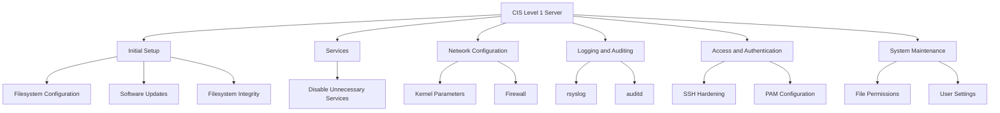

# How to Implement CIS Level 1 Server Hardening on RHEL

Author: [nawazdhandala](https://www.github.com/nawazdhandala)

Tags: RHEL, CIS Level 1, Hardening, Compliance, Linux

Description: A hands-on guide to implementing CIS Level 1 Server hardening controls on RHEL, covering the essential security configurations every server should have.

---

CIS Level 1 is the baseline security configuration that every server should meet. It represents the minimum set of security controls that can be applied without significantly impacting functionality. If you are not meeting CIS Level 1, your servers have gaps that most attackers can exploit. This guide walks through the key control areas with practical commands for RHEL.

## CIS Level 1 Overview

CIS Level 1 is organized into several sections. Here is how they break down:



## Section 1: Initial Setup

### Configure filesystem mount options

```bash
# Ensure /tmp has its own partition with restrictive options
# Check if /tmp is a separate mount
findmnt /tmp

# If using tmpfs for /tmp
systemctl enable tmp.mount
# Edit the mount to add noexec,nosuid,nodev

# Set restrictive mount options in /etc/fstab
# /tmp - nodev,nosuid,noexec
# /var/tmp - nodev,nosuid,noexec
# /home - nodev,nosuid
# /dev/shm - nodev,nosuid,noexec

# Apply mount option for /dev/shm immediately
mount -o remount,nodev,nosuid,noexec /dev/shm
```

### Disable unnecessary filesystems

```bash
# Create a modprobe config to disable unused filesystem modules
cat > /etc/modprobe.d/cis-filesystems.conf << 'EOF'
install cramfs /bin/false
install squashfs /bin/false
install udf /bin/false
install usb-storage /bin/false
EOF
```

### Enable filesystem integrity checking

```bash
# Install AIDE (Advanced Intrusion Detection Environment)
dnf install -y aide

# Initialize the AIDE database
aide --init

# Move the new database into place
mv /var/lib/aide/aide.db.new.gz /var/lib/aide/aide.db.gz

# Set up a daily integrity check via cron
echo "0 5 * * * root /usr/sbin/aide --check" >> /etc/crontab
```

## Section 2: Services

### Disable unnecessary services

```bash
# Time synchronization - ensure chrony is used (not ntpd)
systemctl enable --now chronyd
systemctl disable --now ntpd 2>/dev/null

# Disable services not needed on a server
for svc in avahi-daemon cups bluetooth rpcbind; do
    systemctl disable --now ${svc}.service 2>/dev/null
    systemctl disable --now ${svc}.socket 2>/dev/null
done

# Verify only necessary services are running
systemctl list-units --type=service --state=running
```

### Configure time synchronization

```bash
# Verify chrony is configured
cat /etc/chrony.conf | grep -E "^(server|pool)"

# Ensure chrony is running as the chrony user
grep "^OPTIONS" /etc/sysconfig/chronyd
# Should contain: OPTIONS="-u chrony"
```

## Section 3: Network Configuration

### Kernel network hardening

```bash
# Create sysctl configuration for CIS Level 1
cat > /etc/sysctl.d/60-cis-level1.conf << 'EOF'
# Disable IP forwarding
net.ipv4.ip_forward = 0
net.ipv6.conf.all.forwarding = 0

# Disable source routed packets
net.ipv4.conf.all.accept_source_route = 0
net.ipv4.conf.default.accept_source_route = 0
net.ipv6.conf.all.accept_source_route = 0
net.ipv6.conf.default.accept_source_route = 0

# Disable ICMP redirect acceptance
net.ipv4.conf.all.accept_redirects = 0
net.ipv4.conf.default.accept_redirects = 0
net.ipv6.conf.all.accept_redirects = 0
net.ipv6.conf.default.accept_redirects = 0

# Disable sending ICMP redirects
net.ipv4.conf.all.send_redirects = 0
net.ipv4.conf.default.send_redirects = 0

# Enable TCP SYN cookies
net.ipv4.tcp_syncookies = 1

# Log suspicious packets
net.ipv4.conf.all.log_martians = 1
net.ipv4.conf.default.log_martians = 1

# Ignore ICMP broadcast requests
net.ipv4.icmp_echo_ignore_broadcasts = 1

# Ignore bogus ICMP error responses
net.ipv4.icmp_ignore_bogus_error_responses = 1

# Enable reverse path filtering
net.ipv4.conf.all.rp_filter = 1
net.ipv4.conf.default.rp_filter = 1
EOF

# Apply the settings
sysctl --system
```

### Configure firewalld

```bash
# Ensure firewalld is running
systemctl enable --now firewalld

# Set the default zone to drop or public
firewall-cmd --set-default-zone=public

# Only allow SSH (add other services as needed)
firewall-cmd --permanent --zone=public --add-service=ssh
firewall-cmd --permanent --zone=public --remove-service=cockpit
firewall-cmd --permanent --zone=public --remove-service=dhcpv6-client
firewall-cmd --reload

# Verify the configuration
firewall-cmd --list-all
```

## Section 4: Logging and Auditing

### Configure rsyslog

```bash
# Ensure rsyslog is installed and running
dnf install -y rsyslog
systemctl enable --now rsyslog

# Verify default log file permissions
grep '^\$FileCreateMode' /etc/rsyslog.conf
# Should be 0640 or more restrictive

# Add if not present
echo '$FileCreateMode 0640' >> /etc/rsyslog.conf
systemctl restart rsyslog
```

### Configure auditd

```bash
# Install and enable audit
dnf install -y audit
systemctl enable --now auditd

# Set audit backlog limit
sed -i 's/^-b.*/-b 8192/' /etc/audit/rules.d/audit.rules

# Add CIS-required audit rules
cat > /etc/audit/rules.d/cis-level1.rules << 'EOF'
# Monitor changes to date and time
-a always,exit -F arch=b64 -S adjtimex -S settimeofday -k time-change
-a always,exit -F arch=b32 -S adjtimex -S settimeofday -S stime -k time-change
-w /etc/localtime -p wa -k time-change

# Monitor user/group changes
-w /etc/group -p wa -k identity
-w /etc/passwd -p wa -k identity
-w /etc/gshadow -p wa -k identity
-w /etc/shadow -p wa -k identity

# Monitor network environment changes
-w /etc/sysconfig/network -p wa -k system-locale
-w /etc/hostname -p wa -k system-locale

# Monitor login/logout events
-w /var/log/lastlog -p wa -k logins
-w /var/run/faillock/ -p wa -k logins

# Monitor session initiation
-w /var/run/utmp -p wa -k session
-w /var/log/wtmp -p wa -k logins
-w /var/log/btmp -p wa -k logins

# Monitor sudo configuration
-w /etc/sudoers -p wa -k scope
-w /etc/sudoers.d/ -p wa -k scope
EOF

# Load the rules
augenrules --load
```

## Section 5: Access and Authentication

### SSH hardening

```bash
# Apply CIS Level 1 SSH settings
cat > /etc/ssh/sshd_config.d/cis-level1.conf << 'EOF'
PermitRootLogin no
MaxAuthTries 4
MaxSessions 10
PermitEmptyPasswords no
HostbasedAuthentication no
IgnoreRhosts yes
X11Forwarding no
LoginGraceTime 60
ClientAliveInterval 300
ClientAliveCountMax 3
Banner /etc/issue.net
EOF

# Create a login banner
echo "Authorized uses only. All activity may be monitored and reported." > /etc/issue.net

# Restart SSH
systemctl restart sshd

# Set correct permissions on sshd_config
chmod 600 /etc/ssh/sshd_config
```

### Configure PAM

```bash
# Ensure password creation requirements are configured
dnf install -y libpwquality

# Set password quality requirements
cat > /etc/security/pwquality.conf.d/cis.conf << 'EOF'
minlen = 14
minclass = 4
dcredit = -1
ucredit = -1
ocredit = -1
lcredit = -1
EOF

# Configure account lockout (faillock)
# This is configured in /etc/security/faillock.conf on RHEL
cat > /etc/security/faillock.conf << 'EOF'
deny = 5
unlock_time = 900
fail_interval = 900
EOF
```

## Section 6: System Maintenance

### File permissions

```bash
# Set correct permissions on critical files
chmod 644 /etc/passwd
chmod 644 /etc/group
chmod 000 /etc/shadow
chmod 000 /etc/gshadow
chmod 600 /etc/crontab
chmod 700 /etc/cron.d
chmod 700 /etc/cron.daily
chmod 700 /etc/cron.hourly
chmod 700 /etc/cron.weekly
chmod 700 /etc/cron.monthly
```

### Check for world-writable files and unowned files

```bash
# Find world-writable files (review and fix as needed)
find / -xdev -type f -perm -0002 -ls 2>/dev/null

# Find unowned files
find / -xdev -nouser -ls 2>/dev/null

# Find ungrouped files
find / -xdev -nogroup -ls 2>/dev/null
```

## Verify Compliance

After applying all the controls, run an OpenSCAP scan to verify:

```bash
# Run the CIS Level 1 Server profile scan
oscap xccdf eval \
  --profile xccdf_org.ssgproject.content_profile_cis_server_l1 \
  --results /tmp/cis-l1-final.xml \
  --report /tmp/cis-l1-final.html \
  /usr/share/xml/scap/ssg/content/ssg-rhel9-ds.xml
```

CIS Level 1 is the foundation that every RHEL server should build on. It does not cover everything, but it addresses the most common configuration weaknesses. Get Level 1 in place first, and then evaluate whether Level 2 controls are appropriate for your environment.
