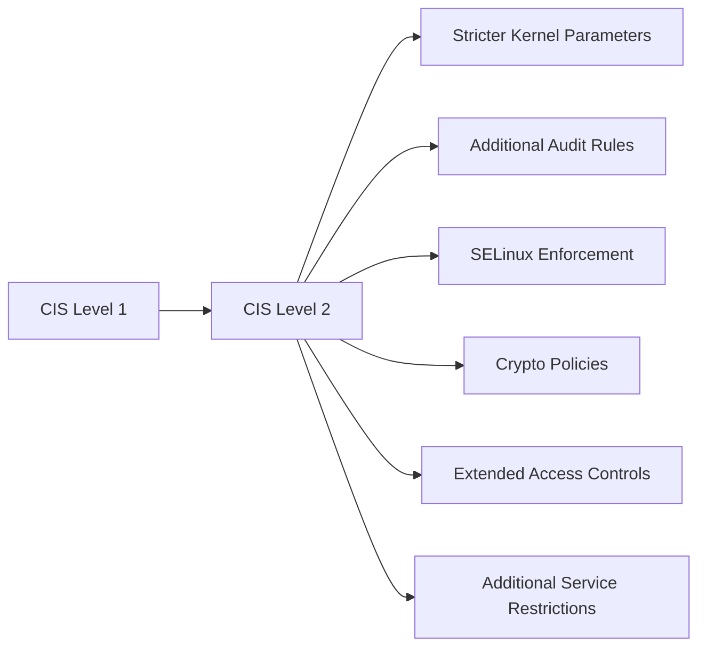

# How to Implement CIS Level 2 Server Hardening on RHEL 9

Author: [nawazdhandala](https://www.github.com/nawazdhandala)

Tags: RHEL, CIS Level 2, Hardening, Compliance, Linux

Description: Go beyond CIS Level 1 with Level 2 server hardening on RHEL 9, implementing stricter controls for environments that require enhanced security.

---

CIS Level 2 takes everything from Level 1 and adds controls that provide deeper defense. These additional rules can affect system functionality or performance, so they are not recommended for every environment. But if you are running servers in regulated industries, handling sensitive data, or operating in a high-threat environment, Level 2 is where you want to be.

This guide focuses specifically on the controls that are in Level 2 but not in Level 1.

## What Level 2 Adds Over Level 1



## SELinux in Enforcing Mode

Level 2 requires SELinux to be in enforcing mode. This is critical and non-negotiable:

```bash
# Check current SELinux status
getenforce
sestatus

# If permissive, switch to enforcing
sed -i 's/^SELINUX=permissive/SELINUX=enforcing/' /etc/selinux/config

# Set enforcing immediately (no reboot needed)
setenforce 1

# Verify SELinux policy is targeted
grep "^SELINUXTYPE=" /etc/selinux/config
# Should output: SELINUXTYPE=targeted
```

If your applications have SELinux issues, fix the policies rather than disabling SELinux. Use `audit2allow` to generate custom policy modules.

## System-Wide Cryptographic Policy

Level 2 requires a stronger cryptographic policy:

```bash
# Check current crypto policy
update-crypto-policies --show

# Set to FUTURE policy (stricter than DEFAULT)
update-crypto-policies --set FUTURE

# Verify the change
update-crypto-policies --show
```

The FUTURE policy disables SHA-1, DSA, and protocols below TLS 1.2. This can break older clients, so test thoroughly.

## Extended Audit Rules

Level 2 requires more comprehensive audit coverage:

```bash
# Additional audit rules beyond Level 1
cat > /etc/audit/rules.d/cis-level2.rules << 'EOF'
# Monitor discretionary access control permission changes
-a always,exit -F arch=b64 -S chmod -S fchmod -S fchmodat -F auid>=1000 -F auid!=unset -k perm_mod
-a always,exit -F arch=b64 -S chown -S fchown -S fchownat -S lchown -F auid>=1000 -F auid!=unset -k perm_mod
-a always,exit -F arch=b32 -S chmod -S fchmod -S fchmodat -F auid>=1000 -F auid!=unset -k perm_mod
-a always,exit -F arch=b32 -S chown -S fchown -S fchownat -S lchown -F auid>=1000 -F auid!=unset -k perm_mod

# Monitor setxattr/removexattr for extended attributes
-a always,exit -F arch=b64 -S setxattr -S lsetxattr -S fsetxattr -S removexattr -S lremovexattr -S fremovexattr -F auid>=1000 -F auid!=unset -k perm_mod
-a always,exit -F arch=b32 -S setxattr -S lsetxattr -S fsetxattr -S removexattr -S lremovexattr -S fremovexattr -F auid>=1000 -F auid!=unset -k perm_mod

# Monitor unauthorized file access attempts
-a always,exit -F arch=b64 -S creat -S open -S openat -S truncate -S ftruncate -F exit=-EACCES -F auid>=1000 -F auid!=unset -k access
-a always,exit -F arch=b64 -S creat -S open -S openat -S truncate -S ftruncate -F exit=-EPERM -F auid>=1000 -F auid!=unset -k access
-a always,exit -F arch=b32 -S creat -S open -S openat -S truncate -S ftruncate -F exit=-EACCES -F auid>=1000 -F auid!=unset -k access
-a always,exit -F arch=b32 -S creat -S open -S openat -S truncate -S ftruncate -F exit=-EPERM -F auid>=1000 -F auid!=unset -k access

# Monitor mount operations
-a always,exit -F arch=b64 -S mount -F auid>=1000 -F auid!=unset -k mounts
-a always,exit -F arch=b32 -S mount -F auid>=1000 -F auid!=unset -k mounts

# Monitor file deletion by users
-a always,exit -F arch=b64 -S unlink -S unlinkat -S rename -S renameat -F auid>=1000 -F auid!=unset -k delete
-a always,exit -F arch=b32 -S unlink -S unlinkat -S rename -S renameat -F auid>=1000 -F auid!=unset -k delete

# Monitor kernel module loading/unloading
-w /sbin/insmod -p x -k modules
-w /sbin/rmmod -p x -k modules
-w /sbin/modprobe -p x -k modules
-a always,exit -F arch=b64 -S init_module -S delete_module -k modules

# Make rules immutable (requires reboot to change)
-e 2
EOF

# Load the rules
augenrules --load
```

## Restrict Core Dumps

Level 2 requires disabling core dumps to prevent sensitive data from being written to disk:

```bash
# Disable core dumps via limits
echo "* hard core 0" >> /etc/security/limits.d/cis.conf

# Disable core dumps in sysctl
echo "fs.suid_dumpable = 0" >> /etc/sysctl.d/60-cis-level2.conf
sysctl -w fs.suid_dumpable=0

# Disable core dump processing in systemd
mkdir -p /etc/systemd/coredump.conf.d/
cat > /etc/systemd/coredump.conf.d/cis.conf << 'EOF'
[Coredump]
Storage=none
ProcessSizeMax=0
EOF

systemctl daemon-reload
```

## Additional Kernel Hardening

```bash
# Level 2 kernel parameters
cat >> /etc/sysctl.d/60-cis-level2.conf << 'EOF'
# Restrict access to kernel logs
kernel.dmesg_restrict = 1

# Restrict access to kernel pointers
kernel.kptr_restrict = 2

# Restrict unprivileged users from using BPF
kernel.unprivileged_bpf_disabled = 1

# Restrict userfaultfd to root only
vm.unprivileged_userfaultfd = 0

# Restrict ptrace scope
kernel.yama.ptrace_scope = 2

# Disable unprivileged user namespaces (may break some containers)
user.max_user_namespaces = 0

# Randomize memory layout (ASLR)
kernel.randomize_va_space = 2
EOF

sysctl --system
```

Note: Setting `user.max_user_namespaces = 0` will break rootless containers. Only apply this if you do not use Podman or Docker in rootless mode.

## Restrict USB Storage

```bash
# Disable USB storage module
echo "install usb-storage /bin/false" > /etc/modprobe.d/usb-storage.conf
echo "blacklist usb-storage" >> /etc/modprobe.d/usb-storage.conf

# Remove the module if currently loaded
rmmod usb-storage 2>/dev/null
```

## Restrict Access to su

```bash
# Only allow wheel group members to use su
grep "pam_wheel.so" /etc/pam.d/su

# If not present, add it
# Ensure pam_wheel.so is enabled in /etc/pam.d/su
sed -i 's/^#auth\s*required\s*pam_wheel.so/auth required pam_wheel.so/' /etc/pam.d/su
```

## Configure Login Banners

```bash
# Set legal warning banners
cat > /etc/issue << 'EOF'
WARNING: This system is for authorized use only. All activity is monitored.
EOF

cat > /etc/issue.net << 'EOF'
WARNING: This system is for authorized use only. All activity is monitored.
EOF

# Remove OS information from banners (CIS requirement)
# Ensure /etc/motd does not contain OS info
echo "" > /etc/motd

# Set correct permissions
chmod 644 /etc/issue
chmod 644 /etc/issue.net
chmod 644 /etc/motd
```

## Disable Uncommon Network Protocols

```bash
# Disable protocols that are rarely needed
cat > /etc/modprobe.d/cis-network.conf << 'EOF'
install dccp /bin/false
install sctp /bin/false
install rds /bin/false
install tipc /bin/false
EOF
```

## Restrict Cron Access

```bash
# Only allow root and explicitly listed users to use cron
echo "root" > /etc/cron.allow
chmod 600 /etc/cron.allow

# Remove cron.deny if it exists (cron.allow takes precedence)
rm -f /etc/cron.deny

# Same for at
echo "root" > /etc/at.allow
chmod 600 /etc/at.allow
rm -f /etc/at.deny
```

## Verify Level 2 Compliance

Run the full CIS Level 2 scan to check your work:

```bash
# Run the CIS Level 2 Server profile
oscap xccdf eval \
  --profile xccdf_org.ssgproject.content_profile_cis \
  --results /tmp/cis-l2-results.xml \
  --report /tmp/cis-l2-report.html \
  /usr/share/xml/scap/ssg/content/ssg-rhel9-ds.xml

# Quick summary of results
echo "Pass: $(grep -c 'result="pass"' /tmp/cis-l2-results.xml)"
echo "Fail: $(grep -c 'result="fail"' /tmp/cis-l2-results.xml)"
```

CIS Level 2 is not for every server, but for high-security environments it is the right target. The key is to test each control in a staging environment first, document any exceptions, and keep scanning regularly to prevent configuration drift.
