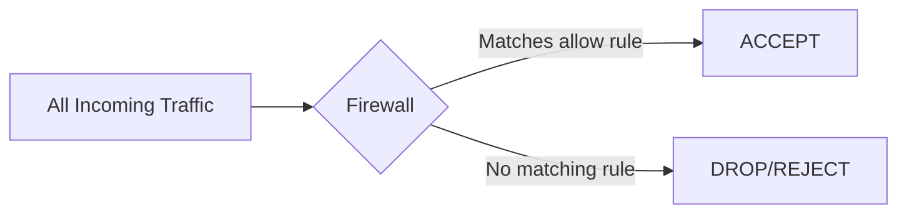

# How to Implement a Deny-All Firewall Policy on RHEL

Author: [nawazdhandala](https://www.github.com/nawazdhandala)

Tags: RHEL, firewalld, Deny-All, Security, Linux

Description: How to implement a deny-all (default deny) firewall policy on RHEL using firewalld, where all traffic is blocked unless explicitly allowed.

---

A deny-all firewall policy means all incoming traffic is blocked unless you have created an explicit rule to allow it. This is the gold standard for server security and a common compliance requirement (PCI DSS, CIS benchmarks, etc.). On RHEL with firewalld, you can achieve this through zone targets and careful rule management.

## Why Deny-All?



With deny-all:
- Only services you explicitly permit are accessible
- New services are blocked by default until you open them
- Reduces attack surface to the absolute minimum
- Makes security auditing straightforward

## Firewalld Zone Targets

Each zone has a target that defines what happens to traffic not matching any rule:

| Target | Behavior |
|---|---|
| default | Reject (sends ICMP error) |
| ACCEPT | Allow all unmatched traffic |
| DROP | Silently drop unmatched traffic |
| REJECT | Reject with ICMP unreachable |

The `default` and `DROP` targets implement deny-all behavior. The difference is that `DROP` gives no feedback to the sender (stealthier), while `default`/`REJECT` sends an ICMP error (faster failure for legitimate clients).

## Method 1: Using the Default Zone Target

The public zone already uses the `default` target, which rejects unmatched traffic. If your interfaces are in the public zone, you already have a deny-all policy for anything beyond the zone's allowed services.

```bash
# Verify the public zone target
firewall-cmd --zone=public --list-all | grep target

# Strip it down to only what you need
firewall-cmd --zone=public --remove-service=dhcpv6-client --permanent
firewall-cmd --zone=public --remove-service=cockpit --permanent

# Only keep SSH (or remove it too if you have out-of-band access)
# Add back only what is needed
firewall-cmd --zone=public --add-service=ssh --permanent
firewall-cmd --zone=public --add-service=http --permanent
firewall-cmd --zone=public --add-service=https --permanent

firewall-cmd --reload
```

## Method 2: Using the DROP Target

For a silent deny-all (no ICMP rejection messages):

```bash
# Set the public zone target to DROP
firewall-cmd --zone=public --set-target=DROP --permanent
firewall-cmd --reload

# Now add only the services you need
firewall-cmd --zone=public --add-service=ssh --permanent
firewall-cmd --zone=public --add-service=http --permanent
firewall-cmd --reload
```

## Method 3: Using the drop Zone

The `drop` zone drops everything with no exceptions. Assign your interface to it and build up from zero:

```bash
# Move your interface to the drop zone
firewall-cmd --zone=drop --change-interface=eth0 --permanent

# The drop zone allows nothing by default
# Add services explicitly
firewall-cmd --zone=drop --add-service=ssh --permanent
firewall-cmd --zone=drop --add-service=http --permanent
firewall-cmd --zone=drop --add-service=https --permanent

firewall-cmd --reload
```

## Setting the Default Zone to DROP

For maximum security, change the default zone so any new interface gets deny-all:

```bash
# Create a strict default
firewall-cmd --set-default-zone=drop
```

Or use a custom zone:

```bash
# Create a deny-all zone with specific allows
firewall-cmd --permanent --new-zone=strict
firewall-cmd --permanent --zone=strict --set-target=DROP

# Add only what is needed
firewall-cmd --permanent --zone=strict --add-service=ssh

# Make it the default
firewall-cmd --reload
firewall-cmd --set-default-zone=strict

# Assign interfaces
firewall-cmd --zone=strict --change-interface=eth0 --permanent
firewall-cmd --reload
```

## Handling Outbound Traffic

Firewalld's zone targets only affect incoming traffic by default. Outbound connections and their return traffic (established connections) are allowed. If you need to restrict outbound traffic too:

```bash
# Block outbound to specific destinations using direct rules
firewall-cmd --direct --add-rule ipv4 filter OUTPUT 0 -d 0.0.0.0/0 -j DROP --permanent

# Then allow specific outbound traffic
firewall-cmd --direct --add-rule ipv4 filter OUTPUT 0 -d 10.0.1.0/24 -j ACCEPT --permanent
firewall-cmd --direct --add-rule ipv4 filter OUTPUT 0 -p tcp --dport 443 -j ACCEPT --permanent
firewall-cmd --direct --add-rule ipv4 filter OUTPUT 0 -p tcp --dport 80 -j ACCEPT --permanent
firewall-cmd --direct --add-rule ipv4 filter OUTPUT 0 -p udp --dport 53 -j ACCEPT --permanent
firewall-cmd --direct --add-rule ipv4 filter OUTPUT 0 -p tcp --dport 53 -j ACCEPT --permanent

# Allow loopback
firewall-cmd --direct --add-rule ipv4 filter OUTPUT 0 -o lo -j ACCEPT --permanent

firewall-cmd --reload
```

## Complete Deny-All Setup Example

Here is a production-ready deny-all configuration for a web server:

```bash
#!/bin/bash
# deny-all-setup.sh - Implement deny-all policy

# Set the target to DROP
firewall-cmd --zone=public --set-target=DROP --permanent

# Remove all default services
for svc in $(firewall-cmd --zone=public --list-services); do
    firewall-cmd --zone=public --remove-service=$svc --permanent
done

# Allow only required services
# SSH from admin network only
firewall-cmd --zone=public --add-rich-rule='rule family="ipv4" source address="10.0.0.0/24" service name="ssh" accept' --permanent

# HTTP and HTTPS from anywhere
firewall-cmd --zone=public --add-service=http --permanent
firewall-cmd --zone=public --add-service=https --permanent

# Monitoring from Prometheus server only
firewall-cmd --zone=public --add-rich-rule='rule family="ipv4" source address="10.0.2.10" port port="9100" protocol="tcp" accept' --permanent

# Enable logging for dropped packets
firewall-cmd --set-log-denied=all

# Apply
firewall-cmd --reload

# Verify
echo "=== Current Configuration ==="
firewall-cmd --zone=public --list-all
```

## Verifying the Deny-All Policy

```bash
# Verify the zone target
firewall-cmd --zone=public --list-all | head -5

# Check from an external machine
# Should work (allowed services):
curl http://your-server
ssh admin@your-server  # from admin network

# Should fail (everything else):
nc -zv your-server 3306  # MySQL
nc -zv your-server 5432  # PostgreSQL
nc -zv your-server 6379  # Redis
```

## Safety Precautions

**Do not lock yourself out**:

1. Always have out-of-band access (IPMI, console, etc.)
2. Test changes in runtime first (without `--permanent`)
3. Keep an SSH session open while making changes
4. Use `firewall-cmd --reload` to revert if runtime changes break things

```bash
# Safe testing approach:
# 1. Make runtime-only change
firewall-cmd --zone=public --set-target=DROP

# 2. Verify SSH still works (in another terminal)
ssh your-server

# 3. If locked out, wait for reboot or have someone reload firewalld

# 4. If it works, make permanent
firewall-cmd --runtime-to-permanent
```

## Auditing the Configuration

Regularly verify that only intended services are allowed:

```bash
# Audit script
echo "=== Default Zone ==="
firewall-cmd --get-default-zone

echo "=== Active Zones ==="
firewall-cmd --get-active-zones

echo "=== Allowed Services ==="
firewall-cmd --list-services

echo "=== Allowed Ports ==="
firewall-cmd --list-ports

echo "=== Rich Rules ==="
firewall-cmd --list-rich-rules

echo "=== Zone Target ==="
firewall-cmd --zone=public --list-all | grep target
```

## Summary

A deny-all policy is the foundation of server security. On RHEL, implement it by setting your zone target to DROP, removing all default services, and explicitly adding only what is needed. Use rich rules for source-based restrictions on sensitive services. Always have out-of-band access, test changes in runtime first, and audit your configuration regularly. The goal is simple: if you did not explicitly allow it, it gets dropped.
