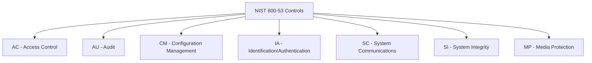

# How to Implement NIST 800-53 Controls on RHEL

Author: [nawazdhandala](https://www.github.com/nawazdhandala)

Tags: RHEL, NIST 800-53, Compliance, Security, Linux

Description: Implement NIST 800-53 security controls on RHEL, mapping technical requirements to practical configurations for federal and high-security environments.

---

NIST Special Publication 800-53 defines the security and privacy controls that federal information systems must implement. It is the foundation that FISMA compliance is built on, and many private sector organizations adopt it as their security framework. RHEL provides solid tooling for implementing these controls, including an OpenSCAP profile that maps directly to NIST 800-53.

## Understanding NIST 800-53 Control Families

The controls are organized into families. Not all of them apply to the operating system level, but many do:



## Scan Against the NIST 800-53 Profile

RHEL includes an OSPP (Operating System Protection Profile) that maps to many NIST 800-53 controls:

```bash
# Install OpenSCAP
dnf install -y openscap-scanner scap-security-guide

# List profiles related to NIST/OSPP
oscap info /usr/share/xml/scap/ssg/content/ssg-rhel9-ds.xml | grep -iE "ospp|800-53"

# Run the OSPP profile scan (maps to 800-53 controls)
oscap xccdf eval \
  --profile xccdf_org.ssgproject.content_profile_ospp \
  --results /var/log/compliance/nist-results.xml \
  --report /var/log/compliance/nist-report.html \
  /usr/share/xml/scap/ssg/content/ssg-rhel9-ds.xml || true
```

## AC - Access Control

### AC-2: Account Management

```bash
# List all system accounts
awk -F: '$3 >= 1000 && $3 < 65534 {print $1, $3, $7}' /etc/passwd

# Ensure no accounts have empty passwords
awk -F: '($2 == "" || $2 == "!") {print $1}' /etc/shadow

# Set password expiration for all human accounts
for user in $(awk -F: '$3 >= 1000 && $3 < 65534 {print $1}' /etc/passwd); do
    chage --maxdays 90 --mindays 1 --warndays 14 "$user"
    echo "Set password aging for: $user"
done

# Disable inactive accounts after 35 days
useradd -D -f 35
```

### AC-3: Access Enforcement

```bash
# Implement file permission controls
chmod 644 /etc/passwd
chmod 000 /etc/shadow
chmod 644 /etc/group
chmod 000 /etc/gshadow

# Ensure SELinux is enforcing (mandatory access control)
setenforce 1
sed -i 's/^SELINUX=.*/SELINUX=enforcing/' /etc/selinux/config
```

### AC-7: Unsuccessful Login Attempts

```bash
# Configure account lockout
cat > /etc/security/faillock.conf << 'EOF'
deny = 3
unlock_time = 900
fail_interval = 900
even_deny_root
audit
silent
EOF
```

### AC-8: System Use Notification

```bash
# Set the login banner
cat > /etc/issue << 'EOF'
This is a Federal computer system and is the property of the United States Government. It is for authorized use only. By using this system, all users acknowledge notice of, and agree to comply with, the Acceptable Use Policy.
EOF

cp /etc/issue /etc/issue.net

# Configure SSH to display the banner
echo "Banner /etc/issue.net" > /etc/ssh/sshd_config.d/banner.conf
systemctl restart sshd
```

## AU - Audit and Accountability

### AU-2/AU-3: Audit Events and Content

```bash
# Configure comprehensive audit rules
cat > /etc/audit/rules.d/nist-800-53.rules << 'EOF'
# AU-2: Audit events
# Record all authentication attempts
-w /var/log/lastlog -p wa -k logins
-w /var/run/faillock/ -p wa -k logins

# Record account changes
-w /etc/passwd -p wa -k identity
-w /etc/group -p wa -k identity
-w /etc/shadow -p wa -k identity
-w /etc/gshadow -p wa -k identity
-w /etc/security/opasswd -p wa -k identity

# Record privilege escalation
-w /etc/sudoers -p wa -k privilege
-w /etc/sudoers.d/ -p wa -k privilege
-a always,exit -F arch=b64 -S execve -C uid!=euid -F euid=0 -k privilege

# Record file permission changes
-a always,exit -F arch=b64 -S chmod -S fchmod -S fchmodat -F auid>=1000 -F auid!=unset -k perm_mod
-a always,exit -F arch=b64 -S chown -S fchown -S fchownat -S lchown -F auid>=1000 -F auid!=unset -k perm_mod

# Record time changes
-a always,exit -F arch=b64 -S adjtimex -S settimeofday -k time-change
-w /etc/localtime -p wa -k time-change

# Record network configuration changes
-w /etc/hostname -p wa -k network
-w /etc/sysconfig/network -p wa -k network

# Record audit configuration changes
-w /etc/audit/ -p wa -k audit-config
-w /etc/audisp/ -p wa -k audit-config

# Record kernel module loading
-w /sbin/insmod -p x -k modules
-w /sbin/rmmod -p x -k modules
-w /sbin/modprobe -p x -k modules
EOF

augenrules --load
```

### AU-9: Protection of Audit Information

```bash
# Set audit log permissions
chmod 600 /var/log/audit/audit.log
chown root:root /var/log/audit/audit.log

# Configure audit to halt on failure
sed -i 's/^space_left_action.*/space_left_action = email/' /etc/audit/auditd.conf
sed -i 's/^admin_space_left_action.*/admin_space_left_action = single/' /etc/audit/auditd.conf
```

## CM - Configuration Management

### CM-6: Configuration Settings

```bash
# Apply recommended sysctl settings
cat > /etc/sysctl.d/99-nist.conf << 'EOF'
kernel.randomize_va_space = 2
kernel.dmesg_restrict = 1
kernel.kptr_restrict = 2
net.ipv4.ip_forward = 0
net.ipv4.conf.all.accept_source_route = 0
net.ipv4.conf.default.accept_source_route = 0
net.ipv4.conf.all.accept_redirects = 0
net.ipv4.conf.default.accept_redirects = 0
net.ipv4.conf.all.send_redirects = 0
net.ipv4.conf.default.send_redirects = 0
net.ipv4.tcp_syncookies = 1
net.ipv4.conf.all.log_martians = 1
EOF

sysctl --system
```

## IA - Identification and Authentication

### IA-5: Authenticator Management

```bash
# Password complexity requirements
cat > /etc/security/pwquality.conf.d/nist.conf << 'EOF'
minlen = 15
minclass = 4
maxrepeat = 3
dictcheck = 1
EOF

# SSH key-based authentication recommended
# Disable password authentication where possible
echo "PubkeyAuthentication yes" > /etc/ssh/sshd_config.d/nist.conf
systemctl restart sshd
```

## SC - System and Communications Protection

### SC-13: Cryptographic Protection

```bash
# Enable FIPS mode for NIST-approved cryptography
fips-mode-setup --enable
# Reboot required

# Set the crypto policy
update-crypto-policies --set FIPS:OSPP
```

## SI - System and Information Integrity

### SI-2: Flaw Remediation

```bash
# Configure automatic security updates
dnf install -y dnf-automatic
sed -i 's/^upgrade_type.*/upgrade_type = security/' /etc/dnf/automatic.conf
sed -i 's/^apply_updates.*/apply_updates = yes/' /etc/dnf/automatic.conf
systemctl enable --now dnf-automatic.timer
```

### SI-7: Software Integrity

```bash
# Install and configure AIDE
dnf install -y aide
aide --init
mv /var/lib/aide/aide.db.new.gz /var/lib/aide/aide.db.gz
echo "0 5 * * * root /usr/sbin/aide --check" >> /etc/crontab
```

## Verify NIST 800-53 Compliance

```bash
# Run the full OSPP scan
oscap xccdf eval \
  --profile xccdf_org.ssgproject.content_profile_ospp \
  --results /var/log/compliance/nist-final.xml \
  --report /var/log/compliance/nist-final.html \
  /usr/share/xml/scap/ssg/content/ssg-rhel9-ds.xml || true

echo "Pass: $(grep -c 'result="pass"' /var/log/compliance/nist-final.xml)"
echo "Fail: $(grep -c 'result="fail"' /var/log/compliance/nist-final.xml)"
```

NIST 800-53 is a comprehensive framework, and not every control maps to an OS configuration. Focus on what you can implement at the RHEL level, document compensating controls for everything else, and use OpenSCAP to continuously validate your compliance posture.
