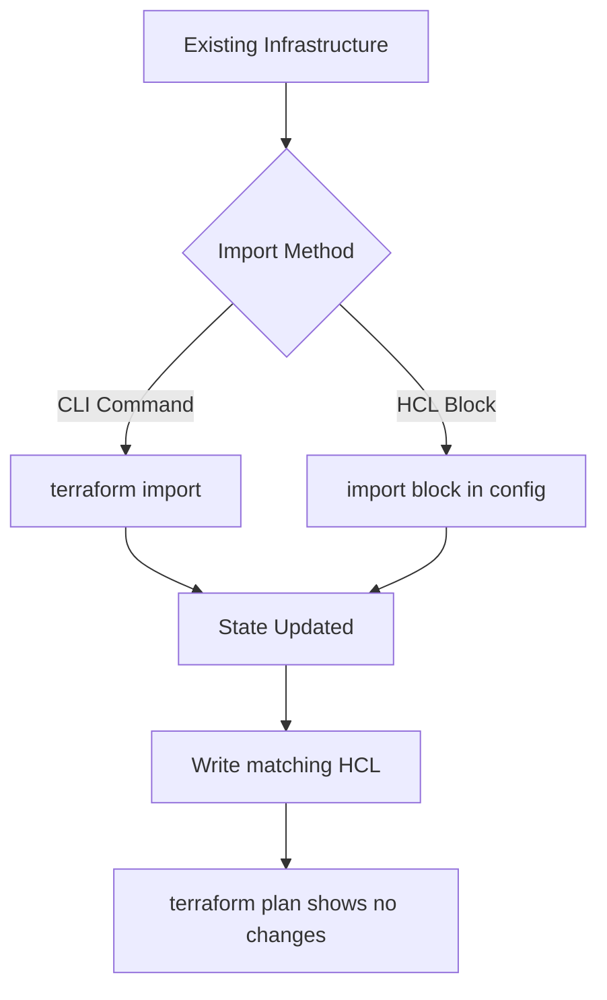

# How to Import Existing Infrastructure into Terraform on RHEL

Author: [nawazdhandala](https://www.github.com/nawazdhandala)

Tags: RHEL, Terraform, Import, Infrastructure, Migration, Linux

Description: Learn how to bring existing manually-created infrastructure under Terraform management on RHEL using terraform import and import blocks.

---

Most teams do not start with Terraform from day one. You probably have servers, networks, and databases that were created manually or with scripts. Terraform import lets you bring those existing resources under Terraform management without recreating them.

## Two Import Methods



## Method 1: CLI Import

First, write the resource block that will represent the existing resource:

```hcl
# main.tf - Resource block for an existing EC2 instance

resource "aws_instance" "existing_server" {
  # These values will be filled in after import
  ami           = "ami-0123456789abcdef0"
  instance_type = "t3.medium"

  tags = {
    Name = "legacy-rhel9-server"
  }
}
```

Then import the resource:

```bash
# Import an existing EC2 instance by its ID
terraform import aws_instance.existing_server i-0abc123def456789

# Import a security group
terraform import aws_security_group.existing_sg sg-0abc123def456789

# Import a VPC
terraform import aws_vpc.existing_vpc vpc-0abc123def456789
```

After importing, run `terraform plan` to see what differs between your configuration and reality:

```bash
# Check for drift between config and actual state
terraform plan

# If there are differences, update your HCL to match
# Then run plan again until it shows no changes
```

## Method 2: Import Blocks (Terraform 1.5+)

The newer import block approach is cleaner because everything is in your configuration:

```hcl
# imports.tf - Declarative import blocks

# Import an existing EC2 instance
import {
  to = aws_instance.web_server
  id = "i-0abc123def456789"
}

# Import an existing security group
import {
  to = aws_security_group.web_sg
  id = "sg-0abc123def456789"
}

# Import an existing subnet
import {
  to = aws_subnet.main
  id = "subnet-0abc123def456789"
}
```

## Generate Configuration Automatically

Terraform 1.5+ can generate the HCL for imported resources:

```bash
# Generate configuration for imported resources
terraform plan -generate-config-out=generated.tf

# This creates generated.tf with the HCL that matches
# the actual state of the imported resources
```

Review the generated file and clean it up:

```bash
# Open and review the generated configuration
vim generated.tf

# Run plan to confirm no changes
terraform plan
```

## Import a Complete Setup

Here is a practical example of importing a manually-created RHEL server setup:

```hcl
# imports.tf - Import all components of an existing deployment

# VPC
import {
  to = aws_vpc.production
  id = "vpc-0a1b2c3d4e5f6g7h8"
}

# Subnet
import {
  to = aws_subnet.production_public
  id = "subnet-0a1b2c3d4e5f6g7h8"
}

# Security group
import {
  to = aws_security_group.production_sg
  id = "sg-0a1b2c3d4e5f6g7h8"
}

# EC2 instance
import {
  to = aws_instance.production_rhel
  id = "i-0a1b2c3d4e5f6g7h8"
}

# Elastic IP
import {
  to = aws_eip.production_eip
  id = "eipalloc-0a1b2c3d4e5f6g7h8"
}
```

```bash
# Generate the matching configuration
terraform plan -generate-config-out=production.tf

# Review and clean up the generated code
vim production.tf

# Verify no changes are needed
terraform plan
# Should show: No changes. Your infrastructure matches the configuration.
```

## Import Script for Multiple Resources

```bash
#!/bin/bash
# import-resources.sh - Bulk import existing resources
set -euo pipefail

# List of resources to import (type:name:id)
RESOURCES=(
  "aws_instance.web_1:i-0abc123def456789"
  "aws_instance.web_2:i-0def456abc789012"
  "aws_security_group.web_sg:sg-0abc123def456789"
  "aws_eip.web_eip_1:eipalloc-0abc123def456789"
)

for resource in "${RESOURCES[@]}"; do
  # Split on colon
  ADDRESS="${resource%%:*}"
  ID="${resource#*:}"

  echo "Importing $ADDRESS ($ID)..."
  terraform import "$ADDRESS" "$ID" || echo "Warning: Failed to import $ADDRESS"
done

echo "Import complete. Run 'terraform plan' to check for drift."
```

## Verify the Import

```bash
# Show the current state
terraform state list

# Show details of a specific resource
terraform state show aws_instance.existing_server

# Run plan to verify everything matches
terraform plan
```

Importing existing infrastructure into Terraform is an essential skill for teams adopting infrastructure as code. Once imported, your RHEL resources gain all the benefits of Terraform: version control, planning, and collaborative management.
