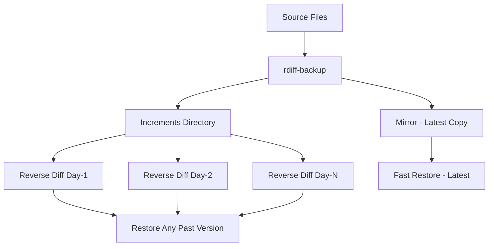

# How to Set Up Incremental Backups with rdiff-backup on RHEL

Author: [nawazdhandala](https://www.github.com/nawazdhandala)

Tags: RHEL, rdiff-backup, Incremental Backups, Linux

Description: Configure rdiff-backup on RHEL for space-efficient incremental backups with the ability to restore files from any point in time.

---

rdiff-backup combines the best of rsync and incremental backups. It keeps a mirror of the most recent backup plus reverse diffs for previous versions. This means restoring the latest version is instant (it is just a file copy), and you can still go back to any previous version by applying the diffs.

## How rdiff-backup Works



## Installation

```bash
# Install rdiff-backup from EPEL
sudo dnf install epel-release
sudo dnf install rdiff-backup
```

If not in EPEL, install via pip:

```bash
sudo dnf install python3-pip librsync-devel
sudo pip3 install rdiff-backup
```

Verify the installation:

```bash
rdiff-backup --version
```

## Basic Local Backup

```bash
# Back up /home to a local backup directory
rdiff-backup /home /backup/home

# Back up /etc
rdiff-backup /etc /backup/etc

# Back up /var/www
rdiff-backup /var/www /backup/www
```

## Remote Backup over SSH

```bash
# Back up to a remote server
rdiff-backup /home backupuser@backup.example.com::/backup/server1/home

# Back up from a remote server to local
rdiff-backup backupuser@remote.example.com::/var/www /backup/remote-www
```

## Automated Backup Script

```bash
#!/bin/bash
# /usr/local/bin/rdiff-backup.sh
# Automated rdiff-backup script with rotation

LOG="/var/log/rdiff-backup.log"
REMOTE_SERVER="backupuser@backup.example.com"
REMOTE_BASE="/backup/$(hostname)"

echo "$(date): Starting rdiff-backup" >> "$LOG"

# Backup each directory
for DIR in /etc /home /var/www /opt/app; do
    DIRNAME=$(basename "$DIR")
    echo "$(date): Backing up $DIR" >> "$LOG"
    
    rdiff-backup \
        --verbosity 3 \
        --exclude '**/*.tmp' \
        --exclude '**/.cache' \
        --exclude '**/lost+found' \
        "$DIR" \
        "${REMOTE_SERVER}::${REMOTE_BASE}/${DIRNAME}" \
        >> "$LOG" 2>&1
    
    if [ $? -ne 0 ]; then
        echo "$(date): ERROR backing up $DIR" >> "$LOG"
    fi
done

# Remove increments older than 30 days
echo "$(date): Removing old increments" >> "$LOG"
for DIR in etc home www app; do
    rdiff-backup --remove-older-than 30D \
        "${REMOTE_SERVER}::${REMOTE_BASE}/${DIR}" \
        >> "$LOG" 2>&1
done

echo "$(date): rdiff-backup complete" >> "$LOG"
```

```bash
sudo chmod +x /usr/local/bin/rdiff-backup.sh
```

Schedule it:

```bash
# Add to crontab
sudo crontab -e
```

```
# Run rdiff-backup daily at 1 AM
0 1 * * * /usr/local/bin/rdiff-backup.sh
```

## Restoring Files

Restore the latest version:

```bash
# Restore a single file (latest version)
rdiff-backup --restore-as-of now /backup/home/user1/document.txt /tmp/restored-document.txt

# Restore an entire directory (latest)
rdiff-backup --restore-as-of now /backup/home/user1/ /tmp/restored-user1/
```

Restore from a specific point in time:

```bash
# Restore from 3 days ago
rdiff-backup --restore-as-of 3D /backup/home/user1/document.txt /tmp/restored-3days.txt

# Restore from a specific date
rdiff-backup --restore-as-of 2026-02-28 /backup/etc/ /tmp/restored-etc/

# Restore from 1 week ago
rdiff-backup --restore-as-of 1W /backup/var/www/ /tmp/restored-www/
```

## Listing Available Increments

```bash
# List available backup dates for a directory
rdiff-backup --list-increments /backup/home

# Show increment sizes
rdiff-backup --list-increment-sizes /backup/home

# List files changed at a specific increment
rdiff-backup --list-changed-since 3D /backup/home
```

## Comparing Backups

```bash
# Compare current source with backup
rdiff-backup --compare /home /backup/home

# Compare with a backup from 5 days ago
rdiff-backup --compare-at-time 5D /home /backup/home
```

## Managing Backup Size

```bash
# Remove increments older than 60 days
rdiff-backup --remove-older-than 60D /backup/home

# Remove all but the last 10 increments
rdiff-backup --remove-older-than 10B /backup/home

# Check backup directory size
rdiff-backup --list-increment-sizes /backup/home
```

## Verifying Backups

```bash
# Verify backup integrity
rdiff-backup --verify /backup/home

# Get backup statistics
rdiff-backup --calculate-average /backup/home
```

## Wrapping Up

rdiff-backup is ideal when you want the simplicity of a mirror backup with the safety net of being able to go back in time. The most recent backup is always a plain directory you can browse and copy from without any special tools. Only the older versions require the rdiff-backup tool to reconstruct. This is a significant advantage over tools that store everything in a proprietary format. The time-based retention (`--remove-older-than 30D`) keeps disk usage under control without any complex rotation scripts.
