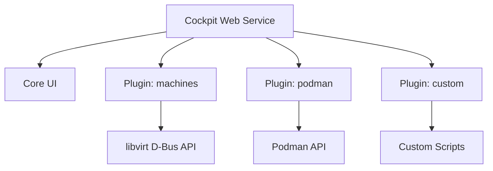

# How to Install Cockpit Web Console Add-ons and Create Custom Pages on RHEL 9

Author: [nawazdhandala](https://www.github.com/nawazdhandala)

Tags: RHEL, Cockpit, Add-ons, Customization, Linux

Description: Learn how to extend the Cockpit web console on RHEL 9 with official add-on packages and how to create your own custom dashboard pages.

---

The base Cockpit installation covers the essentials, but the real power comes from add-ons. There are official packages for managing VMs, containers, storage, and more. And if none of the existing modules do what you need, you can build your own custom pages. Let me walk you through both.

## Available Cockpit Add-on Packages

RHEL 9 ships several Cockpit add-on packages in its repositories. Here's what's available:

```bash
# Search for all Cockpit packages
sudo dnf search cockpit
```

The most commonly used add-ons:

| Package | Description |
|---------|-------------|
| cockpit-machines | Virtual machine management (KVM/libvirt) |
| cockpit-podman | Podman container management |
| cockpit-pcp | Performance Co-Pilot metrics integration |
| cockpit-storaged | Storage management (usually installed by default) |
| cockpit-networkmanager | Network configuration (usually installed by default) |
| cockpit-selinux | SELinux troubleshooting |
| cockpit-kdump | Kernel crash dump configuration |
| cockpit-sosreport | Generate sosreport from the web console |
| cockpit-session-recording | Session recording management |

## Installing Add-on Packages

Install the packages you need. No restart of Cockpit is required - new modules appear immediately after installation.

Install the most popular add-ons:

```bash
# Install VM management
sudo dnf install cockpit-machines -y

# Install container management
sudo dnf install cockpit-podman -y

# Install performance monitoring integration
sudo dnf install cockpit-pcp -y

# Install SELinux troubleshooting
sudo dnf install cockpit-selinux -y

# Or install several at once
sudo dnf install cockpit-machines cockpit-podman cockpit-pcp cockpit-selinux cockpit-sosreport -y
```

After installation, refresh your browser. The new modules show up in the sidebar.

## The SELinux Add-on

The `cockpit-selinux` package adds an SELinux page to Cockpit. It shows:

- Current SELinux mode (enforcing, permissive, disabled)
- Recent SELinux denials with detailed explanations
- Suggested fixes, including the exact `setsebool` or `semanage` commands needed

This is incredibly useful. Instead of parsing `audit.log` and running `audit2why` manually, Cockpit presents the information in plain language.

```bash
# What you'd do from the CLI
sudo ausearch -m avc -ts recent
sudo audit2why < /var/log/audit/audit.log
```

## The SOS Report Add-on

The `cockpit-sosreport` package lets you generate a support report directly from the web console. When you need to open a case with Red Hat support, this collects all the system information they need.

```bash
# CLI equivalent
sudo sos report
```

The Cockpit version lets you watch the progress and download the archive when it's done.

## Understanding Cockpit's Plugin Architecture

Cockpit modules are web applications that communicate with the system through Cockpit's API. Each module consists of:

- HTML, CSS, and JavaScript files served from a specific directory
- A `manifest.json` file that tells Cockpit how to load the module
- Backend communication through Cockpit's D-Bus bridge or direct process spawning



Modules are installed to `/usr/share/cockpit/` (system-wide) or `~/.local/share/cockpit/` (per-user).

## Creating a Custom Cockpit Page

Let's build a simple custom page that shows system information. This is useful for creating team-specific dashboards.

Create the directory structure:

```bash
# Create the module directory
sudo mkdir -p /usr/share/cockpit/my-dashboard
```

Create the manifest file that registers the page with Cockpit:

```bash
sudo tee /usr/share/cockpit/my-dashboard/manifest.json << 'EOF'
{
    "version": 0,
    "tools": {
        "my-dashboard": {
            "label": "My Dashboard",
            "path": "index.html"
        }
    },
    "content-security-policy": "default-src 'self' 'unsafe-inline'"
}
EOF
```

The `tools` key places the entry in the "Tools" section of the sidebar. You could also use `menu` to place it in the main navigation.

Create the HTML page:

```bash
sudo tee /usr/share/cockpit/my-dashboard/index.html << 'HTMLEOF'
<!DOCTYPE html>
<html>
<head>
    <title>My Dashboard</title>
    <meta charset="utf-8">
    <link href="../base1/cockpit.css" type="text/css" rel="stylesheet">
    <script src="../base1/cockpit.js"></script>
</head>
<body>
    <div class="container-fluid" style="padding: 20px;">
        <h2>System Dashboard</h2>
        <div id="hostname" style="margin: 10px 0;">Loading hostname...</div>
        <div id="uptime" style="margin: 10px 0;">Loading uptime...</div>
        <div id="load" style="margin: 10px 0;">Loading load average...</div>
        <div id="disk" style="margin: 10px 0;">Loading disk usage...</div>
        <br>
        <button id="refresh-btn" class="pf-c-button pf-m-primary">Refresh</button>
    </div>
    <script src="dashboard.js"></script>
</body>
</html>
HTMLEOF
```

Create the JavaScript that fetches system data:

```bash
sudo tee /usr/share/cockpit/my-dashboard/dashboard.js << 'JSEOF'
// Use Cockpit's process spawning to run system commands
function updateDashboard() {
    // Get the hostname
    cockpit.spawn(["hostname", "-f"])
        .then(function(data) {
            document.getElementById("hostname").textContent = "Hostname: " + data.trim();
        });

    // Get the uptime
    cockpit.spawn(["uptime", "-p"])
        .then(function(data) {
            document.getElementById("uptime").textContent = "Uptime: " + data.trim();
        });

    // Get the load average
    cockpit.spawn(["cat", "/proc/loadavg"])
        .then(function(data) {
            var parts = data.trim().split(" ");
            document.getElementById("load").textContent =
                "Load Average: " + parts[0] + " " + parts[1] + " " + parts[2];
        });

    // Get disk usage summary
    cockpit.spawn(["df", "-h", "/"])
        .then(function(data) {
            var lines = data.trim().split("\n");
            if (lines.length > 1) {
                document.getElementById("disk").textContent = "Root Disk: " + lines[1];
            }
        });
}

// Run on page load
updateDashboard();

// Refresh button handler
document.getElementById("refresh-btn").addEventListener("click", updateDashboard);
JSEOF
```

Refresh Cockpit in your browser, and you'll see "My Dashboard" in the Tools section of the sidebar.

## Running Commands from Custom Pages

Cockpit's JavaScript API provides `cockpit.spawn()` for running commands and `cockpit.file()` for reading files. Here are some useful patterns:

```javascript
// Run a command and get the output
cockpit.spawn(["systemctl", "is-active", "httpd"])
    .then(function(output) {
        console.log("httpd status: " + output.trim());
    })
    .catch(function(error) {
        console.log("httpd is not active");
    });

// Read a file
cockpit.file("/etc/hostname").read()
    .then(function(content) {
        console.log("Hostname file: " + content);
    });

// Run a command as root (with privilege escalation)
cockpit.spawn(["systemctl", "restart", "httpd"], { superuser: "try" })
    .then(function() {
        console.log("httpd restarted");
    });
```

## Per-User Custom Pages

If you don't have root access or want to experiment without affecting the system, create modules in your home directory:

```bash
# Create a per-user module directory
mkdir -p ~/.local/share/cockpit/my-test-page

# Place manifest.json, HTML, and JS files here
# Same structure as the system-wide example above
```

Per-user modules only show up for that specific user.

## Removing Add-ons and Custom Pages

Remove official packages with dnf:

```bash
sudo dnf remove cockpit-machines -y
```

Remove custom pages by deleting the directory:

```bash
sudo rm -rf /usr/share/cockpit/my-dashboard
```

In both cases, the sidebar entry disappears after a browser refresh.

## Wrapping Up

Cockpit's add-on system makes it easy to expand the web console's capabilities. The official packages cover common admin tasks like VM management, container operations, and SELinux troubleshooting. When you need something specific to your environment, the custom page API is simple enough that basic JavaScript knowledge is all you need. A manifest file, an HTML page, and some calls to `cockpit.spawn()` give you a custom dashboard that runs securely within Cockpit's authentication framework.
