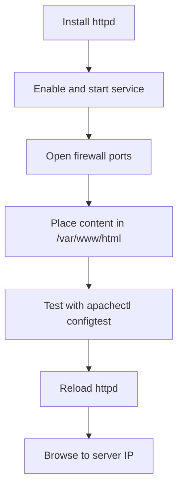

# How to Install and Configure Apache httpd on RHEL

Author: [nawazdhandala](https://www.github.com/nawazdhandala)

Tags: RHEL, Apache, HTTPD, Web Server, Linux

Description: A practical guide to installing, configuring, and running the Apache HTTP Server on Red Hat Enterprise Linux 9 from scratch.

---

## Why Apache httpd?

Apache has been the backbone of the web for decades. It is stable, well-documented, and supported by every major Linux distribution. On RHEL, Apache httpd ships via the standard AppStream repository, so there is no need to hunt for third-party packages.

In this guide we will install Apache, walk through the key configuration files, serve a basic site, and make sure everything survives a reboot.

## Prerequisites

- A RHEL system with a valid subscription or configured repositories
- Root or sudo access
- Firewall access to ports 80 and 443

## Step 1 - Install Apache httpd

Install the httpd package and the supporting tools:

```bash
# Install the Apache web server package
sudo dnf install -y httpd
```

Verify the installed version:

```bash
# Check the version to confirm installation
httpd -v
```

You should see output similar to `Server version: Apache/2.4.x (Red Hat Enterprise Linux)`.

## Step 2 - Start and Enable the Service

Start httpd and configure it to start on boot:

```bash
# Start Apache immediately and enable it across reboots
sudo systemctl enable --now httpd
```

Double-check the status:

```bash
# Verify that httpd is running
sudo systemctl status httpd
```

## Step 3 - Open the Firewall

RHEL uses firewalld by default. Open HTTP and HTTPS ports:

```bash
# Allow HTTP and HTTPS traffic through the firewall
sudo firewall-cmd --permanent --add-service=http
sudo firewall-cmd --permanent --add-service=https
sudo firewall-cmd --reload
```

At this point, browsing to `http://<your-server-ip>` should show the default RHEL test page.

## Step 4 - Understand the Directory Layout

Here is how Apache organizes its files on RHEL:

| Path | Purpose |
|------|---------|
| `/etc/httpd/conf/httpd.conf` | Main configuration file |
| `/etc/httpd/conf.d/` | Drop-in configuration snippets |
| `/etc/httpd/conf.modules.d/` | Module loading directives |
| `/var/www/html/` | Default document root |
| `/var/log/httpd/` | Access and error logs |

## Step 5 - Serve Your First Page

Create a simple index page:

```bash
# Write a basic HTML file to the default document root
sudo tee /var/www/html/index.html > /dev/null <<'EOF'
<!DOCTYPE html>
<html>
<head><title>Welcome</title></head>
<body>
<h1>Hello from RHEL and Apache httpd</h1>
</body>
</html>
EOF
```

No restart is needed for static file changes, but if you edit any config files you will need to reload:

```bash
# Reload Apache to pick up configuration changes
sudo systemctl reload httpd
```

## Step 6 - Key Configuration Directives

Open the main configuration file to review the most important settings:

```bash
# Edit the main Apache configuration
sudo vi /etc/httpd/conf/httpd.conf
```

A few directives worth knowing:

```apache
# The address and port Apache listens on
Listen 80

# The email shown on error pages
ServerAdmin root@localhost

# The hostname the server uses to identify itself
ServerName www.example.com:80

# The directory where web files are served from
DocumentRoot "/var/www/html"

# Controls the default directory listing and symlink behavior
<Directory "/var/www/html">
    Options Indexes FollowSymLinks
    AllowOverride None
    Require all granted
</Directory>
```

After making changes, always test the configuration before reloading:

```bash
# Validate the configuration syntax
sudo apachectl configtest
```

If it prints `Syntax OK`, go ahead and reload:

```bash
sudo systemctl reload httpd
```

## Step 7 - SELinux Considerations

RHEL ships with SELinux in enforcing mode. Apache expects files in the document root to carry the `httpd_sys_content_t` label. If you move files from another location, fix the labels:

```bash
# Restore default SELinux labels on the web root
sudo restorecon -Rv /var/www/html/
```

If you want Apache to serve content from a non-default directory, set the correct SELinux context:

```bash
# Label a custom directory so Apache can read from it
sudo semanage fcontext -a -t httpd_sys_content_t "/srv/mysite(/.*)?"
sudo restorecon -Rv /srv/mysite/
```

## Step 8 - Viewing Logs

Apache writes two key log files by default:

```bash
# Follow the access log in real time
sudo tail -f /var/log/httpd/access_log

# Check the error log for issues
sudo tail -f /var/log/httpd/error_log
```

These are your first stop when troubleshooting any issue.

## Step 9 - Graceful Restarts vs. Full Restarts

A graceful restart lets existing connections finish before applying new config:

```bash
# Graceful restart - finishes active requests first
sudo apachectl graceful
```

A full restart drops all connections immediately:

```bash
# Full restart - drops active connections
sudo systemctl restart httpd
```

In production, always prefer `apachectl graceful` unless you have a reason to do otherwise.

## Quick Reference



## Wrap-Up

That covers the basics of getting Apache httpd up and running on RHEL. From here you can add virtual hosts, enable TLS, or tune the MPM settings for your workload. The key takeaway is to always validate your config before reloading and keep SELinux in enforcing mode rather than disabling it.
