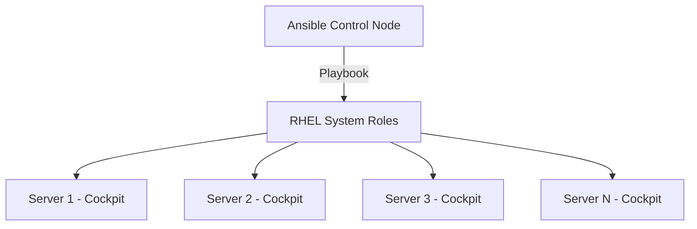

# How to Install and Configure the Cockpit Web Console Using RHEL System Roles

Author: [nawazdhandala](https://www.github.com/nawazdhandala)

Tags: RHEL, Cockpit, Ansible, System Roles, Linux

Description: Learn how to automate Cockpit installation and configuration across multiple RHEL 9 servers using RHEL System Roles and Ansible.

---

Setting up Cockpit on one server is easy. Setting it up identically on fifty servers is where automation comes in. RHEL System Roles are a collection of Ansible roles maintained by Red Hat that standardize common administration tasks. The `cockpit` system role lets you deploy and configure the web console across your entire fleet with a single playbook.

## What Are RHEL System Roles?

RHEL System Roles are officially supported Ansible roles that ship with RHEL. They cover networking, storage, time synchronization, SELinux, firewall, logging, and yes, Cockpit. The idea is to provide a consistent, tested way to manage configuration without writing custom playbooks from scratch.



## Prerequisites

You need:

- A control node with Ansible installed (can be your workstation or a dedicated management server)
- SSH access to target RHEL 9 servers with sudo privileges
- The RHEL System Roles package installed on the control node

Install the required packages on the control node:

```bash
# Install Ansible core
sudo dnf install ansible-core -y

# Install RHEL System Roles
sudo dnf install rhel-system-roles -y
```

Verify the installation:

```bash
# Check that the cockpit role is available
ls /usr/share/ansible/roles/rhel-system-roles.cockpit/

# Or list all available system roles
ls /usr/share/ansible/roles/ | grep rhel-system-roles
```

## Setting Up the Ansible Inventory

Create an inventory file that lists your target servers:

```bash
mkdir -p ~/ansible-cockpit
```

Create the inventory file:

```bash
tee ~/ansible-cockpit/inventory.ini << 'EOF'
[cockpit_servers]
server1.example.com
server2.example.com
server3.example.com

[cockpit_servers:vars]
ansible_user=admin
ansible_become=true
EOF
```

Test connectivity to your servers:

```bash
ansible -i ~/ansible-cockpit/inventory.ini cockpit_servers -m ping
```

## Basic Cockpit Deployment Playbook

Create a playbook that installs and enables Cockpit with default settings:

```bash
tee ~/ansible-cockpit/deploy-cockpit.yml << 'EOF'
---
- name: Deploy Cockpit web console
  hosts: cockpit_servers
  become: true

  roles:
    - role: rhel-system-roles.cockpit
EOF
```

Run the playbook:

```bash
ansible-playbook -i ~/ansible-cockpit/inventory.ini ~/ansible-cockpit/deploy-cockpit.yml
```

This installs the `cockpit` package, enables the `cockpit.socket`, and opens the firewall port. All in one role invocation.

## Customizing the Cockpit Deployment

The cockpit system role accepts several variables to customize the installation. Here's a more detailed playbook:

```bash
tee ~/ansible-cockpit/deploy-cockpit-custom.yml << 'EOF'
---
- name: Deploy Cockpit with custom configuration
  hosts: cockpit_servers
  become: true

  vars:
    # Install additional Cockpit packages
    cockpit_packages:
      - cockpit-storaged
      - cockpit-networkmanager
      - cockpit-podman
      - cockpit-pcp
      - cockpit-selinux

    # Enable the Cockpit socket
    cockpit_enabled: true
    cockpit_started: true

    # Manage the firewall rule
    cockpit_manage_firewall: true

  roles:
    - role: rhel-system-roles.cockpit
EOF
```

Run it:

```bash
ansible-playbook -i ~/ansible-cockpit/inventory.ini ~/ansible-cockpit/deploy-cockpit-custom.yml
```

## Installing Cockpit with Custom Certificates

For production deployments, you'll want proper TLS certificates instead of the self-signed ones. The system role can deploy certificates using the `certificate` system role integration.

```bash
tee ~/ansible-cockpit/deploy-cockpit-tls.yml << 'EOF'
---
- name: Deploy Cockpit with custom TLS certificate
  hosts: cockpit_servers
  become: true

  vars:
    cockpit_packages:
      - cockpit-storaged
      - cockpit-networkmanager

    cockpit_enabled: true
    cockpit_started: true
    cockpit_manage_firewall: true

    # Configure custom certificate
    cockpit_cert: /etc/pki/tls/certs/cockpit.pem
    cockpit_private_key: /etc/pki/tls/private/cockpit.key

  pre_tasks:
    - name: Copy TLS certificate
      ansible.builtin.copy:
        src: files/cockpit.pem
        dest: /etc/pki/tls/certs/cockpit.pem
        owner: root
        group: root
        mode: '0644'

    - name: Copy TLS private key
      ansible.builtin.copy:
        src: files/cockpit.key
        dest: /etc/pki/tls/private/cockpit.key
        owner: root
        group: root
        mode: '0600'

  roles:
    - role: rhel-system-roles.cockpit
EOF
```

## Deploying Cockpit Configuration Files

You can also template the `cockpit.conf` configuration file:

```bash
tee ~/ansible-cockpit/deploy-cockpit-configured.yml << 'EOF'
---
- name: Deploy Cockpit with configuration
  hosts: cockpit_servers
  become: true

  vars:
    cockpit_packages:
      - cockpit-storaged
      - cockpit-networkmanager
      - cockpit-podman

    cockpit_enabled: true
    cockpit_started: true
    cockpit_manage_firewall: true

  roles:
    - role: rhel-system-roles.cockpit

  post_tasks:
    - name: Deploy cockpit.conf
      ansible.builtin.copy:
        dest: /etc/cockpit/cockpit.conf
        content: |
          [WebService]
          LoginTitle = {{ inventory_hostname }}
          IdleTimeout = 15
          MaxStartups = 10

          [Session]
          IdleTimeout = 15
        owner: root
        group: root
        mode: '0644'
      notify: Restart cockpit

  handlers:
    - name: Restart cockpit
      ansible.builtin.systemd:
        name: cockpit.socket
        state: restarted
EOF
```

## Combining with Other System Roles

The real power of system roles is combining them. Here's a playbook that sets up a fully configured server with networking, firewall, and Cockpit:

```bash
tee ~/ansible-cockpit/full-server-setup.yml << 'EOF'
---
- name: Full server setup with Cockpit
  hosts: cockpit_servers
  become: true

  vars:
    # Firewall configuration
    firewall:
      - service:
          - cockpit
          - ssh
        state: enabled

    # Cockpit configuration
    cockpit_packages:
      - cockpit-storaged
      - cockpit-networkmanager
      - cockpit-podman
      - cockpit-pcp
    cockpit_enabled: true
    cockpit_started: true

    # TuneD profile
    tuned_profile: throughput-performance

  roles:
    - role: rhel-system-roles.firewall
    - role: rhel-system-roles.cockpit
EOF
```

## Verifying the Deployment

After running the playbook, verify Cockpit is working on all servers:

```bash
# Check cockpit.socket status on all servers
ansible -i ~/ansible-cockpit/inventory.ini cockpit_servers \
    -m command -a "systemctl is-active cockpit.socket"

# Check the firewall rule
ansible -i ~/ansible-cockpit/inventory.ini cockpit_servers \
    -m command -a "firewall-cmd --query-service=cockpit"

# Check installed packages
ansible -i ~/ansible-cockpit/inventory.ini cockpit_servers \
    -m command -a "rpm -qa cockpit*"
```

## Updating Cockpit Across the Fleet

When new versions of Cockpit packages are available, update all servers at once:

```bash
tee ~/ansible-cockpit/update-cockpit.yml << 'EOF'
---
- name: Update Cockpit packages
  hosts: cockpit_servers
  become: true

  tasks:
    - name: Update all cockpit packages
      ansible.builtin.dnf:
        name: cockpit*
        state: latest

    - name: Restart cockpit socket
      ansible.builtin.systemd:
        name: cockpit.socket
        state: restarted
EOF
```

```bash
ansible-playbook -i ~/ansible-cockpit/inventory.ini ~/ansible-cockpit/update-cockpit.yml
```

## Removing Cockpit with a Playbook

If you need to remove Cockpit from servers:

```bash
tee ~/ansible-cockpit/remove-cockpit.yml << 'EOF'
---
- name: Remove Cockpit from servers
  hosts: cockpit_servers
  become: true

  tasks:
    - name: Stop and disable cockpit
      ansible.builtin.systemd:
        name: cockpit.socket
        state: stopped
        enabled: false

    - name: Remove cockpit packages
      ansible.builtin.dnf:
        name: cockpit*
        state: absent

    - name: Remove firewall rule
      ansible.posix.firewalld:
        service: cockpit
        permanent: true
        state: disabled
        immediate: true
EOF
```

## Troubleshooting System Role Issues

If the playbook fails, common issues include:

```bash
# Check Ansible can reach all hosts
ansible -i ~/ansible-cockpit/inventory.ini cockpit_servers -m ping -v

# Run the playbook with verbose output
ansible-playbook -i ~/ansible-cockpit/inventory.ini ~/ansible-cockpit/deploy-cockpit.yml -vvv

# Check if the role is properly installed
ansible-galaxy role list | grep cockpit
```

Common problems:
- **SSH key not configured**: Set up key-based SSH access first
- **sudo requires password**: Add `ansible_become_password` or configure passwordless sudo
- **Package not found**: Ensure RHEL repositories are configured on target servers

## Wrapping Up

RHEL System Roles turn Cockpit deployment from a per-server manual task into a repeatable, automated process. The `cockpit` role handles package installation, service activation, and firewall configuration. Combined with other system roles for networking, firewall, and TuneD, you can stand up fully configured servers with a single playbook run. For organizations managing more than a handful of RHEL servers, this is the way to keep configurations consistent and deployments predictable.
