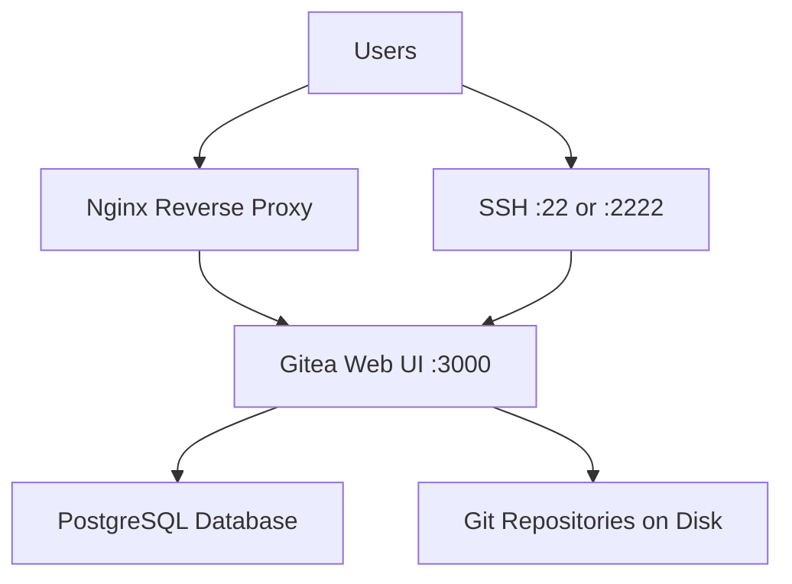

# How to Install and Configure Git Server with Gitea on RHEL

Author: [nawazdhandala](https://www.github.com/nawazdhandala)

Tags: RHEL, Gitea, Git, Version Control, Self-Hosted, Linux

Description: Set up a self-hosted Git server using Gitea on RHEL, complete with web interface, repository management, and SSH access.

---

Gitea is a lightweight, self-hosted Git service that gives you a GitHub-like experience on your own infrastructure. It is written in Go, runs as a single binary, and uses minimal resources compared to GitLab.

## Architecture



## Install Prerequisites

```bash
# Install Git
sudo dnf install -y git

# Install PostgreSQL for the database
sudo dnf install -y postgresql-server postgresql

# Initialize and start PostgreSQL
sudo postgresql-setup --initdb
sudo systemctl enable --now postgresql
```

## Create the Database

```bash
# Switch to the postgres user and create a database
sudo -u postgres psql << 'SQL'
CREATE USER gitea WITH PASSWORD 'your_secure_password';
CREATE DATABASE giteadb OWNER gitea;
\q
SQL

# Allow password authentication for gitea user
sudo sed -i '/^local/s/peer/md5/' /var/lib/pgsql/data/pg_hba.conf
sudo systemctl restart postgresql
```

## Create a Gitea System User

```bash
# Create a dedicated user for Gitea
sudo useradd -r -m -d /var/lib/gitea -s /bin/bash gitea

# Create required directories
sudo mkdir -p /var/lib/gitea/{custom,data,log}
sudo mkdir -p /etc/gitea

# Set permissions
sudo chown -R gitea:gitea /var/lib/gitea
sudo chown root:gitea /etc/gitea
sudo chmod 770 /etc/gitea
```

## Download and Install Gitea

```bash
# Download the latest Gitea binary
GITEA_VERSION="1.21.4"
sudo wget -O /usr/local/bin/gitea \
  "https://dl.gitea.com/gitea/${GITEA_VERSION}/gitea-${GITEA_VERSION}-linux-amd64"

# Make it executable
sudo chmod +x /usr/local/bin/gitea

# Verify the installation
gitea --version
```

## Create a systemd Service

```bash
# Create the Gitea service file
sudo tee /etc/systemd/system/gitea.service << 'EOF'
[Unit]
Description=Gitea (Git with a cup of tea)
After=syslog.target
After=network.target
After=postgresql.service

[Service]
Type=simple
User=gitea
Group=gitea
WorkingDirectory=/var/lib/gitea/
ExecStart=/usr/local/bin/gitea web --config /etc/gitea/app.ini
Restart=always
Environment=USER=gitea HOME=/var/lib/gitea GITEA_WORK_DIR=/var/lib/gitea

[Install]
WantedBy=multi-user.target
EOF

# Reload systemd and start Gitea
sudo systemctl daemon-reload
sudo systemctl enable --now gitea
```

## Configure the Firewall

```bash
# Allow the Gitea web port
sudo firewall-cmd --permanent --add-port=3000/tcp

# If using a custom SSH port for Gitea
sudo firewall-cmd --permanent --add-port=2222/tcp

sudo firewall-cmd --reload
```

## Initial Configuration

Open your browser and navigate to `http://your-server:3000`. Fill in the installation form:

- Database Type: PostgreSQL
- Host: 127.0.0.1:5432
- User: gitea
- Password: your_secure_password
- Database Name: giteadb
- Site Title: Your Git Server
- Server Domain: git.example.com

After initial setup, lock down the config directory:

```bash
# Make the config read-only after setup
sudo chmod 750 /etc/gitea
sudo chmod 640 /etc/gitea/app.ini
```

## Set Up Nginx Reverse Proxy

```bash
# Install Nginx
sudo dnf install -y nginx

# Create the Gitea proxy configuration
sudo tee /etc/nginx/conf.d/gitea.conf << 'EOF'
server {
    listen 80;
    server_name git.example.com;

    location / {
        proxy_pass http://127.0.0.1:3000;
        proxy_set_header Host $host;
        proxy_set_header X-Real-IP $remote_addr;
        proxy_set_header X-Forwarded-For $proxy_add_x_forwarded_for;
        proxy_set_header X-Forwarded-Proto $scheme;

        # Increase buffer size for large Git operations
        client_max_body_size 512M;
        proxy_connect_timeout 300;
        proxy_send_timeout 300;
        proxy_read_timeout 300;
    }
}
EOF

# Test and start Nginx
sudo nginx -t
sudo systemctl enable --now nginx

# Allow HTTP through the firewall
sudo firewall-cmd --permanent --add-service=http
sudo firewall-cmd --reload
```

## Configure SELinux

```bash
# Allow Nginx to proxy to Gitea
sudo setsebool -P httpd_can_network_connect 1

# If Gitea uses a non-standard port for SSH
sudo semanage port -a -t ssh_port_t -p tcp 2222
```

## Create Your First Repository

```bash
# Clone a repository from your Gitea server
git clone http://git.example.com/username/my-repo.git

# Or use SSH
git clone git@git.example.com:username/my-repo.git
```

Gitea gives you a full-featured Git hosting solution on RHEL with minimal resource usage. It supports pull requests, issue tracking, webhooks, and CI/CD integration, making it a practical choice for teams that want to self-host their code.
