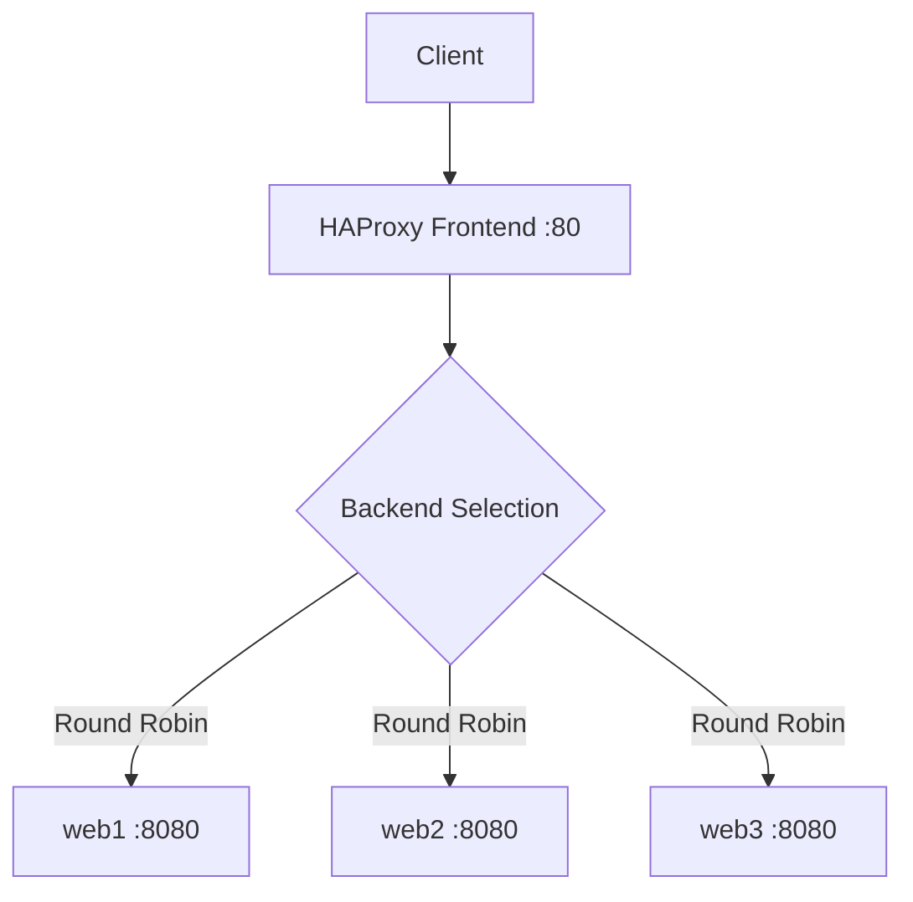

# How to Install and Configure HAProxy on RHEL 9

Author: [nawazdhandala](https://www.github.com/nawazdhandala)

Tags: RHEL, HAProxy, Load Balancer, Linux

Description: A complete guide to installing, configuring, and running HAProxy as a load balancer on Red Hat Enterprise Linux 9.

---

## What Is HAProxy?

HAProxy (High Availability Proxy) is a dedicated load balancer and proxy that handles TCP and HTTP traffic. It is used by some of the highest-traffic websites in the world. Unlike Nginx or Apache, HAProxy's sole focus is proxying and load balancing, and it does that job exceptionally well.

## Prerequisites

- RHEL 9 with active subscription or configured repositories
- Root or sudo access
- Two or more backend servers to load balance

## Step 1 - Install HAProxy

HAProxy is available in the RHEL 9 AppStream repository:

```bash
# Install HAProxy
sudo dnf install -y haproxy
```

Check the version:

```bash
# Verify installation
haproxy -v
```

## Step 2 - Understand the Configuration Structure

The main configuration file is `/etc/haproxy/haproxy.cfg`. It has four main sections:

| Section | Purpose |
|---------|---------|
| `global` | Process-wide settings (logging, max connections, security) |
| `defaults` | Default parameters for frontend and backend sections |
| `frontend` | Defines how client requests are received |
| `backend` | Defines the pool of servers that handle requests |

## Step 3 - Configure a Basic HTTP Load Balancer

Back up the default config and create a new one:

```bash
# Back up the default configuration
sudo cp /etc/haproxy/haproxy.cfg /etc/haproxy/haproxy.cfg.bak
```

Create the configuration:

```bash
# Write the HAProxy configuration
sudo tee /etc/haproxy/haproxy.cfg > /dev/null <<'EOF'
global
    log /dev/log local0
    log /dev/log local1 notice
    chroot /var/lib/haproxy
    stats socket /var/lib/haproxy/stats
    user haproxy
    group haproxy
    daemon

    # Security settings
    maxconn 4096

defaults
    log     global
    mode    http
    option  httplog
    option  dontlognull
    timeout connect 5s
    timeout client  30s
    timeout server  30s
    retries 3

frontend http_front
    bind *:80
    default_backend web_servers

backend web_servers
    balance roundrobin
    option httpchk GET /health
    server web1 192.168.1.11:8080 check
    server web2 192.168.1.12:8080 check
    server web3 192.168.1.13:8080 check
EOF
```

## Step 4 - Validate the Configuration

```bash
# Check the configuration for errors
haproxy -c -f /etc/haproxy/haproxy.cfg
```

If it says `Configuration file is valid`, you are good.

## Step 5 - Open the Firewall

```bash
# Allow HTTP traffic
sudo firewall-cmd --permanent --add-service=http
sudo firewall-cmd --reload
```

## Step 6 - Start and Enable HAProxy

```bash
# Enable and start HAProxy
sudo systemctl enable --now haproxy
```

Check the status:

```bash
# Verify HAProxy is running
sudo systemctl status haproxy
```

## Step 7 - Handle SELinux

HAProxy needs to bind to network ports and connect to backends. If you use non-standard ports:

```bash
# Allow HAProxy to connect to any port
sudo setsebool -P haproxy_connect_any on
```

For standard HTTP/HTTPS ports, SELinux usually allows the connections without extra configuration.

## Step 8 - Enable the Stats Page

The stats page gives you a real-time view of backend health and traffic:

Add this to your `haproxy.cfg`:

```
listen stats
    bind *:8404
    stats enable
    stats uri /stats
    stats refresh 10s
    stats admin if LOCALHOST
    stats auth admin:yourpassword
```

Open the firewall port:

```bash
# Allow access to the stats page
sudo firewall-cmd --permanent --add-port=8404/tcp
sudo firewall-cmd --reload
```

Browse to `http://your-server:8404/stats` and log in with the credentials you set.

## HAProxy Request Flow



## Step 9 - Test the Setup

```bash
# Send a request through HAProxy
curl -I http://your-haproxy-server/

# Send multiple requests to verify load balancing
for i in $(seq 1 6); do
    curl -s http://your-haproxy-server/health
done
```

## Step 10 - View Logs

HAProxy logs via syslog. On RHEL 9, check the journal:

```bash
# View HAProxy logs
sudo journalctl -u haproxy --since "10 minutes ago"
```

For more detailed logging, configure rsyslog to write HAProxy logs to a dedicated file:

```bash
# Create rsyslog config for HAProxy
sudo tee /etc/rsyslog.d/99-haproxy.conf > /dev/null <<'EOF'
local0.* /var/log/haproxy.log
local1.* /var/log/haproxy-notice.log
EOF

# Restart rsyslog
sudo systemctl restart rsyslog
```

## Useful Commands

```bash
# Validate configuration
haproxy -c -f /etc/haproxy/haproxy.cfg

# Reload without dropping connections
sudo systemctl reload haproxy

# Check runtime status via the stats socket
echo "show stat" | sudo socat stdio /var/lib/haproxy/stats
```

## Wrap-Up

HAProxy on RHEL 9 gives you a robust, purpose-built load balancer. The configuration is declarative and easy to reason about: frontends receive traffic, backends serve it, and defaults keep things consistent. Enable the stats page from the start because it is invaluable for monitoring. From here you can add SSL termination, health checks, and more sophisticated routing.
