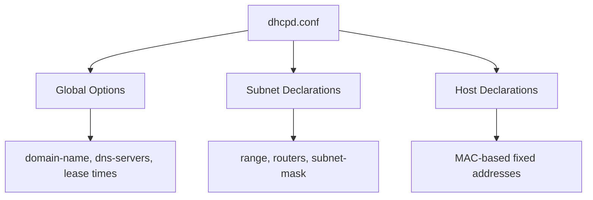

# How to Install and Configure an ISC DHCP Server on RHEL 9

Author: [nawazdhandala](https://www.github.com/nawazdhandala)

Tags: RHEL, DHCP, ISC, Server, Linux

Description: Install and configure the ISC DHCP server on RHEL 9 to automatically assign IP addresses, gateways, and DNS servers to clients on your network.

---

DHCP automates IP address management on your network. Without it, you'd manually configure every device, keeping track of which IPs are in use, updating settings when things change. The ISC DHCP server is the standard implementation on Linux and handles everything from simple home networks to complex enterprise deployments with multiple subnets and VLANs.

## Installing ISC DHCP Server

```bash
dnf install dhcp-server -y
```

This installs the `dhcpd` daemon and its configuration tools.

## Basic Configuration

The main configuration file is `/etc/dhcp/dhcpd.conf`. It's empty by default, with a sample at `/usr/share/doc/dhcp-server/dhcpd.conf.example`.

Create a basic DHCP configuration:

```bash
cat > /etc/dhcp/dhcpd.conf << 'EOF'
# Global settings
option domain-name "example.com";
option domain-name-servers 192.168.1.10, 8.8.8.8;

# Default and maximum lease times
default-lease-time 600;
max-lease-time 7200;

# This server is authoritative for this network
authoritative;

# Log to local7 facility
log-facility local7;

# Subnet declaration
subnet 192.168.1.0 netmask 255.255.255.0 {
    # IP range to hand out
    range 192.168.1.100 192.168.1.200;

    # Default gateway
    option routers 192.168.1.1;

    # Subnet mask
    option subnet-mask 255.255.255.0;

    # Broadcast address
    option broadcast-address 192.168.1.255;

    # NTP server
    option ntp-servers 192.168.1.10;

    # Lease time for this subnet (overrides global)
    default-lease-time 3600;
    max-lease-time 14400;
}
EOF
```

## Understanding the Configuration



**Global options** apply to all subnets unless overridden. **Subnet declarations** define the network parameters for each subnet. **Host declarations** assign fixed IPs to specific MAC addresses.

## Specifying the Listening Interface

By default, dhcpd tries to listen on all interfaces. If you have multiple interfaces and want DHCP only on one:

```bash
# Edit the service configuration
cat > /etc/sysconfig/dhcpd << 'EOF'
DHCPDARGS="eth1"
EOF
```

Or create a systemd override:

```bash
mkdir -p /etc/systemd/system/dhcpd.service.d
cat > /etc/systemd/system/dhcpd.service.d/override.conf << 'EOF'
[Service]
ExecStart=
ExecStart=/usr/sbin/dhcpd -f -cf /etc/dhcp/dhcpd.conf -user dhcpd -group dhcpd --no-pid eth1
EOF

systemctl daemon-reload
```

## Multiple Subnets

If your server has multiple interfaces or serves multiple VLANs:

```bash
cat >> /etc/dhcp/dhcpd.conf << 'EOF'

# Second subnet - server room
subnet 10.10.10.0 netmask 255.255.255.0 {
    range 10.10.10.50 10.10.10.100;
    option routers 10.10.10.1;
    option subnet-mask 255.255.255.0;
    option domain-name-servers 10.10.10.2;
    option domain-name "servers.example.com";
    default-lease-time 86400;
    max-lease-time 172800;
}

# Third subnet - guest network (shorter leases)
subnet 172.16.0.0 netmask 255.255.255.0 {
    range 172.16.0.10 172.16.0.250;
    option routers 172.16.0.1;
    option subnet-mask 255.255.255.0;
    option domain-name-servers 8.8.8.8, 8.8.4.4;
    default-lease-time 1800;
    max-lease-time 3600;
}
EOF
```

## Adding DHCP Options

Common DHCP options you might want to set:

```bash
# TFTP server for PXE booting
option tftp-server-name "192.168.1.10";
next-server 192.168.1.10;
filename "pxelinux.0";

# WINS server (for Windows networks)
option netbios-name-servers 192.168.1.15;

# Custom option for vendor-specific needs
option vendor-class-identifier "PXEClient";
```

## Validating the Configuration

Check the configuration file for syntax errors:

```bash
dhcpd -t -cf /etc/dhcp/dhcpd.conf
```

This parses the file without starting the server. Fix any errors before proceeding.

## Starting the DHCP Server

Enable and start the service:

```bash
systemctl enable --now dhcpd
```

Check the status:

```bash
systemctl status dhcpd
```

If it fails to start, check the journal:

```bash
journalctl -u dhcpd --no-pager -n 30
```

## Firewall Configuration

Allow DHCP traffic through the firewall:

```bash
firewall-cmd --permanent --add-service=dhcp
firewall-cmd --reload
```

## Testing

From a client machine, release and renew the DHCP lease:

```bash
# On the client
dhclient -r eth0
dhclient eth0
```

Or on a client using NetworkManager:

```bash
nmcli connection down "Wired connection 1"
nmcli connection up "Wired connection 1"
```

Check the client got the right settings:

```bash
ip addr show eth0
ip route show
cat /etc/resolv.conf
```

## Checking Lease Assignments

View current leases on the server:

```bash
cat /var/lib/dhcpd/dhcpd.leases
```

This file shows all active leases with their MAC addresses, assigned IPs, and expiration times.

## Logging

DHCP logs to syslog by default (facility local7). View the logs:

```bash
journalctl -u dhcpd -f
```

For more detailed logging, you can configure rsyslog to send DHCP messages to a separate file:

```bash
cat > /etc/rsyslog.d/dhcpd.conf << 'EOF'
local7.* /var/log/dhcpd.log
EOF

systemctl restart rsyslog
```

## Common Issues

**"No subnet declaration for eth0"** means dhcpd can't find a subnet declaration matching the server's interface IP. Add a subnet block for the interface's network, even if you don't want to serve DHCP on it (just leave out the range).

**"Not configured to listen on any interfaces"** means the server doesn't have an interface in any of the declared subnets. Double-check your interface IPs and subnet declarations.

**Clients not receiving addresses** - Check the firewall, verify the interface is correct, and make sure the DHCP range doesn't overlap with any static IPs on the network.

ISC DHCP is reliable and battle-tested. Once configured, it runs quietly in the background doing its job. Just remember to monitor your lease pool utilization so you don't run out of addresses.
