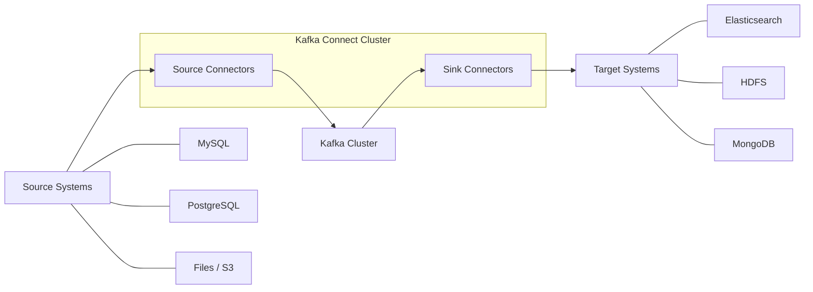

# How to Install and Configure Apache Kafka Connect on RHEL

Author: [nawazdhandala](https://www.github.com/nawazdhandala)

Tags: RHEL, Apache Kafka, Kafka Connect, Data Streaming, ETL, Linux

Description: Install and configure Apache Kafka Connect on RHEL to build scalable data pipelines that stream data between Kafka and external systems.

---

Kafka Connect is a framework for connecting Apache Kafka with external systems like databases, search indexes, and file systems. It provides a standardized way to move data in and out of Kafka without writing custom code. This guide covers installing and configuring Kafka Connect on RHEL.

## Prerequisites

- RHEL with at least 4 GB RAM
- Apache Kafka cluster (or a single broker for testing)
- Java 11 or later
- Root or sudo access

## Architecture Overview



## Step 1: Install Java and Kafka

```bash
# Install Java 17
sudo dnf install -y java-17-openjdk

# Create a Kafka user
sudo useradd -r -m -s /sbin/nologin kafka

# Download Apache Kafka (includes Kafka Connect)
cd /opt
sudo curl -LO https://downloads.apache.org/kafka/3.7.0/kafka_2.13-3.7.0.tgz
sudo tar xzf kafka_2.13-3.7.0.tgz
sudo mv kafka_2.13-3.7.0 kafka
sudo chown -R kafka:kafka /opt/kafka
```

## Step 2: Configure Kafka Connect in Distributed Mode

Distributed mode is recommended for production because it provides fault tolerance and scalability.

```properties
# /opt/kafka/config/connect-distributed.properties

# Kafka broker connection
bootstrap.servers=localhost:9092

# Unique name for this Connect cluster
group.id=connect-cluster

# Converters control how data is serialized in Kafka
key.converter=org.apache.kafka.connect.json.JsonConverter
value.converter=org.apache.kafka.connect.json.JsonConverter

# Include schemas in the JSON payloads
key.converter.schemas.enable=true
value.converter.schemas.enable=true

# Internal topics for storing connector configs, offsets, and status
config.storage.topic=connect-configs
offset.storage.topic=connect-offsets
status.storage.topic=connect-status

# Replication factor for internal topics (set to 1 for single broker)
config.storage.replication.factor=1
offset.storage.replication.factor=1
status.storage.replication.factor=1

# REST API settings
rest.host.name=0.0.0.0
rest.port=8083

# Plugin path where connector JARs are stored
plugin.path=/opt/kafka/plugins
```

## Step 3: Create the Plugin Directory

```bash
# Create the directory for connector plugins
sudo mkdir -p /opt/kafka/plugins
sudo chown kafka:kafka /opt/kafka/plugins
```

## Step 4: Install Popular Connectors

```bash
# Download the JDBC connector (for database sources and sinks)
cd /opt/kafka/plugins
sudo mkdir -p jdbc-connector
cd jdbc-connector

# Download the Confluent JDBC connector
sudo curl -LO https://packages.confluent.io/maven/io/confluent/kafka-connect-jdbc/10.7.4/kafka-connect-jdbc-10.7.4.jar

# Download database drivers
sudo curl -LO https://jdbc.postgresql.org/download/postgresql-42.7.1.jar
sudo curl -LO https://repo1.maven.org/maven2/com/mysql/mysql-connector-j/8.3.0/mysql-connector-j-8.3.0.jar

# Download the Elasticsearch connector
cd /opt/kafka/plugins
sudo mkdir -p elasticsearch-connector
cd elasticsearch-connector
sudo curl -LO https://packages.confluent.io/maven/io/confluent/kafka-connect-elasticsearch/14.0.12/kafka-connect-elasticsearch-14.0.12.jar

# Fix ownership
sudo chown -R kafka:kafka /opt/kafka/plugins
```

## Step 5: Create a Systemd Service

```ini
# /etc/systemd/system/kafka-connect.service
[Unit]
Description=Apache Kafka Connect Distributed
After=network.target kafka.service

[Service]
Type=simple
User=kafka
Group=kafka
ExecStart=/opt/kafka/bin/connect-distributed.sh /opt/kafka/config/connect-distributed.properties
Restart=on-failure
RestartSec=10

# JVM memory settings
Environment="KAFKA_HEAP_OPTS=-Xms512m -Xmx2g"

[Install]
WantedBy=multi-user.target
```

```bash
# Start Kafka Connect
sudo systemctl daemon-reload
sudo systemctl enable --now kafka-connect

# Check the service status
sudo systemctl status kafka-connect
```

## Step 6: Verify the REST API

Kafka Connect exposes a REST API for managing connectors.

```bash
# Check the cluster status
curl -s http://localhost:8083/ | python3 -m json.tool

# List installed connector plugins
curl -s http://localhost:8083/connector-plugins | python3 -m json.tool

# List running connectors (should be empty initially)
curl -s http://localhost:8083/connectors | python3 -m json.tool
```

## Step 7: Create a JDBC Source Connector

This example streams data from a PostgreSQL table into a Kafka topic.

```bash
# Create a JDBC source connector using the REST API
curl -X POST http://localhost:8083/connectors \
    -H "Content-Type: application/json" \
    -d '{
    "name": "postgres-source",
    "config": {
        "connector.class": "io.confluent.connect.jdbc.JdbcSourceConnector",
        "connection.url": "jdbc:postgresql://localhost:5432/mydb",
        "connection.user": "kafka_reader",
        "connection.password": "secure_password",
        "table.whitelist": "orders,customers",
        "mode": "timestamp+incrementing",
        "timestamp.column.name": "updated_at",
        "incrementing.column.name": "id",
        "topic.prefix": "db-",
        "poll.interval.ms": 5000,
        "tasks.max": 2
    }
}'
```

## Step 8: Create an Elasticsearch Sink Connector

This sends data from Kafka topics to Elasticsearch for search and analytics.

```bash
# Create an Elasticsearch sink connector
curl -X POST http://localhost:8083/connectors \
    -H "Content-Type: application/json" \
    -d '{
    "name": "elasticsearch-sink",
    "config": {
        "connector.class": "io.confluent.connect.elasticsearch.ElasticsearchSinkConnector",
        "connection.url": "http://localhost:9200",
        "topics": "db-orders,db-customers",
        "type.name": "_doc",
        "key.ignore": true,
        "schema.ignore": true,
        "tasks.max": 2
    }
}'
```

## Step 9: Monitor Connectors

```bash
# Check the status of a specific connector
curl -s http://localhost:8083/connectors/postgres-source/status | python3 -m json.tool

# Get the configuration of a connector
curl -s http://localhost:8083/connectors/postgres-source/config | python3 -m json.tool

# Pause a connector
curl -X PUT http://localhost:8083/connectors/postgres-source/pause

# Resume a connector
curl -X PUT http://localhost:8083/connectors/postgres-source/resume

# Restart a failed task
curl -X POST http://localhost:8083/connectors/postgres-source/tasks/0/restart

# Delete a connector
curl -X DELETE http://localhost:8083/connectors/postgres-source
```

## Firewall Configuration

```bash
# Allow the Kafka Connect REST API port
sudo firewall-cmd --permanent --add-port=8083/tcp
sudo firewall-cmd --reload
```

## Conclusion

Kafka Connect is now running on your RHEL system in distributed mode, ready to move data between Kafka and your external systems. The REST API makes it straightforward to create, monitor, and manage connectors without writing any code. For production environments, run multiple Kafka Connect workers for high availability and use Avro with Schema Registry instead of JSON for better schema management.
