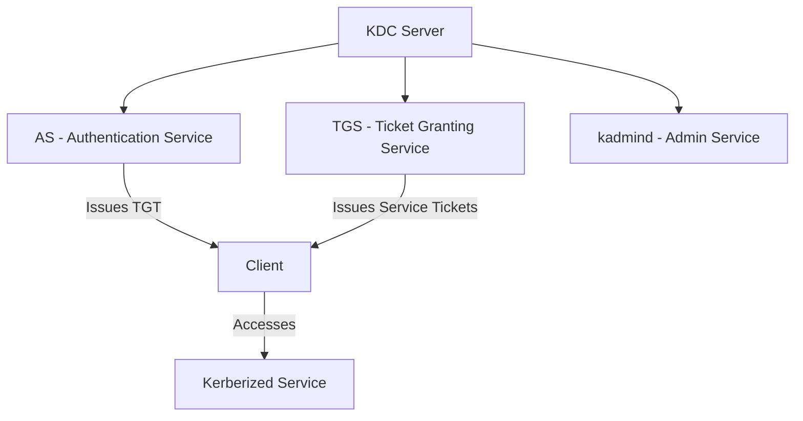

# How to Install and Configure a Kerberos KDC on RHEL 9

Author: [nawazdhandala](https://www.github.com/nawazdhandala)

Tags: RHEL, Kerberos, KDC, Authentication, Linux

Description: A step-by-step guide to installing and configuring a standalone MIT Kerberos Key Distribution Center (KDC) on RHEL 9, covering realm setup, principal management, and keytab creation.

---

A Kerberos Key Distribution Center (KDC) is the authentication server that issues tickets in a Kerberos realm. While most RHEL environments get their KDC through FreeIPA or Active Directory, there are cases where a standalone MIT Kerberos KDC makes sense, such as lab environments, legacy applications, or non-directory authentication needs. This guide walks through setting up a standalone KDC on RHEL 9 from scratch.

## KDC Architecture



The KDC has two main components: the Authentication Service (AS) that issues TGTs when users authenticate, and the Ticket Granting Service (TGS) that issues service tickets for accessing specific services.

## Step 1 - Install KDC Packages

```bash
# Install the KDC server and admin packages
sudo dnf install krb5-server krb5-libs krb5-workstation -y
```

## Step 2 - Configure the Kerberos Realm

Edit the main Kerberos configuration file.

```bash
sudo vi /etc/krb5.conf
```

```ini
[libdefaults]
  default_realm = EXAMPLE.COM
  dns_lookup_realm = false
  dns_lookup_kdc = false
  ticket_lifetime = 24h
  renew_lifetime = 7d
  forwardable = true
  rdns = false

[realms]
  EXAMPLE.COM = {
    kdc = kdc.example.com
    admin_server = kdc.example.com
  }

[domain_realm]
  .example.com = EXAMPLE.COM
  example.com = EXAMPLE.COM
```

## Step 3 - Configure the KDC Server

Edit the KDC configuration file.

```bash
sudo vi /var/kerberos/krb5kdc/kdc.conf
```

```ini
[kdcdefaults]
  kdc_ports = 88
  kdc_tcp_ports = 88

[realms]
  EXAMPLE.COM = {
    kadmind_port = 749
    max_life = 24h 0m 0s
    max_renewable_life = 7d 0h 0m 0s
    master_key_type = aes256-cts-hmac-sha1-96
    supported_enctypes = aes256-cts-hmac-sha1-96:normal aes128-cts-hmac-sha1-96:normal
    default_principal_flags = +preauth
  }
```

## Step 4 - Create the KDC Database

Initialize the Kerberos database. You will be prompted to create a master password. Keep this password safe, as losing it means losing the entire realm.

```bash
# Create the KDC database
sudo kdb5_util create -s

# You will be prompted for the database master password
```

The `-s` flag creates a stash file so the KDC can start without entering the master password.

## Step 5 - Create the Admin Principal

```bash
# Start kadmin locally (no network, uses the local database directly)
sudo kadmin.local

# Create an admin principal
kadmin.local: addprinc admin/admin@EXAMPLE.COM

# Create a regular user principal
kadmin.local: addprinc jsmith@EXAMPLE.COM

# List principals
kadmin.local: listprincs

# Exit
kadmin.local: quit
```

## Step 6 - Configure kadm5.acl

Set up access control for the admin service.

```bash
sudo vi /var/kerberos/krb5kdc/kadm5.acl
```

```
# Grant full admin access to admin principals
*/admin@EXAMPLE.COM  *
```

This means any principal with an `/admin` suffix has full administrative access to the KDC.

## Step 7 - Configure the Firewall

```bash
# Open KDC ports
sudo firewall-cmd --permanent --add-service=kerberos
sudo firewall-cmd --permanent --add-port=749/tcp
sudo firewall-cmd --reload
```

## Step 8 - Start the KDC Services

```bash
# Enable and start the KDC
sudo systemctl enable --now krb5kdc

# Enable and start the admin service
sudo systemctl enable --now kadmin

# Verify both are running
sudo systemctl status krb5kdc
sudo systemctl status kadmin
```

## Step 9 - Test the KDC

```bash
# Get a ticket for the admin principal
kinit admin/admin@EXAMPLE.COM

# Verify the ticket
klist

# Test remote admin access
kadmin -p admin/admin@EXAMPLE.COM
kadmin: listprincs
kadmin: quit
```

## Managing Principals

### Create Service Principals

Service principals are used by kerberized services (SSH, HTTP, NFS, etc.).

```bash
sudo kadmin.local

# Create a host principal for SSH
kadmin.local: addprinc -randkey host/server1.example.com@EXAMPLE.COM

# Create an HTTP principal for a web server
kadmin.local: addprinc -randkey HTTP/web.example.com@EXAMPLE.COM

# Create an NFS principal
kadmin.local: addprinc -randkey nfs/nfs.example.com@EXAMPLE.COM
```

### Export Keytabs

Services need keytab files to authenticate without a password.

```bash
# Export a keytab for a host principal
sudo kadmin.local
kadmin.local: ktadd -k /tmp/server1.keytab host/server1.example.com@EXAMPLE.COM
kadmin.local: quit

# Copy the keytab to the target server
scp /tmp/server1.keytab root@server1.example.com:/etc/krb5.keytab

# Verify the keytab on the target server
klist -kt /etc/krb5.keytab
```

### Modify Principal Properties

```bash
sudo kadmin.local

# Set a principal's password expiration
kadmin.local: modprinc -expire "2027-01-01" jsmith@EXAMPLE.COM

# Disable a principal
kadmin.local: modprinc -allow_tix jsmith@EXAMPLE.COM

# Re-enable a principal
kadmin.local: modprinc +allow_tix jsmith@EXAMPLE.COM

# Change a principal's password
kadmin.local: cpw jsmith@EXAMPLE.COM
```

### Delete a Principal

```bash
kadmin.local: delprinc jsmith@EXAMPLE.COM
```

## Backup and Recovery

### Back Up the KDC Database

```bash
# Create a database dump
sudo kdb5_util dump /var/kerberos/krb5kdc/kdc-backup

# Copy the backup off-server
sudo scp /var/kerberos/krb5kdc/kdc-backup* backup-server:/backups/kerberos/
```

### Restore the Database

```bash
# Stop the KDC
sudo systemctl stop krb5kdc kadmin

# Restore from backup
sudo kdb5_util load /var/kerberos/krb5kdc/kdc-backup

# Restart the KDC
sudo systemctl start krb5kdc kadmin
```

## Logging and Monitoring

```bash
# KDC logs go to syslog by default
sudo journalctl -u krb5kdc -f

# Admin service logs
sudo journalctl -u kadmin -f
```

For more detailed logging, add to `/etc/krb5.conf`:

```ini
[logging]
  kdc = FILE:/var/log/krb5kdc.log
  admin_server = FILE:/var/log/kadmin.log
  default = FILE:/var/log/krb5lib.log
```

## Security Hardening

- Use strong encryption types (AES-256 is the default on RHEL 9)
- Protect the master key stash file (`/var/kerberos/krb5kdc/.k5.EXAMPLE.COM`)
- Restrict network access to the KDC to only systems that need it
- Back up the database regularly and test restores
- Monitor for failed authentication attempts

A standalone KDC is lightweight and straightforward, but it lacks the user management, web UI, and integration features of FreeIPA. For anything beyond basic Kerberos authentication, consider deploying FreeIPA instead.
