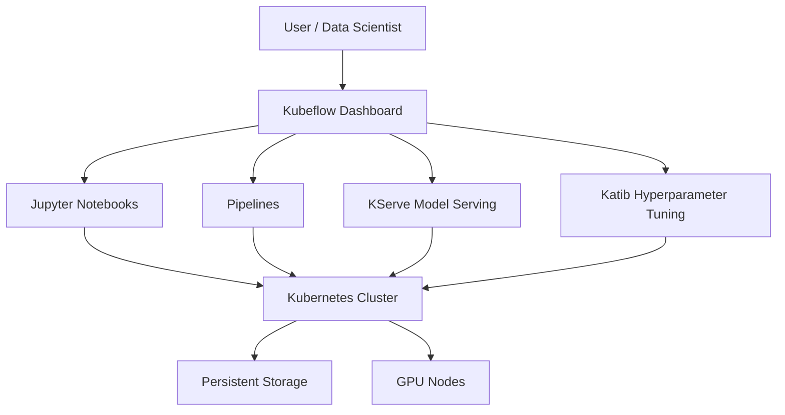

# How to Install and Configure Kubeflow on RHEL 9

Author: [nawazdhandala](https://www.github.com/nawazdhandala)

Tags: RHEL, Kubeflow, Machine Learning, Kubernetes, MLOps, Linux

Description: Learn how to install and configure Kubeflow on RHEL 9 for building scalable machine learning pipelines on Kubernetes.

---

Machine learning workflows involve multiple stages from data preparation to model training, serving, and monitoring. Kubeflow brings all of these stages together on Kubernetes, giving you a unified platform for ML operations. This guide walks you through installing Kubeflow on RHEL 9.

## Prerequisites

Before getting started, make sure you have:

- A RHEL 9 system with at least 16 GB RAM and 4 CPU cores
- A running Kubernetes cluster (v1.25 or later)
- kubectl configured to interact with your cluster
- kustomize installed
- Root or sudo access

## Architecture Overview



## Step 1: Install Required Tools

First, install kubectl and kustomize on your RHEL 9 system.

```bash
# Install kubectl
sudo dnf install -y kubectl

# If kubectl is not in RHEL repos, download it directly
curl -LO "https://dl.k8s.io/release/$(curl -L -s https://dl.k8s.io/release/stable.txt)/bin/linux/amd64/kubectl"
chmod +x kubectl
sudo mv kubectl /usr/local/bin/

# Install kustomize (required for Kubeflow deployment)
curl -s "https://raw.githubusercontent.com/kubernetes-sigs/kustomize/master/hack/install_kustomize.sh" | bash
sudo mv kustomize /usr/local/bin/
```

## Step 2: Set Up a Kubernetes Cluster

If you do not already have a Kubernetes cluster, you can set one up with kubeadm.

```bash
# Enable required kernel modules
sudo modprobe br_netfilter
sudo modprobe overlay

# Persist kernel modules across reboots
cat <<EOF | sudo tee /etc/modules-load.d/k8s.conf
br_netfilter
overlay
EOF

# Set required sysctl parameters
cat <<EOF | sudo tee /etc/sysctl.d/k8s.conf
net.bridge.bridge-nf-call-iptables  = 1
net.bridge.bridge-nf-call-ip6tables = 1
net.ipv4.ip_forward                 = 1
EOF

# Apply sysctl settings
sudo sysctl --system

# Install container runtime (containerd)
sudo dnf install -y containerd
sudo systemctl enable --now containerd

# Install kubeadm, kubelet
sudo dnf install -y kubeadm kubelet
sudo systemctl enable --now kubelet

# Initialize the cluster
sudo kubeadm init --pod-network-cidr=10.244.0.0/16

# Set up kubeconfig for the current user
mkdir -p $HOME/.kube
sudo cp -i /etc/kubernetes/admin.conf $HOME/.kube/config
sudo chown $(id -u):$(id -g) $HOME/.kube/config

# Install a CNI plugin (Calico)
kubectl apply -f https://docs.projectcalico.org/manifests/calico.yaml

# Allow scheduling on the control plane (for single-node setups)
kubectl taint nodes --all node-role.kubernetes.io/control-plane-
```

## Step 3: Clone the Kubeflow Manifests Repository

Kubeflow uses kustomize manifests for deployment.

```bash
# Clone the official Kubeflow manifests repo
git clone https://github.com/kubeflow/manifests.git
cd manifests

# Check out a stable release tag
git checkout v1.8-branch
```

## Step 4: Deploy Kubeflow

Use kustomize to build and apply the Kubeflow components.

```bash
# Deploy all Kubeflow components
# This single command installs the entire Kubeflow stack
while ! kustomize build example | kubectl apply -f -; do
    echo "Retrying to apply resources..."
    sleep 10
done
```

This command may need to run multiple times because of custom resource definition (CRD) ordering issues. The while loop handles that automatically.

## Step 5: Verify the Installation

Check that all Kubeflow pods are running.

```bash
# List all namespaces created by Kubeflow
kubectl get namespaces

# Check pod status in the kubeflow namespace
kubectl get pods -n kubeflow --watch

# Verify all deployments are ready
kubectl get deployments -n kubeflow
```

Wait until all pods show a Running status. This can take 10 to 15 minutes depending on your cluster resources.

## Step 6: Access the Kubeflow Dashboard

Expose the Kubeflow dashboard using port forwarding.

```bash
# Forward the Istio ingress gateway to localhost
kubectl port-forward svc/istio-ingressgateway -n istio-system 8080:80 &

# The dashboard is now available at http://localhost:8080
echo "Kubeflow dashboard is available at http://localhost:8080"
```

The default credentials are:

- Email: `user@example.com`
- Password: `12341234`

## Step 7: Configure Persistent Storage

For production use, configure a StorageClass for persistent volumes.

```yaml
# storage-class.yaml
# Define a local storage class for Kubeflow persistent volumes
apiVersion: storage.k8s.io/v1
kind: StorageClass
metadata:
  name: kubeflow-storage
provisioner: kubernetes.io/no-provisioner
volumeBindingMode: WaitForFirstConsumer
reclaimPolicy: Retain
```

```bash
# Apply the storage class
kubectl apply -f storage-class.yaml

# Set it as the default storage class
kubectl patch storageclass kubeflow-storage \
  -p '{"metadata": {"annotations":{"storageclass.kubernetes.io/is-default-class":"true"}}}'
```

## Step 8: Create a Kubeflow Pipeline

Here is a simple example pipeline to verify your setup works.

```python
# simple_pipeline.py
# A minimal Kubeflow pipeline that demonstrates the basic workflow

from kfp import dsl
from kfp import compiler

# Define a simple component that prints a message
@dsl.component(base_image="python:3.9")
def say_hello(name: str) -> str:
    greeting = f"Hello, {name}!"
    print(greeting)
    return greeting

# Define another component that processes the greeting
@dsl.component(base_image="python:3.9")
def process_greeting(greeting: str) -> str:
    result = f"Processed: {greeting}"
    print(result)
    return result

# Build the pipeline from the components
@dsl.pipeline(name="hello-pipeline", description="A simple hello world pipeline")
def hello_pipeline(recipient: str = "World"):
    # Step 1: Generate a greeting
    hello_task = say_hello(name=recipient)
    # Step 2: Process the greeting from step 1
    process_task = process_greeting(greeting=hello_task.output)

# Compile the pipeline to a YAML file
compiler.Compiler().compile(
    pipeline_func=hello_pipeline,
    package_path="hello_pipeline.yaml"
)
```

## Step 9: Configure User Authentication

Change the default credentials for production use.

```bash
# Generate a new password hash using Python
python3 -c "from passlib.hash import bcrypt; print(bcrypt.using(rounds=12).hash('YourNewSecurePassword'))"

# Edit the Dex configuration to update credentials
kubectl edit configmap dex -n auth
```

Update the `staticPasswords` section with your new hash and preferred email address.

## Firewall Configuration

Open the required ports if you plan to access Kubeflow remotely.

```bash
# Allow access to the Kubeflow dashboard port
sudo firewall-cmd --permanent --add-port=8080/tcp

# Allow Kubernetes API server access
sudo firewall-cmd --permanent --add-port=6443/tcp

# Reload the firewall to apply changes
sudo firewall-cmd --reload
```

## Troubleshooting

If pods are stuck in Pending state, check for resource constraints:

```bash
# Check node resource usage
kubectl top nodes

# Describe a stuck pod to see scheduling issues
kubectl describe pod <pod-name> -n kubeflow

# Check events in the kubeflow namespace
kubectl get events -n kubeflow --sort-by='.lastTimestamp'
```

## Conclusion

You now have Kubeflow running on RHEL 9 with a Kubernetes cluster. This setup gives you access to Jupyter notebooks, ML pipelines, model serving with KServe, and hyperparameter tuning with Katib. For production environments, consider adding GPU support, setting up proper authentication, and configuring external storage backends.
