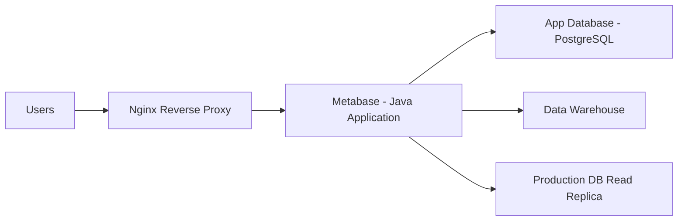

# How to Install and Configure Metabase for Business Intelligence on RHEL

Author: [nawazdhandala](https://www.github.com/nawazdhandala)

Tags: RHEL, Metabase, Business Intelligence, Data Analytics, Linux

Description: Install and configure Metabase on RHEL to give your team an intuitive, self-service business intelligence tool for querying databases and building dashboards.

---

Metabase is an open-source business intelligence tool that lets non-technical users ask questions about data and build dashboards without writing SQL. It connects to your existing databases and provides a clean interface for data exploration. This guide covers installing Metabase on RHEL with a production-ready configuration.

## Prerequisites

- RHEL with at least 2 GB RAM
- Java 11 or later
- PostgreSQL for the application database
- Root or sudo access

## Architecture Overview



## Step 1: Install Java

Metabase runs on the JVM and requires Java 11 or later.

```bash
# Install OpenJDK 17
sudo dnf install -y java-17-openjdk java-17-openjdk-devel

# Verify the installation
java -version
```

## Step 2: Set Up PostgreSQL for Metabase

By default, Metabase uses an embedded H2 database, but PostgreSQL is strongly recommended for production.

```bash
# Install PostgreSQL
sudo dnf install -y postgresql-server postgresql
sudo postgresql-setup --initdb
sudo systemctl enable --now postgresql

# Create a database and user for Metabase
sudo -u postgres psql <<EOF
CREATE USER metabase WITH PASSWORD 'MetabaseSecurePass123';
CREATE DATABASE metabase OWNER metabase;
GRANT ALL PRIVILEGES ON DATABASE metabase TO metabase;
EOF
```

## Step 3: Download and Install Metabase

```bash
# Create a dedicated user and directory
sudo useradd -r -m -s /sbin/nologin metabase
sudo mkdir -p /opt/metabase
cd /opt/metabase

# Download the latest Metabase JAR file
sudo curl -L -o metabase.jar https://downloads.metabase.com/v0.48.0/metabase.jar

# Set ownership
sudo chown -R metabase:metabase /opt/metabase
```

## Step 4: Configure Environment Variables

```bash
# Create an environment file for Metabase
sudo tee /etc/sysconfig/metabase <<EOF
# Database configuration for Metabase application data
MB_DB_TYPE=postgres
MB_DB_DBNAME=metabase
MB_DB_PORT=5432
MB_DB_USER=metabase
MB_DB_PASS=MetabaseSecurePass123
MB_DB_HOST=localhost

# Jetty server settings
MB_JETTY_PORT=3000
MB_JETTY_HOST=127.0.0.1

# Encryption key for sensitive data in the database
# Generate with: openssl rand -base64 32
MB_ENCRYPTION_SECRET_KEY=your-generated-encryption-key

# Logging configuration
MB_EMOJI_IN_LOGS=false
EOF

# Secure the configuration file
sudo chmod 600 /etc/sysconfig/metabase
sudo chown metabase:metabase /etc/sysconfig/metabase
```

## Step 5: Create a Systemd Service

```ini
# /etc/systemd/system/metabase.service
[Unit]
Description=Metabase Business Intelligence Server
After=network.target postgresql.service

[Service]
Type=simple
User=metabase
Group=metabase
EnvironmentFile=/etc/sysconfig/metabase
ExecStart=/usr/bin/java -jar /opt/metabase/metabase.jar
WorkingDirectory=/opt/metabase
Restart=on-failure
RestartSec=10
StandardOutput=journal
StandardError=journal

# Security hardening
NoNewPrivileges=true
PrivateTmp=true
ProtectSystem=strict
ReadWritePaths=/opt/metabase

[Install]
WantedBy=multi-user.target
```

```bash
# Start and enable Metabase
sudo systemctl daemon-reload
sudo systemctl enable --now metabase

# Monitor the startup (first run takes a few minutes for migrations)
sudo journalctl -u metabase -f
```

## Step 6: Configure Nginx Reverse Proxy

```bash
sudo dnf install -y nginx
```

```nginx
# /etc/nginx/conf.d/metabase.conf
server {
    listen 80;
    server_name metabase.example.com;

    client_max_body_size 50M;

    location / {
        proxy_pass http://127.0.0.1:3000;
        proxy_set_header Host $host;
        proxy_set_header X-Real-IP $remote_addr;
        proxy_set_header X-Forwarded-For $proxy_add_x_forwarded_for;
        proxy_set_header X-Forwarded-Proto $scheme;
        proxy_read_timeout 300;
        proxy_connect_timeout 300;
    }
}
```

```bash
# Start Nginx and configure the firewall
sudo systemctl enable --now nginx
sudo firewall-cmd --permanent --add-service=http
sudo firewall-cmd --permanent --add-service=https
sudo firewall-cmd --reload
```

## Step 7: Complete the Setup Wizard

Open your browser and go to `http://your-server-ip`. The setup wizard will guide you through:

1. Setting your preferred language
2. Creating the admin account
3. Adding your first database connection
4. Configuring email settings (optional)

## Step 8: Connect Data Sources

After initial setup, add databases through the Admin panel. Here are common connection examples:

```
# PostgreSQL connection
Host: db-server.example.com
Port: 5432
Database: analytics
Username: readonly_user
Password: secure_password

# MySQL connection
Host: mysql-server.example.com
Port: 3306
Database: production
Username: metabase_reader
Password: secure_password
```

Always use read-only database users for Metabase connections to production databases.

## Step 9: Configure Email for Alerts

Edit the Metabase environment file to add SMTP settings.

```bash
# Add email configuration to /etc/sysconfig/metabase
sudo tee -a /etc/sysconfig/metabase <<EOF

# Email configuration for alerts and subscriptions
MB_EMAIL_SMTP_HOST=smtp.example.com
MB_EMAIL_SMTP_PORT=587
MB_EMAIL_SMTP_USERNAME=metabase@example.com
MB_EMAIL_SMTP_PASSWORD=email_password
MB_EMAIL_SMTP_SECURITY=tls
MB_EMAIL_FROM_ADDRESS=metabase@example.com
EOF

# Restart Metabase to apply the changes
sudo systemctl restart metabase
```

## Backup Strategy

```bash
# Create a backup script for Metabase
sudo tee /opt/metabase/backup.sh <<'EOF'
#!/bin/bash
# Backup script for Metabase PostgreSQL database

BACKUP_DIR="/opt/metabase/backups"
DATE=$(date +%Y%m%d_%H%M%S)

# Create backup directory if it does not exist
mkdir -p "$BACKUP_DIR"

# Dump the Metabase database
pg_dump -U metabase -h localhost metabase | gzip > "$BACKUP_DIR/metabase_${DATE}.sql.gz"

# Keep only the last 7 backups
ls -t "$BACKUP_DIR"/metabase_*.sql.gz | tail -n +8 | xargs rm -f

echo "Backup completed: metabase_${DATE}.sql.gz"
EOF

sudo chmod +x /opt/metabase/backup.sh
sudo chown metabase:metabase /opt/metabase/backup.sh

# Schedule daily backups with cron
echo "0 2 * * * metabase /opt/metabase/backup.sh" | sudo tee /etc/cron.d/metabase-backup
```

## Conclusion

Metabase is now running on your RHEL server with PostgreSQL as the application database and Nginx as a reverse proxy. Your team can start connecting data sources, asking questions about their data, and building dashboards without writing code. For production deployments, add SSL with certbot, configure LDAP or SAML for authentication, and set up automated backups.
