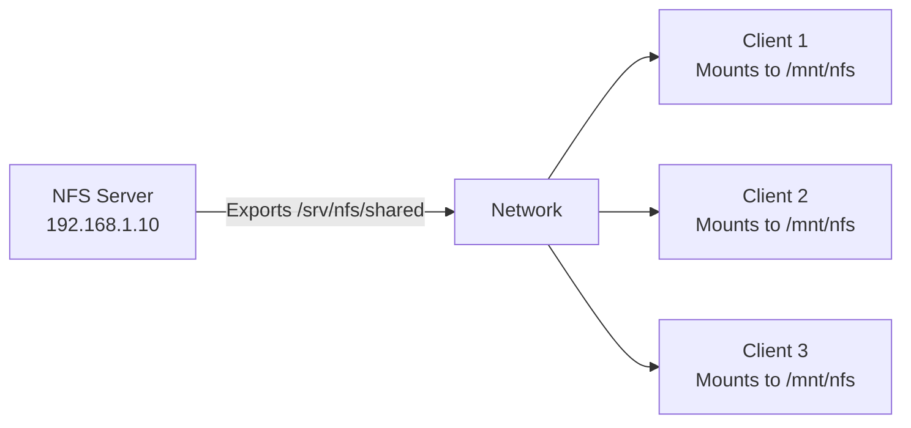

# How to Install and Configure an NFS Server on RHEL

Author: [nawazdhandala](https://www.github.com/nawazdhandala)

Tags: RHEL, NFS, Server, Storage, Linux

Description: Set up an NFS server on RHEL from scratch, covering package installation, export configuration, firewall rules, and basic security settings.

---

## What NFS Does

NFS (Network File System) lets you share directories over the network so that remote machines can mount and access them as if they were local storage. It has been a staple of Unix/Linux environments for decades, and RHEL ships with full NFSv4 support.

NFS is commonly used for shared home directories, centralized log storage, application data sharing between cluster nodes, and development environments.

## Prerequisites

- RHEL with root access
- Network connectivity between the server and intended clients
- A directory to export

## Step 1 - Install NFS Packages

```bash
# Install the NFS server utilities
sudo dnf install -y nfs-utils
```

## Step 2 - Enable and Start NFS Services

```bash
# Enable and start the NFS server
sudo systemctl enable --now nfs-server

# Verify it is running
sudo systemctl status nfs-server
```

## Step 3 - Create the Export Directory

```bash
# Create a directory to share
sudo mkdir -p /srv/nfs/shared

# Set ownership (adjust as needed)
sudo chown nobody:nobody /srv/nfs/shared

# Set permissions
sudo chmod 755 /srv/nfs/shared
```

## Step 4 - Configure Exports

Edit /etc/exports to define what gets shared and who can access it.

```bash
# Add export entries to /etc/exports
# Format: directory client(options)

# Share with a specific subnet
echo "/srv/nfs/shared 192.168.1.0/24(rw,sync,no_subtree_check,no_root_squash)" | sudo tee -a /etc/exports
```

### Export Options Explained

| Option | Description |
|--------|-------------|
| `rw` | Read-write access |
| `ro` | Read-only access |
| `sync` | Write data to disk before replying (safer) |
| `async` | Reply before data is written (faster, less safe) |
| `no_subtree_check` | Disables subtree checking for better reliability |
| `no_root_squash` | Allow root on client to act as root on server |
| `root_squash` | Map client root to nobody (default, more secure) |
| `all_squash` | Map all users to anonymous |

## Step 5 - Apply the Export Configuration

```bash
# Export the shares
sudo exportfs -arv

# Verify active exports
sudo exportfs -s
```

## Step 6 - Configure the Firewall

```bash
# Open NFS-related services in the firewall
sudo firewall-cmd --permanent --add-service=nfs
sudo firewall-cmd --permanent --add-service=mountd
sudo firewall-cmd --permanent --add-service=rpc-bind
sudo firewall-cmd --reload

# Verify
sudo firewall-cmd --list-services
```

## Step 7 - Test from a Client

On a client machine:

```bash
# Install NFS client utilities
sudo dnf install -y nfs-utils

# Show available exports from the server
showmount -e 192.168.1.10

# Mount the share
sudo mkdir -p /mnt/nfs-shared
sudo mount -t nfs 192.168.1.10:/srv/nfs/shared /mnt/nfs-shared

# Test read/write
touch /mnt/nfs-shared/test-file
ls /mnt/nfs-shared
```

## Architecture Overview



## Multiple Exports

You can share multiple directories with different access controls:

```bash
# /etc/exports with multiple shares
/srv/nfs/shared    192.168.1.0/24(rw,sync,no_subtree_check)
/srv/nfs/readonly  192.168.1.0/24(ro,sync,no_subtree_check)
/srv/nfs/project   10.0.0.50(rw,sync,no_root_squash) 10.0.0.51(rw,sync,no_root_squash)
```

After editing, apply changes:

```bash
sudo exportfs -arv
```

## Checking NFS Version

RHEL uses NFSv4 by default. You can verify the active versions:

```bash
# Check which NFS versions are enabled
cat /proc/fs/nfsd/versions

# List NFS protocol statistics
nfsstat -s
```

To disable older NFS versions (v3, v2) for security:

```bash
# Edit /etc/nfs.conf and set vers3=n under [nfsd] section
sudo vi /etc/nfs.conf
# Under [nfsd]:
# vers3=n
# vers2=n

# Restart NFS
sudo systemctl restart nfs-server
```

## SELinux Configuration

If SELinux is enforcing, set the appropriate booleans:

```bash
# Allow NFS to share files with read-write access
sudo setsebool -P nfs_export_all_rw 1
sudo setsebool -P nfs_export_all_ro 1

# If sharing home directories
sudo setsebool -P use_nfs_home_dirs 1
```

Set the correct SELinux context on the exported directory:

```bash
# Set the NFS export context
sudo semanage fcontext -a -t public_content_rw_t "/srv/nfs/shared(/.*)?"
sudo restorecon -Rv /srv/nfs/shared
```

## Wrap-Up

Setting up an NFS server on RHEL is a straightforward process: install the packages, define your exports, open the firewall, and start the service. The defaults are sensible for most use cases, and NFSv4 provides good security and performance out of the box. For production deployments, add Kerberos authentication and tune performance options, both of which are covered in other posts in this series.
