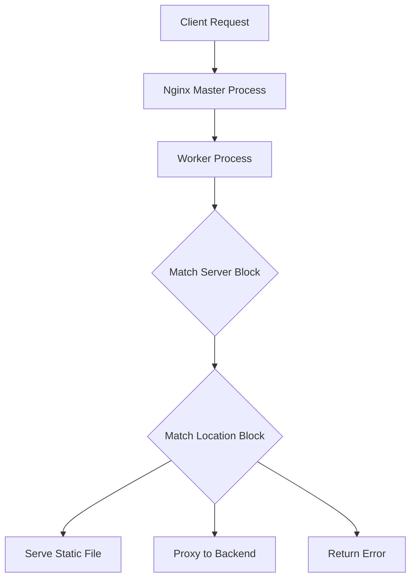

# How to Install and Configure Nginx on RHEL 9

Author: [nawazdhandala](https://www.github.com/nawazdhandala)

Tags: RHEL, Nginx, Web Server, Linux

Description: A complete guide to installing, configuring, and running Nginx as a web server on Red Hat Enterprise Linux 9.

---

## Why Nginx?

Nginx handles concurrent connections efficiently using an event-driven architecture. It uses far less memory per connection than traditional process-based servers. Whether you need a static file server, a reverse proxy, or a load balancer, Nginx is a solid choice on RHEL 9.

## Prerequisites

- RHEL 9 with active subscription or configured repositories
- Root or sudo access
- Firewall access to ports 80 and 443

## Step 1 - Install Nginx

Nginx is available in the RHEL 9 AppStream repository:

```bash
# Install Nginx
sudo dnf install -y nginx
```

Verify the installed version:

```bash
# Check the Nginx version
nginx -v
```

## Step 2 - Start and Enable Nginx

```bash
# Start Nginx and enable it to start on boot
sudo systemctl enable --now nginx
```

Check the status:

```bash
# Verify Nginx is running
sudo systemctl status nginx
```

## Step 3 - Open the Firewall

```bash
# Allow HTTP and HTTPS traffic
sudo firewall-cmd --permanent --add-service=http
sudo firewall-cmd --permanent --add-service=https
sudo firewall-cmd --reload
```

Browse to `http://your-server-ip` and you should see the default RHEL Nginx welcome page.

## Step 4 - Understand the File Layout

| Path | Purpose |
|------|---------|
| `/etc/nginx/nginx.conf` | Main configuration file |
| `/etc/nginx/conf.d/` | Drop-in server block configs |
| `/usr/share/nginx/html/` | Default document root |
| `/var/log/nginx/` | Access and error logs |

## Step 5 - Create a Basic Site

Replace the default page with your own:

```bash
# Create a simple index page
sudo tee /usr/share/nginx/html/index.html > /dev/null <<'EOF'
<!DOCTYPE html>
<html>
<head><title>Hello</title></head>
<body>
<h1>Hello from Nginx on RHEL 9</h1>
</body>
</html>
EOF
```

## Step 6 - Review the Main Configuration

```bash
# Open the main Nginx config
sudo vi /etc/nginx/nginx.conf
```

Key sections to understand:

```nginx
# Number of worker processes - set to auto for one per CPU core
worker_processes auto;

# Maximum connections per worker
events {
    worker_connections 1024;
}

http {
    # Include MIME types
    include /etc/nginx/mime.types;

    # Default type for unknown extensions
    default_type application/octet-stream;

    # Enable sendfile for efficient file serving
    sendfile on;

    # Keep connections alive for 65 seconds
    keepalive_timeout 65;

    # Include all configs from conf.d
    include /etc/nginx/conf.d/*.conf;
}
```

## Step 7 - Create a Custom Server Block

Instead of modifying the main config, create a file in `conf.d`:

```bash
# Create a custom server block
sudo tee /etc/nginx/conf.d/mysite.conf > /dev/null <<'EOF'
server {
    listen 80;
    server_name www.example.com example.com;
    root /var/www/mysite;
    index index.html;

    # Logging
    access_log /var/log/nginx/mysite-access.log;
    error_log /var/log/nginx/mysite-error.log;

    location / {
        try_files $uri $uri/ =404;
    }
}
EOF
```

Create the document root:

```bash
# Create the site directory and a test page
sudo mkdir -p /var/www/mysite
sudo tee /var/www/mysite/index.html > /dev/null <<'EOF'
<html><body><h1>My Site on Nginx</h1></body></html>
EOF
```

## Step 8 - Handle SELinux

If you use a custom document root, fix the SELinux labels:

```bash
# Set the correct SELinux context for custom web content
sudo semanage fcontext -a -t httpd_sys_content_t "/var/www/mysite(/.*)?"
sudo restorecon -Rv /var/www/mysite/
```

## Step 9 - Test and Reload

Always test the config before reloading:

```bash
# Test Nginx configuration syntax
sudo nginx -t
```

If the test passes:

```bash
# Reload Nginx to apply changes
sudo systemctl reload nginx
```

## Step 10 - Useful Commands

```bash
# Test configuration
sudo nginx -t

# Reload configuration gracefully
sudo systemctl reload nginx

# View active connections (requires stub_status)
# Full restart
sudo systemctl restart nginx

# View logs
sudo tail -f /var/log/nginx/access.log
sudo tail -f /var/log/nginx/error.log
```

## Nginx Request Flow



## Wrap-Up

Nginx on RHEL 9 is straightforward to install and configure. Keep your server blocks in separate files under `/etc/nginx/conf.d/`, always test with `nginx -t` before reloading, and set SELinux contexts correctly for custom document roots. From here you can add TLS, set up reverse proxying, or configure load balancing.
