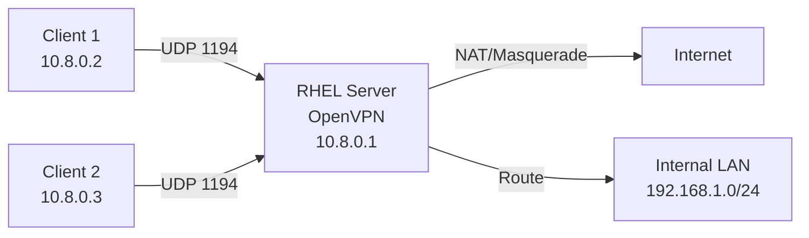

# How to Install and Configure an OpenVPN Server on RHEL

Author: [nawazdhandala](https://www.github.com/nawazdhandala)

Tags: RHEL, OpenVPN, VPN, Server, Linux

Description: A comprehensive guide to installing and configuring an OpenVPN server on RHEL, covering package installation, certificate generation, server configuration, firewall rules, and client setup.

---

OpenVPN has been the workhorse of Linux VPN solutions for years. While WireGuard is newer and faster, OpenVPN still has its place - it runs over TCP (useful for restrictive networks), has mature client support on every platform, and supports complex authentication methods like LDAP and RADIUS. Here's how to get it running on RHEL.

## Prerequisites

- RHEL server with a public IP
- Root or sudo access
- EPEL repository enabled
- A domain name or public IP for the VPN endpoint

## Installing OpenVPN and Easy-RSA

```bash
# Enable EPEL
sudo dnf install -y epel-release

# Install OpenVPN and the certificate management tool
sudo dnf install -y openvpn easy-rsa
```

## Setting Up the PKI (Public Key Infrastructure)

OpenVPN uses TLS certificates for authentication. Easy-RSA makes managing them straightforward.

```bash
# Create the Easy-RSA directory
mkdir -p ~/easy-rsa
ln -s /usr/share/easy-rsa/3/* ~/easy-rsa/
cd ~/easy-rsa

# Initialize the PKI
./easyrsa init-pki

# Build the Certificate Authority
./easyrsa build-ca nopass
# You'll be prompted for a Common Name - use something like "OpenVPN-CA"
```

## Generating Server Certificates

```bash
# Generate the server certificate and key
cd ~/easy-rsa
./easyrsa gen-req server nopass
./easyrsa sign-req server server

# Generate Diffie-Hellman parameters (this takes a while)
./easyrsa gen-dh

# Generate a TLS auth key for additional security
openvpn --genkey secret /etc/openvpn/server/ta.key
```

## Copying Certificates to the Right Location

```bash
# Copy server certificates
sudo cp ~/easy-rsa/pki/ca.crt /etc/openvpn/server/
sudo cp ~/easy-rsa/pki/issued/server.crt /etc/openvpn/server/
sudo cp ~/easy-rsa/pki/private/server.key /etc/openvpn/server/
sudo cp ~/easy-rsa/pki/dh.pem /etc/openvpn/server/

# Set proper permissions
sudo chmod 600 /etc/openvpn/server/server.key
sudo chmod 600 /etc/openvpn/server/ta.key
```

## Creating the Server Configuration

```bash
# Create the server configuration file
sudo tee /etc/openvpn/server/server.conf > /dev/null << 'EOF'
# Network settings
port 1194
proto udp
dev tun

# Certificate paths
ca /etc/openvpn/server/ca.crt
cert /etc/openvpn/server/server.crt
key /etc/openvpn/server/server.key
dh /etc/openvpn/server/dh.pem

# TLS auth for HMAC protection
tls-auth /etc/openvpn/server/ta.key 0

# VPN subnet
server 10.8.0.0 255.255.255.0

# Push routes and DNS to clients
push "redirect-gateway def1 bypass-dhcp"
push "dhcp-option DNS 1.1.1.1"
push "dhcp-option DNS 1.0.0.1"

# Keep track of client IPs
ifconfig-pool-persist /var/log/openvpn/ipp.txt

# Encryption settings
cipher AES-256-GCM
auth SHA256

# Keep connections alive
keepalive 10 120

# Security hardening
user nobody
group nobody
persist-key
persist-tun

# Logging
status /var/log/openvpn/openvpn-status.log
log-append /var/log/openvpn/openvpn.log
verb 3
EOF
```

## Creating the Log Directory

```bash
sudo mkdir -p /var/log/openvpn
```

## Enabling IP Forwarding

```bash
# Enable IP forwarding
sudo sysctl -w net.ipv4.ip_forward=1
echo "net.ipv4.ip_forward = 1" | sudo tee /etc/sysctl.d/99-openvpn.conf
```

## Configuring the Firewall

```bash
# Allow OpenVPN port
sudo firewall-cmd --permanent --add-port=1194/udp

# Enable masquerading for VPN clients
sudo firewall-cmd --permanent --add-masquerade

# Reload
sudo firewall-cmd --reload
```

## Starting OpenVPN

```bash
# Start the OpenVPN server
sudo systemctl start openvpn-server@server

# Enable on boot
sudo systemctl enable openvpn-server@server

# Check status
sudo systemctl status openvpn-server@server
```

## Generating Client Certificates

For each client, generate a certificate:

```bash
cd ~/easy-rsa

# Generate client certificate
./easyrsa gen-req client1 nopass
./easyrsa sign-req client client1
```

## Creating the Client Configuration

```bash
# Create a client configuration file
tee ~/client1.ovpn > /dev/null << 'EOF'
client
dev tun
proto udp

# Your server's public IP or hostname
remote YOUR_SERVER_IP 1194

resolv-retry infinite
nobind
persist-key
persist-tun

# Certificate and key (inline below or as separate files)
ca ca.crt
cert client1.crt
key client1.key
tls-auth ta.key 1

cipher AES-256-GCM
auth SHA256
verb 3
EOF
```

For easier distribution, you can embed the certificates directly in the .ovpn file using `<ca>`, `<cert>`, `<key>`, and `<tls-auth>` inline tags.

## Architecture Overview



## Verifying the Server

```bash
# Check OpenVPN is listening
ss -ulnp | grep 1194

# Watch the log
sudo tail -f /var/log/openvpn/openvpn.log

# Check connected clients
sudo cat /var/log/openvpn/openvpn-status.log
```

## Troubleshooting

**Server won't start:**

```bash
# Check for configuration errors
sudo openvpn --config /etc/openvpn/server/server.conf --verb 4

# Check SELinux denials
sudo ausearch -m avc --start recent
```

**Clients connect but can't reach the internet:**

```bash
# Verify IP forwarding
sysctl net.ipv4.ip_forward

# Check masquerading
sudo firewall-cmd --query-masquerade

# Check routes on the server
ip route show
```

## Wrapping Up

OpenVPN on RHEL requires more setup than WireGuard, but the flexibility it offers is worth it for environments that need TCP transport, LDAP authentication, or broad client compatibility. The PKI setup is the most involved part. Once that's done, adding new clients is just a matter of generating certificates and handing out config files.
