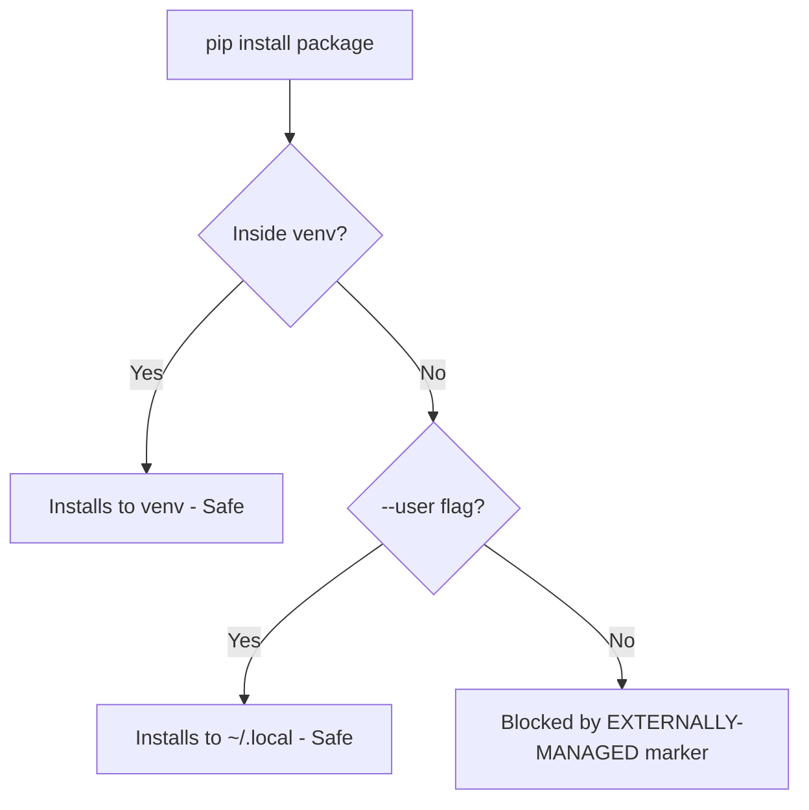

# How to Install and Configure pip on RHEL Without Breaking System Python

Author: [nawazdhandala](https://www.github.com/nawazdhandala)

Tags: RHEL, Python, Pip, Package Management, Linux

Description: Learn how to safely install and configure pip on RHEL while protecting the system Python installation from accidental modifications.

---

RHEL takes a protective stance toward its system Python. Running `pip install` outside a virtual environment will fail by default, and that is intentional. This guide shows you how to work with pip properly on RHEL.

## Understanding the RHEL Python Policy

RHEL uses Python 3.9 as the system Python. Many system tools depend on it, so Red Hat introduced PEP 668 support to prevent users from accidentally breaking system packages with pip.



## Installing pip

```bash
# Install pip for the default Python 3.9
sudo dnf install -y python3-pip

# Verify the installation
pip3 --version
# Output: pip 21.x.x from /usr/lib/python3.9/site-packages (python 3.9)

# For Python 3.11
sudo dnf install -y python3.11-pip
python3.11 -m pip --version

# For Python 3.12
sudo dnf install -y python3.12-pip
python3.12 -m pip --version
```

## The EXTERNALLY-MANAGED Error

If you try to run `pip install` directly on RHEL, you will see this error:

```bash
error: externally-managed-environment
This environment is externally managed
```

This is expected behavior. RHEL marks the system Python as externally managed to protect it.

## Safe Way 1: Use Virtual Environments (Recommended)

The best approach is to use a virtual environment for every project.

```bash
# Create and activate a virtual environment
python3 -m venv ~/myproject/venv
source ~/myproject/venv/bin/activate

# Now pip works normally inside the venv
pip install requests flask numpy

# Deactivate when done
deactivate
```

## Safe Way 2: Use the --user Flag

If you need a package available outside a venv, install it to your home directory.

```bash
# Install a package to ~/.local/lib/python3.9/site-packages/
pip3 install --user httpie

# The binary goes to ~/.local/bin/
# Make sure it is in your PATH
echo 'export PATH="$HOME/.local/bin:$PATH"' >> ~/.bashrc
source ~/.bashrc

# Verify
http --version
```

## Safe Way 3: Use pipx for CLI Tools

For Python-based command-line tools, pipx is the cleanest option. It installs each tool in its own isolated environment.

```bash
# Install pipx
sudo dnf install -y pipx

# Install CLI tools with pipx
pipx install httpie
pipx install black
pipx install poetry

# Each tool gets its own venv under ~/.local/pipx/venvs/
```

## Configuring pip Defaults

You can set default pip behavior in a configuration file.

```bash
# Create the pip configuration directory
mkdir -p ~/.config/pip

# Create the config file
cat > ~/.config/pip/pip.conf << 'PIPCONF'
[global]
# Default to user installs when outside a venv
user = true

# Set a custom index URL if you use a private PyPI mirror
# index-url = https://pypi.example.com/simple/

# Set a timeout for slow connections
timeout = 60

# Require a hash check for added security
# require-hashes = true

[install]
# Do not install if a compatible version already exists
# upgrade-strategy = only-if-needed
PIPCONF
```

## Upgrading pip Itself

```bash
# Inside a virtual environment, upgrade pip
source ~/myproject/venv/bin/activate
pip install --upgrade pip

# For user-level pip upgrade
pip3 install --user --upgrade pip

# Verify the upgrade
pip3 --version
```

## Using pip with a Private Package Index

If your organization hosts a private PyPI server, configure pip to use it.

```bash
# Temporary usage with --index-url
pip install --index-url https://pypi.example.com/simple/ mypackage

# Or add an extra index alongside the public PyPI
pip install --extra-index-url https://pypi.example.com/simple/ mypackage

# Permanent configuration in pip.conf
cat >> ~/.config/pip/pip.conf << 'PIPCONF'

[global]
index-url = https://pypi.example.com/simple/
trusted-host = pypi.example.com
PIPCONF
```

## Checking for Security Vulnerabilities

```bash
# Install pip-audit in a venv
python3 -m venv ~/tools/audit-env
source ~/tools/audit-env/bin/activate
pip install pip-audit

# Audit packages in any requirements file
pip-audit -r /path/to/requirements.txt

# Audit the current environment
pip-audit
```

## Summary

On RHEL, pip is available but intentionally restricted outside virtual environments. Always use venvs for project work, the `--user` flag for personal tools, or pipx for CLI applications. This keeps your system Python healthy and your packages organized.
