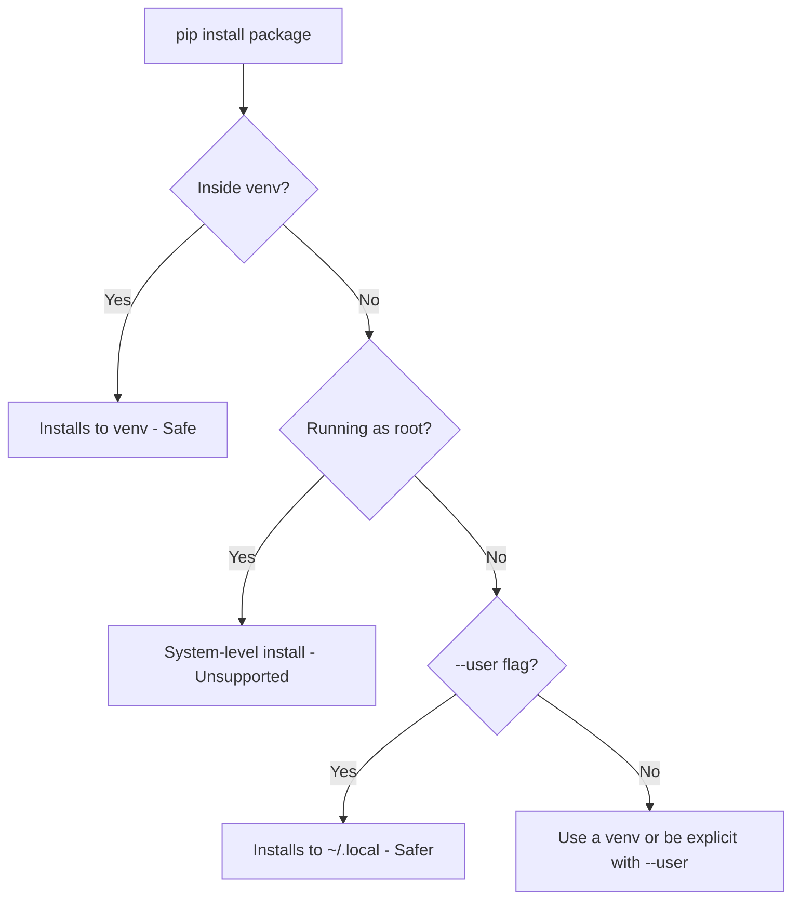

# How to Install and Configure pip on RHEL Without Breaking System Python

Author: [nawazdhandala](https://www.github.com/nawazdhandala)

Tags: RHEL, Python, pip, Package Management, Linux

Description: Learn how to safely install and configure pip on RHEL while protecting the system Python installation from accidental modifications.

---

RHEL takes a protective stance toward its system Python. Running `pip install` as root at the system level can override RHEL-managed libraries, and Red Hat does not support that use. This guide shows you how to work with pip properly on RHEL.

## Understanding the RHEL Python Policy

RHEL uses Python 3.9 as the default Python implementation. Many system tools depend on Python libraries managed by RPM packages, so Red Hat recommends using virtual environments or non-root `--user` installs instead of installing packages with pip at the system level.


```mermaid
graph TD
    A[pip install package] --> B{Inside venv?}
    B -->|Yes| C[Installs to venv - Safe]
    B -->|No| D{Running as root?}
    D -->|Yes| E[System-level install - Unsupported]
    D -->|No| F{--user flag?}
    F -->|Yes| G[Installs to ~/.local - Safer]
    F -->|No| H[Use a venv or be explicit with --user]
```

## Installing pip

```bash
# Install pip for the default Python 3.9

sudo dnf install -y python3.9-pip

# Verify the installation
pip3 --version
# Output: pip 21.x.x from /usr/lib/python3.9/site-packages (python 3.9)

# For Python 3.11
sudo dnf install -y python3.11-pip
python3.11 -m pip --version

# For Python 3.12
sudo dnf install -y python3.12-pip
python3.12 -m pip --version
```

## The System-Level pip Risk

If you run `pip install` as root on RHEL, pip can place files in system locations:

```bash
sudo pip3 install package
```

That can override RHEL libraries and cause system instability or conflicts with supported packages. Use a virtual environment or a non-root `--user` install instead.

## Safe Way 1: Use Virtual Environments (Recommended)

The best approach is to use a virtual environment for every project.

```bash
# Create and activate a virtual environment
python3 -m venv ~/myproject/venv
source ~/myproject/venv/bin/activate

# Now pip works normally inside the venv
pip install requests flask numpy

# Deactivate when done
deactivate
```

## Safe Way 2: Use the --user Flag

If you need a package available outside a venv, install it to your home directory.

```bash
# Install a package to ~/.local/lib/python3.9/site-packages/
pip3 install --user httpie

# The binary goes to ~/.local/bin/
# Make sure it is in your PATH
echo 'export PATH="$HOME/.local/bin:$PATH"' >> ~/.bashrc
source ~/.bashrc

# Verify
http --version
```

## Safe Way 3: Use pipx for CLI Tools

For Python-based command-line tools, pipx is the cleanest option. It installs each tool in its own isolated environment.

```bash
# Install pipx from an enabled repository such as EPEL
sudo dnf install -y pipx

# Install CLI tools with pipx
pipx install httpie
pipx install black
pipx install poetry

# Each tool gets its own venv under ~/.local/share/pipx/venvs/
```

## Configuring pip Defaults

You can set default pip behavior in a configuration file.

```bash
# Create the pip configuration directory
mkdir -p ~/.config/pip

# Create the config file
cat > ~/.config/pip/pip.conf << 'PIPCONF'
[global]
# Set a custom index URL if you use a private PyPI mirror
# index-url = https://pypi.example.com/simple/

# Set a timeout for slow connections
timeout = 60

# Require a hash check for added security
# require-hashes = true

[install]
# Do not install if a compatible version already exists
# upgrade-strategy = only-if-needed

# Do not set user = true globally if you use virtual environments.
PIPCONF
```

## Upgrading pip Itself

```bash
# Inside a virtual environment, upgrade pip
source ~/myproject/venv/bin/activate
pip install --upgrade pip

# For user-level pip upgrade
pip3 install --user --upgrade pip

# Verify the upgrade
pip3 --version
```

## Using pip with a Private Package Index

If your organization hosts a private PyPI server, configure pip to use it.

```bash
# Temporary usage with --index-url
pip install --index-url https://pypi.example.com/simple/ mypackage

# Or add an extra index alongside the public PyPI
# Use this carefully for private packages because it can allow dependency confusion.
pip install --extra-index-url https://pypi.example.com/simple/ mypackage

# Permanent configuration in your user pip.conf
python3 -m pip config set global.index-url https://pypi.example.com/simple/
python3 -m pip config set global.trusted-host pypi.example.com
```

## Checking for Security Vulnerabilities

```bash
# Install pip-audit in a venv
python3 -m venv ~/tools/audit-env
source ~/tools/audit-env/bin/activate
pip install pip-audit

# Audit packages in any requirements file
pip-audit -r /path/to/requirements.txt

# Audit the current environment
pip-audit
```

## Summary

On RHEL, pip is available but should not be used for root-level system installs. Always use venvs for project work, the `--user` flag for personal tools, or pipx for CLI applications. This keeps your system Python healthy and your packages organized.
